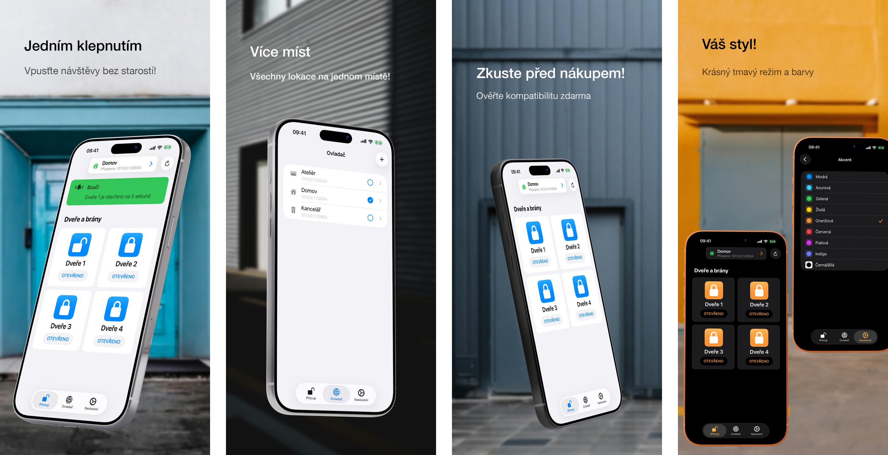

<h1>GateTap</h1>

---

🌍 **Tento dokument je dostupný v dalších jazycích:**  
[🇺🇸 English](../README.md) | [🇩🇪 Deutsch](README.de.md) | [🇸🇦 العربية](README.ar.md) | [🇪🇸 Català](README.ca.md) | 🇨🇿 Čeština | [🇩🇰 Dansk](README.da.md) | [🇬🇷 Ελληνικά](README.el.md) | [🇪🇸 Español](README.es.md) | [🇲🇽 Español (México)](README.es-MX.md) | [🇫🇮 Suomi](README.fi.md) | [🇫🇷 Français](README.fr.md) | [🇮🇱 עברית](README.he.md) | [🇮🇳 हिन्दी](README.hi.md) | [🇭🇷 Hrvatski](README.hr.md) | [🇭🇺 Magyar](README.hu.md) | [🇮🇩 Bahasa Indonesia](README.id.md) | [🇮🇹 Italiano](README.it.md) | [🇯🇵 日本語](README.ja.md) | [🇰🇷 한국어](README.ko.md) | [🇲🇾 Bahasa Melayu](README.ms.md) | [🇳🇴 Norsk Bokmål](README.nb.md) | [🇳🇱 Nederlands](README.nl.md) | [🇵🇱 Polski](README.pl.md) | [🇧🇷 Português (Brasil)](README.pt-BR.md) | [🇵🇹 Português (Portugal)](README.pt-PT.md) | [🇷🇴 Română](README.ro.md) | [🇷🇺 Русский](README.ru.md) | [🇸🇰 Slovenčina](README.sk.md) | [🇸🇪 Svenska](README.sv.md) | [🇹🇭 ไทย](README.th.md) | [🇹🇷 Türkçe](README.tr.md) | [🇺🇦 Українська](README.uk.md) | [🇻🇳 Tiếng Việt](README.vi.md) | [🇨🇳 简体中文](README.zh-Hans.md) | [🇹🇼 繁體中文](README.zh-Hant.md)

---

_**Moderní rozhraní pro iPhone pro kompatibilní webově spravované systémy kontroly přístupu.**_

Řadič přístupu je zařízení, které elektronicky řídí otevírání dveří, bran, garáží nebo závor — například aktivací dveřního bzučáku přes domovní telefon nebo ovládáním motoru brány.

Mnoho moderních systémů kontroly přístupu je připojeno k místní síti a lze je ovládat přes webové rozhraní. Tato rozhraní jsou však často pomalá, obtížná a nepohodlná k používání. GateTap nahrazuje zastaralé webové stránky rychlým, dotykově optimalizovaným prostředím navrženým pro iPhone.

GateTap je vytvořen pro místní sítě a připojuje se přímo ke kompatibilním řadičům přístupu — bez cloudových služeb, předplatného nebo externích účtů.

---

## Funkce

• ☑️ Moderní ovládání bran a dveří  
• 📱 Intuitivní rozhraní optimalizované pro dotyk  
• ⚡ Rychlé přihlášení s bezpečně uloženými přihlašovacími údaji nebo dočasnými údaji relace  
• 🔐 Volitelná ochrana aplikace pomocí Face ID / Touch ID  
• 📡 Přímá komunikace v místní síti  
• ☁️ Není vyžadováno cloudové připojení  
• 🖥️ Navrženo pro vestavěné webově spravované řadiče  
• 🏢 Podpora více řadičů / více míst  

---

## Kompatibilita

GateTap je navržen pro určité řadiče přístupu s Ethernetem nebo Wi‑Fi, které poskytují integrované rozhraní pro správu v prohlížeči.

Kompatibilní systémy obvykle poskytují:
- místní přístup přes IP adresu
- vestavěné webové administrační stránky
- přihlášení přes prohlížeč
- ovládání relé nebo přístupu přes webové rozhraní

Kompatibilita závisí na:
- modelu řadiče
- verzi firmwaru
- struktuře webového rozhraní
- konfiguraci sítě

### Není kompatibilní s

GateTap obecně **není kompatibilní** s:
- systémy pouze v cloudu
- systémy pouze přes Bluetooth
- samostatnými IR ovladači
- řadiči přístupu bez webového rozhraní
- obecnými čtečkami bez síťových modulů

[Podívejte se na známý seznam kompatibilních zařízení.](../support/cs/compatibility.cs.md)

---

## Vyzkoušejte před nákupem

GateTap si můžete zdarma stáhnout a nakonfigurovat, abyste si před nákupem ověřili kompatibilitu se svým systémem.

Bezplatná verze umožňuje:
- připojit se k řadiči
- ověřit přihlašovací údaje
- otestovat kompatibilitu
- zobrazit náhled rozhraní řadiče

Jednorázový nákup v aplikaci odemkne:
- spouštění bran a dveří
- plné provozní používání řadiče
- podporu více řadičů / více míst
- budoucí pokročilé funkce

Není vyžadováno předplatné.

---

## Nastavení

GateTap je určen pro technicky zkušené uživatele a vyžaduje ruční konfiguraci.

1. Zadejte místní IP adresu řadiče  
2. Zadejte své přihlašovací údaje  
3. Otestujte připojení  
4. Odemkněte plnou funkčnost a začněte systém ovládat přímo z iPhonu  

Přečtěte si úplnou [příručku nastavení](../setup-guide/setup-guide.cs.md).

---

## Podpora a pomoc s kompatibilitou

Protože se hardware pro kontrolu přístupu mezi výrobci a verzemi firmwaru výrazně liší, nelze kompatibilitu zaručit pro všechny systémy.

Pokud váš řadič aktuálně není podporován, podpora může být stále možná.

Uživatelé mohou kontaktovat podporu a poskytnout:
- snímky obrazovky webového rozhraní řadiče
- exportované HTML stránky
- informace o modelu řadiče
- podrobnosti o firmwaru

Pokud je to proveditelné, lze zlepšení kompatibility vyvíjet a testovat společně s uživateli prostřednictvím beta verzí TestFlight.

Upozorňujeme, že tento proces může být technický a může vyžadovat aktivní spolupráci během testování.

---

## Soukromí na prvním místě

Vaše data zůstávají ve vašem zařízení.

GateTap neposílá:
- přihlašovací údaje
- příkazy
- data řadiče

na externí servery.

Volitelné hlášení pádů lze kdykoli vypnout.

Přečtěte si úplné [Zásady ochrany osobních údajů](../legal/cs/privacy-policy.cs.md) a [Podmínky použití](../legal/cs/terms-of-use.cs.md).

---

## Kontakt

Pro podporu, dotazy ke kompatibilitě nebo zpětnou vazbu:

[erikmartens.developer@gmail.com](mailto:erikmartens.developer@gmail.com)

---

## Prohlášení

GateTap je nezávislá aplikace a není přidružena k žádnému výrobci hardwaru pro kontrolu přístupu ani jím podporována.
