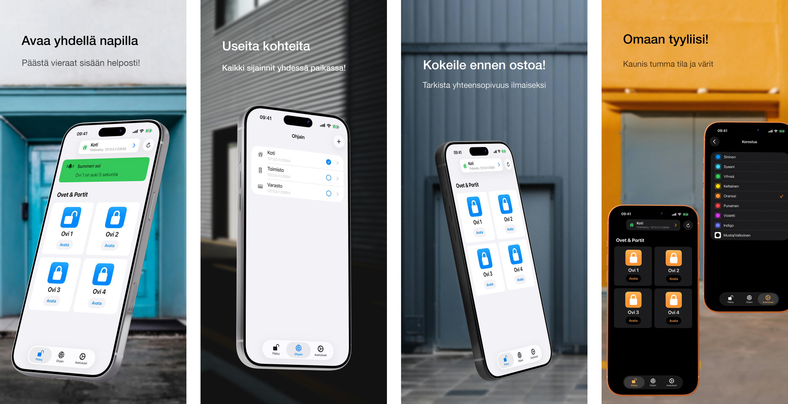

<h1>GateTap</h1>

---

🌍 **Tämä asiakirja on saatavilla muilla kielillä:**  
[🇺🇸 English](../README.md) | [🇩🇪 Deutsch](README.de.md) | [🇸🇦 العربية](README.ar.md) | [🇪🇸 Català](README.ca.md) | [🇨🇿 Čeština](README.cs.md) | [🇩🇰 Dansk](README.da.md) | [🇬🇷 Ελληνικά](README.el.md) | [🇪🇸 Español](README.es.md) | [🇲🇽 Español (México)](README.es-MX.md) | 🇫🇮 Suomi | [🇫🇷 Français](README.fr.md) | [🇮🇱 עברית](README.he.md) | [🇮🇳 हिन्दी](README.hi.md) | [🇭🇷 Hrvatski](README.hr.md) | [🇭🇺 Magyar](README.hu.md) | [🇮🇩 Bahasa Indonesia](README.id.md) | [🇮🇹 Italiano](README.it.md) | [🇯🇵 日本語](README.ja.md) | [🇰🇷 한국어](README.ko.md) | [🇲🇾 Bahasa Melayu](README.ms.md) | [🇳🇴 Norsk Bokmål](README.nb.md) | [🇳🇱 Nederlands](README.nl.md) | [🇵🇱 Polski](README.pl.md) | [🇧🇷 Português (Brasil)](README.pt-BR.md) | [🇵🇹 Português (Portugal)](README.pt-PT.md) | [🇷🇴 Română](README.ro.md) | [🇷🇺 Русский](README.ru.md) | [🇸🇰 Slovenčina](README.sk.md) | [🇸🇪 Svenska](README.sv.md) | [🇹🇭 ไทย](README.th.md) | [🇹🇷 Türkçe](README.tr.md) | [🇺🇦 Українська](README.uk.md) | [🇻🇳 Tiếng Việt](README.vi.md) | [🇨🇳 简体中文](README.zh-Hans.md) | [🇹🇼 繁體中文](README.zh-Hant.md)

---

_**Moderni iPhone-käyttöliittymä yhteensopiville web-hallittaville kulunvalvontajärjestelmille.**_

Kulunvalvontaohjain on laite, joka ohjaa sähköisesti ovien, porttien, autotallien tai puomien avaamista — esimerkiksi aktivoimalla ovensummerin ovipuhelinjärjestelmän kautta tai ohjaamalla portin moottoria.

Monet nykyaikaiset kulunvalvontajärjestelmät ovat yhteydessä paikallisverkkoon ja niitä voidaan ohjata verkkokäyttöliittymän kautta. Nämä käyttöliittymät ovat kuitenkin usein hitaita, vaikeita ja kömpelöitä käyttää. GateTap korvaa vanhentuneet verkkosivut nopealla, kosketukselle optimoidulla iPhone-kokemuksella.

Paikallisverkkoja varten rakennettu GateTap yhdistää suoraan yhteensopiviin kulunvalvontaohjaimiin — ilman pilvipalveluja, tilauksia tai ulkoisia tilejä.

---

## Ominaisuudet

• ☑️ Moderni porttien ja ovien ohjaus  
• 📱 Intuitiivinen, kosketukselle optimoitu käyttöliittymä  
• ⚡ Nopea kirjautuminen turvallisesti tallennetuilla tunnuksilla tai väliaikaisilla istuntotunnuksilla  
• 🔐 Valinnainen Face ID / Touch ID -suojaus sovellukselle  
• 📡 Suora paikallisverkkoviestintä  
• ☁️ Pilviyhteyttä ei tarvita  
• 🖥️ Suunniteltu sulautetuille web-hallittaville ohjaimille  
• 🏢 Usean ohjaimen / usean kohteen tuki  

---

## Yhteensopivuus

GateTap on suunniteltu tietyille Ethernet- tai Wi‑Fi-yhteydellä varustetuille kulunvalvontaohjaimille, joissa on sisäänrakennettu selainpohjainen hallintakäyttöliittymä.

Yhteensopivat järjestelmät tarjoavat yleensä:
- paikallisen IP-pohjaisen pääsyn
- sisäänrakennetut web-hallintasivut
- selainkirjautumisen
- releen tai kulunvalvonnan ohjauksen verkkokäyttöliittymän kautta

Yhteensopivuus riippuu seuraavista:
- ohjaimen malli
- laiteohjelmiston versio
- verkkokäyttöliittymän rakenne
- verkkoasetukset

### Ei yhteensopiva seuraavien kanssa

GateTap ei yleensä **ole yhteensopiva** seuraavien kanssa:
- vain pilvessä toimivat järjestelmät
- vain Bluetoothia käyttävät järjestelmät
- erilliset IR-kaukosäätimet
- kulunvalvontaohjaimet ilman verkkokäyttöliittymiä
- yleiset lukijat ilman verkkomoduuleja

[Katso tunnettu luettelo yhteensopivista laitteista.](../support/fi/compatibility.fi.md)

---

## Kokeile ennen ostamista

GateTapin voi ladata ja määrittää ilmaiseksi, jotta voit varmistaa yhteensopivuuden järjestelmäsi kanssa ennen ostamista.

Ilmaisversiolla voit:
- yhdistää ohjaimeesi
- tarkistaa kirjautumistiedot
- testata yhteensopivuuden
- esikatsella ohjaimen käyttöliittymää

Kertaluonteinen sovelluksen sisäinen osto avaa:
- porttien ja ovien laukaisun
- ohjaimen täyden käyttötoiminnallisuuden
- usean ohjaimen / usean kohteen tuen
- tulevat lisäominaisuudet

Tilausta ei tarvita.

---

## Määritys

GateTap on tarkoitettu teknisesti kokeneille käyttäjille ja edellyttää manuaalista määritystä.

1. Syötä ohjaimesi paikallinen IP-osoite  
2. Anna kirjautumistietosi  
3. Testaa yhteys  
4. Avaa täysi toiminnallisuus ja aloita järjestelmän ohjaaminen suoraan iPhonella  

Lue koko [määritysopas](../setup-guide/setup-guide.fi.md).

---

## Tuki ja yhteensopivuusapu

Koska kulunvalvontalaitteisto vaihtelee merkittävästi valmistajien ja laiteohjelmistoversioiden välillä, yhteensopivuutta ei voida taata kaikille järjestelmille.

Jos ohjaintasi ei tällä hetkellä tueta, tuki voi silti olla mahdollinen.

Käyttäjät voivat ottaa yhteyttä tukeen ja toimittaa:
- kuvakaappauksia ohjaimen verkkokäyttöliittymästä
- vietyjä HTML-sivuja
- ohjaimen mallitiedot
- laiteohjelmiston tiedot

Kun se on mahdollista, yhteensopivuusparannuksia voidaan kehittää ja testata yhdessä käyttäjien kanssa TestFlight-beta-versioiden kautta.

Huomaa, että tämä prosessi voi olla tekninen ja voi edellyttää aktiivista yhteistyötä testauksen aikana.

---

## Yksityisyys ensin

Tietosi pysyvät laitteellasi.

GateTap ei lähetä:
- tunnistetietoja
- komentoja
- ohjaimen tietoja

ulkoisille palvelimille.

Valinnaisen kaatumisraportoinnin voi poistaa käytöstä milloin tahansa.

Lue koko [tietosuojakäytäntö](../legal/fi/privacy-policy.fi.md) ja [käyttöehdot](../legal/fi/terms-of-use.fi.md).

---

## Yhteystiedot

Tukea, yhteensopivuuskysymyksiä tai palautetta varten:

[erikmartens.developer@gmail.com](mailto:erikmartens.developer@gmail.com)

---

## Vastuuvapauslauseke

GateTap on itsenäinen sovellus, eikä se ole sidoksissa mihinkään kulunvalvontalaitteiston valmistajaan tai näiden hyväksymä.
