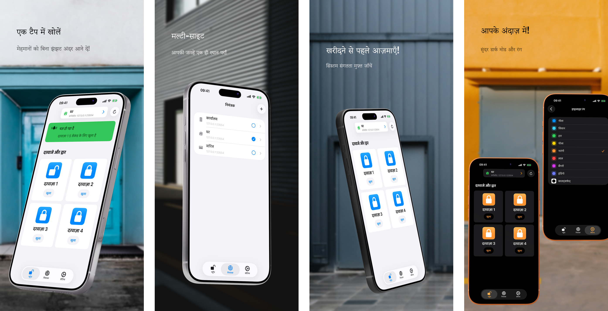

<h1>GateTap</h1>

---

🌍 **यह दस्तावेज़ अन्य भाषाओं में उपलब्ध है:**  
[🇺🇸 English](../README.md) | [🇩🇪 Deutsch](README.de.md) | [🇸🇦 العربية](README.ar.md) | [🇪🇸 Català](README.ca.md) | [🇨🇿 Čeština](README.cs.md) | [🇩🇰 Dansk](README.da.md) | [🇬🇷 Ελληνικά](README.el.md) | [🇪🇸 Español](README.es.md) | [🇲🇽 Español (México)](README.es-MX.md) | [🇫🇮 Suomi](README.fi.md) | [🇫🇷 Français](README.fr.md) | [🇮🇱 עברית](README.he.md) | 🇮🇳 हिन्दी | [🇭🇷 Hrvatski](README.hr.md) | [🇭🇺 Magyar](README.hu.md) | [🇮🇩 Bahasa Indonesia](README.id.md) | [🇮🇹 Italiano](README.it.md) | [🇯🇵 日本語](README.ja.md) | [🇰🇷 한국어](README.ko.md) | [🇲🇾 Bahasa Melayu](README.ms.md) | [🇳🇴 Norsk Bokmål](README.nb.md) | [🇳🇱 Nederlands](README.nl.md) | [🇵🇱 Polski](README.pl.md) | [🇧🇷 Português (Brasil)](README.pt-BR.md) | [🇵🇹 Português (Portugal)](README.pt-PT.md) | [🇷🇴 Română](README.ro.md) | [🇷🇺 Русский](README.ru.md) | [🇸🇰 Slovenčina](README.sk.md) | [🇸🇪 Svenska](README.sv.md) | [🇹🇭 ไทย](README.th.md) | [🇹🇷 Türkçe](README.tr.md) | [🇺🇦 Українська](README.uk.md) | [🇻🇳 Tiếng Việt](README.vi.md) | [🇨🇳 简体中文](README.zh-Hans.md) | [🇹🇼 繁體中文](README.zh-Hant.md)

---

_**संगत वेब-प्रबंधित एक्सेस कंट्रोल सिस्टम के लिए एक आधुनिक iPhone इंटरफ़ेस।**_

एक एक्सेस कंट्रोलर वह उपकरण है जो दरवाज़ों, गेटों, गैरेज या बैरियर के खुलने को इलेक्ट्रॉनिक रूप से नियंत्रित करता है — उदाहरण के लिए आपके इंटरकॉम सिस्टम के माध्यम से डोर बज़र सक्रिय करके या गेट मोटर को नियंत्रित करके।

कई आधुनिक एक्सेस कंट्रोल सिस्टम स्थानीय नेटवर्क से जुड़े होते हैं और उन्हें वेब इंटरफ़ेस के माध्यम से नियंत्रित किया जा सकता है। हालांकि, ये इंटरफ़ेस अक्सर धीमे, कठिन और उपयोग में बोझिल होते हैं। GateTap पुराने वेब पेजों की जगह iPhone के लिए डिज़ाइन किया गया तेज़, टच-अनुकूल अनुभव देता है।

स्थानीय नेटवर्क के लिए बनाया गया GateTap संगत एक्सेस कंट्रोलरों से सीधे जुड़ता है — बिना क्लाउड सेवाओं, सदस्यताओं या बाहरी खातों के।

---

## विशेषताएँ

• ☑️ आधुनिक गेट और दरवाज़ा नियंत्रण  
• 📱 सहज, टच-अनुकूल इंटरफ़ेस  
• ⚡ सुरक्षित रूप से सहेजे गए क्रेडेंशियल या अस्थायी सत्र क्रेडेंशियल के साथ तेज़ लॉगिन  
• 🔐 ऐप के लिए वैकल्पिक Face ID / Touch ID सुरक्षा  
• 📡 स्थानीय नेटवर्क पर सीधा संचार  
• ☁️ क्लाउड कनेक्शन आवश्यक नहीं  
• 🖥️ एम्बेडेड वेब-प्रबंधित कंट्रोलरों के लिए डिज़ाइन किया गया  
• 🏢 कई कंट्रोलर / कई साइट समर्थन  

---

## संगतता

GateTap कुछ Ethernet या Wi‑Fi सक्षम एक्सेस कंट्रोलरों के लिए बनाया गया है जो अंतर्निहित ब्राउज़र-आधारित प्रबंधन इंटरफ़ेस प्रदान करते हैं।

संगत सिस्टम आम तौर पर प्रदान करते हैं:
- स्थानीय IP-आधारित एक्सेस
- अंतर्निहित वेब प्रशासन पेज
- ब्राउज़र लॉगिन सुविधा
- वेब इंटरफ़ेस के माध्यम से रिले या एक्सेस कंट्रोल

संगतता इन पर निर्भर करती है:
- कंट्रोलर मॉडल
- फ़र्मवेयर संस्करण
- वेब इंटरफ़ेस संरचना
- नेटवर्क कॉन्फ़िगरेशन

### इनके साथ संगत नहीं

GateTap सामान्यतः **संगत नहीं** है:
- केवल क्लाउड वाले सिस्टम
- केवल Bluetooth वाले सिस्टम
- स्वतंत्र IR रिमोट
- वेब इंटरफ़ेस के बिना एक्सेस कंट्रोलर
- नेटवर्क मॉड्यूल के बिना सामान्य रीडर

[संगत उपकरणों की ज्ञात सूची देखें।](../support/hi/compatibility.hi.md)

---

## खरीदने से पहले आज़माएँ

GateTap को मुफ्त में डाउनलोड और कॉन्फ़िगर किया जा सकता है ताकि आप खरीदने से पहले अपने सिस्टम के साथ संगतता सत्यापित कर सकें।

मुफ्त संस्करण आपको अनुमति देता है:
- अपने कंट्रोलर से कनेक्ट करने की
- लॉगिन क्रेडेंशियल सत्यापित करने की
- संगतता परीक्षण करने की
- कंट्रोलर इंटरफ़ेस का पूर्वावलोकन करने की

एक बार की इन-ऐप खरीद अनलॉक करती है:
- गेट और दरवाज़ा ट्रिगर करना
- कंट्रोलर का पूर्ण परिचालन उपयोग
- कई कंट्रोलर / कई साइट समर्थन
- भविष्य की उन्नत सुविधाएँ

सदस्यता आवश्यक नहीं।

---

## सेटअप

GateTap तकनीकी रूप से अनुभवी उपयोगकर्ताओं के लिए है और मैन्युअल कॉन्फ़िगरेशन की आवश्यकता होती है।

1. अपने कंट्रोलर का स्थानीय IP पता दर्ज करें  
2. अपने लॉगिन क्रेडेंशियल प्रदान करें  
3. कनेक्शन का परीक्षण करें  
4. पूर्ण कार्यक्षमता अनलॉक करें और अपने iPhone से सीधे सिस्टम नियंत्रित करना शुरू करें  

पूरी [सेटअप गाइड](../setup-guide/setup-guide.hi.md) पढ़ें।

---

## सहायता और संगतता समर्थन

क्योंकि एक्सेस कंट्रोल हार्डवेयर निर्माता और फ़र्मवेयर संस्करणों के अनुसार बहुत भिन्न होता है, सभी सिस्टमों के लिए संगतता की गारंटी नहीं दी जा सकती।

यदि आपका कंट्रोलर वर्तमान में समर्थित नहीं है, तो भी समर्थन संभव हो सकता है।

उपयोगकर्ता सहायता से संपर्क कर सकते हैं और प्रदान कर सकते हैं:
- कंट्रोलर वेब इंटरफ़ेस के स्क्रीनशॉट
- निर्यात किए गए HTML पेज
- कंट्रोलर मॉडल जानकारी
- फ़र्मवेयर विवरण

जहाँ संभव हो, संगतता सुधार TestFlight बीटा बिल्ड के माध्यम से उपयोगकर्ताओं के साथ मिलकर विकसित और परीक्षण किए जा सकते हैं।

कृपया ध्यान दें कि यह प्रक्रिया तकनीकी हो सकती है और परीक्षण के दौरान सक्रिय सहयोग की आवश्यकता हो सकती है।

---

## गोपनीयता पहले

आपका डेटा आपके डिवाइस पर रहता है।

GateTap नहीं भेजता:
- क्रेडेंशियल
- कमांड
- कंट्रोलर डेटा

बाहरी सर्वरों को।

वैकल्पिक क्रैश रिपोर्टिंग को किसी भी समय बंद किया जा सकता है।

पूरी [गोपनीयता नीति](../legal/hi/privacy-policy.hi.md) और [उपयोग की शर्तें](../legal/hi/terms-of-use.hi.md) पढ़ें।

---

## संपर्क

सहायता, संगतता प्रश्नों या प्रतिक्रिया के लिए:

[erikmartens.developer@gmail.com](mailto:erikmartens.developer@gmail.com)

---

## अस्वीकरण

GateTap एक स्वतंत्र ऐप है और किसी भी एक्सेस कंट्रोल हार्डवेयर निर्माता से संबद्ध या समर्थित नहीं है।
