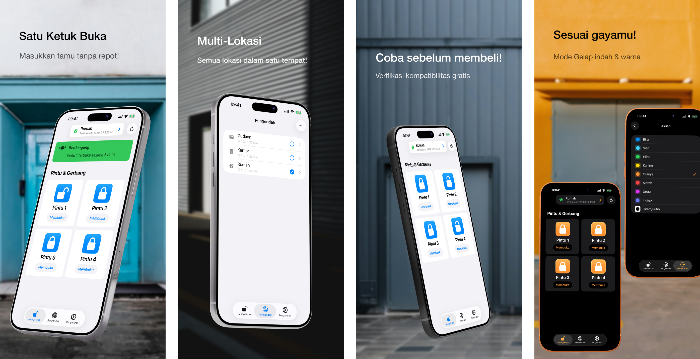

<h1>GateTap</h1>

---

🌍 **Dokumen ini tersedia dalam bahasa lain:**  
[🇺🇸 English](../README.md) | [🇩🇪 Deutsch](README.de.md) | [🇸🇦 العربية](README.ar.md) | [🇪🇸 Català](README.ca.md) | [🇨🇿 Čeština](README.cs.md) | [🇩🇰 Dansk](README.da.md) | [🇬🇷 Ελληνικά](README.el.md) | [🇪🇸 Español](README.es.md) | [🇲🇽 Español (México)](README.es-MX.md) | [🇫🇮 Suomi](README.fi.md) | [🇫🇷 Français](README.fr.md) | [🇮🇱 עברית](README.he.md) | [🇮🇳 हिन्दी](README.hi.md) | [🇭🇷 Hrvatski](README.hr.md) | [🇭🇺 Magyar](README.hu.md) | 🇮🇩 Bahasa Indonesia | [🇮🇹 Italiano](README.it.md) | [🇯🇵 日本語](README.ja.md) | [🇰🇷 한국어](README.ko.md) | [🇲🇾 Bahasa Melayu](README.ms.md) | [🇳🇴 Norsk Bokmål](README.nb.md) | [🇳🇱 Nederlands](README.nl.md) | [🇵🇱 Polski](README.pl.md) | [🇧🇷 Português (Brasil)](README.pt-BR.md) | [🇵🇹 Português (Portugal)](README.pt-PT.md) | [🇷🇴 Română](README.ro.md) | [🇷🇺 Русский](README.ru.md) | [🇸🇰 Slovenčina](README.sk.md) | [🇸🇪 Svenska](README.sv.md) | [🇹🇭 ไทย](README.th.md) | [🇹🇷 Türkçe](README.tr.md) | [🇺🇦 Українська](README.uk.md) | [🇻🇳 Tiếng Việt](README.vi.md) | [🇨🇳 简体中文](README.zh-Hans.md) | [🇹🇼 繁體中文](README.zh-Hant.md)

---

_**Antarmuka iPhone modern untuk sistem kontrol akses kompatibel yang dikelola melalui web.**_

Kontroler akses adalah perangkat yang secara elektronik mengelola pembukaan pintu, gerbang, garasi, atau palang — misalnya dengan mengaktifkan buzzer pintu melalui sistem interkom Anda atau mengendalikan motor gerbang.

Banyak sistem kontrol akses modern terhubung ke jaringan lokal dan dapat dikendalikan melalui antarmuka web. Namun, antarmuka ini sering lambat, sulit, dan merepotkan digunakan. GateTap menggantikan halaman web usang dengan pengalaman cepat yang dioptimalkan untuk sentuhan dan dirancang untuk iPhone.

Dibangun untuk jaringan lokal, GateTap terhubung langsung ke kontroler akses yang kompatibel — tanpa layanan cloud, langganan, atau akun eksternal.

---

## Fitur

• ☑️ Kontrol gerbang & pintu modern  
• 📱 Antarmuka intuitif yang dioptimalkan untuk sentuhan  
• ⚡ Login cepat dengan kredensial yang tersimpan aman atau kredensial sesi sementara  
• 🔐 Perlindungan aplikasi opsional dengan Face ID / Touch ID  
• 📡 Komunikasi jaringan lokal langsung  
• ☁️ Tidak memerlukan koneksi cloud  
• 🖥️ Dirancang untuk kontroler tertanam yang dikelola melalui web  
• 🏢 Dukungan multi-kontroler / multi-lokasi  

---

## Kompatibilitas

GateTap dirancang untuk kontroler akses tertentu yang mendukung Ethernet atau Wi‑Fi dan menyediakan antarmuka manajemen bawaan berbasis browser.

Sistem yang kompatibel biasanya menyediakan:
- akses lokal berbasis IP
- halaman administrasi web bawaan
- fungsi login browser
- kontrol relai atau akses melalui antarmuka web

Kompatibilitas bergantung pada:
- model kontroler
- versi firmware
- struktur antarmuka web
- konfigurasi jaringan

### Tidak kompatibel dengan

GateTap umumnya **tidak kompatibel** dengan:
- sistem khusus cloud
- sistem khusus Bluetooth
- remote IR mandiri
- kontroler akses tanpa antarmuka web
- reader generik tanpa modul jaringan

[Lihat daftar perangkat kompatibel yang diketahui.](../support/id/compatibility.id.md)

---

## Coba sebelum membeli

GateTap dapat diunduh dan dikonfigurasi secara gratis sehingga Anda dapat memverifikasi kompatibilitas dengan sistem Anda sebelum membeli.

Versi gratis memungkinkan Anda untuk:
- terhubung ke kontroler Anda
- memverifikasi kredensial login
- menguji kompatibilitas
- melihat pratinjau antarmuka kontroler

Pembelian dalam aplikasi satu kali membuka:
- pemicu gerbang & pintu
- penggunaan operasional penuh kontroler
- dukungan multi-kontroler / multi-lokasi
- fitur lanjutan di masa depan

Tidak memerlukan langganan.

---

## Pengaturan

GateTap ditujukan untuk pengguna yang berpengalaman secara teknis dan memerlukan konfigurasi manual.

1. Masukkan alamat IP lokal kontroler Anda  
2. Berikan kredensial login Anda  
3. Uji koneksi  
4. Buka fungsionalitas penuh dan mulai kendalikan sistem Anda langsung dari iPhone  

Baca [Panduan Pengaturan](../setup-guide/setup-guide.id.md) lengkap.

---

## Dukungan & Bantuan Kompatibilitas

Karena perangkat keras kontrol akses sangat bervariasi antar produsen dan versi firmware, kompatibilitas tidak dapat dijamin untuk semua sistem.

Jika kontroler Anda saat ini belum didukung, dukungan mungkin masih memungkinkan.

Pengguna dapat menghubungi dukungan dan menyediakan:
- tangkapan layar antarmuka web kontroler
- halaman HTML yang diekspor
- informasi model kontroler
- detail firmware

Jika memungkinkan, peningkatan kompatibilitas dapat dikembangkan dan diuji bersama pengguna melalui build beta TestFlight.

Harap diperhatikan bahwa proses ini dapat bersifat teknis dan mungkin memerlukan kolaborasi aktif selama pengujian.

---

## Privasi Diutamakan

Data Anda tetap berada di perangkat Anda.

GateTap tidak mengirim:
- kredensial
- perintah
- data kontroler

ke server eksternal.

Pelaporan crash opsional dapat dinonaktifkan kapan saja.

Baca [Kebijakan Privasi](../legal/id/privacy-policy.id.md) dan [Ketentuan Penggunaan](../legal/id/terms-of-use.id.md) lengkap.

---

## Kontak

Untuk dukungan, pertanyaan kompatibilitas, atau masukan:

[erikmartens.developer@gmail.com](mailto:erikmartens.developer@gmail.com)

---

## Penafian

GateTap adalah aplikasi independen dan tidak berafiliasi dengan atau didukung oleh produsen perangkat keras kontrol akses mana pun.
