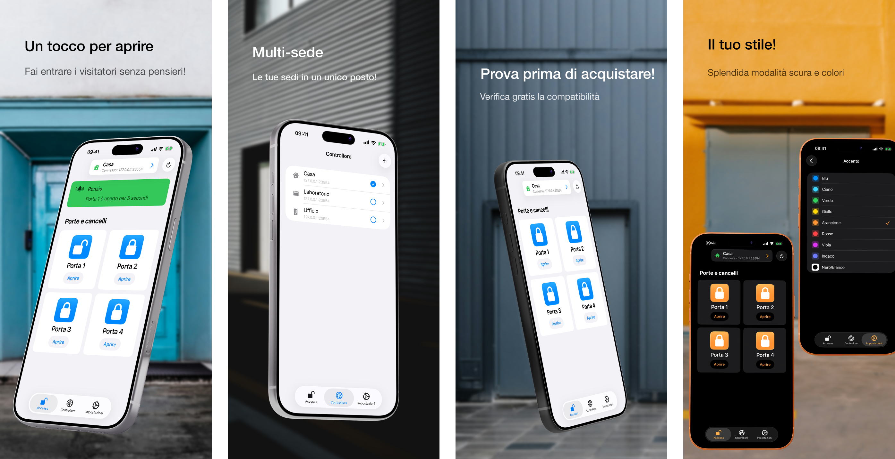

<h1>GateTap</h1>

---

🌍 **Questo documento è disponibile in altre lingue:**  
[🇺🇸 English](../README.md) | [🇩🇪 Deutsch](README.de.md) | [🇸🇦 العربية](README.ar.md) | [🇪🇸 Català](README.ca.md) | [🇨🇿 Čeština](README.cs.md) | [🇩🇰 Dansk](README.da.md) | [🇬🇷 Ελληνικά](README.el.md) | [🇪🇸 Español](README.es.md) | [🇲🇽 Español (México)](README.es-MX.md) | [🇫🇮 Suomi](README.fi.md) | [🇫🇷 Français](README.fr.md) | [🇮🇱 עברית](README.he.md) | [🇮🇳 हिन्दी](README.hi.md) | [🇭🇷 Hrvatski](README.hr.md) | [🇭🇺 Magyar](README.hu.md) | [🇮🇩 Bahasa Indonesia](README.id.md) | 🇮🇹 Italiano | [🇯🇵 日本語](README.ja.md) | [🇰🇷 한국어](README.ko.md) | [🇲🇾 Bahasa Melayu](README.ms.md) | [🇳🇴 Norsk Bokmål](README.nb.md) | [🇳🇱 Nederlands](README.nl.md) | [🇵🇱 Polski](README.pl.md) | [🇧🇷 Português (Brasil)](README.pt-BR.md) | [🇵🇹 Português (Portugal)](README.pt-PT.md) | [🇷🇴 Română](README.ro.md) | [🇷🇺 Русский](README.ru.md) | [🇸🇰 Slovenčina](README.sk.md) | [🇸🇪 Svenska](README.sv.md) | [🇹🇭 ไทย](README.th.md) | [🇹🇷 Türkçe](README.tr.md) | [🇺🇦 Українська](README.uk.md) | [🇻🇳 Tiếng Việt](README.vi.md) | [🇨🇳 简体中文](README.zh-Hans.md) | [🇹🇼 繁體中文](README.zh-Hant.md)

---

_**Un’interfaccia moderna per iPhone per sistemi di controllo accessi compatibili gestiti via web.**_

Un controller di accesso è un dispositivo che gestisce elettronicamente l’apertura di porte, cancelli, garage o barriere — ad esempio attivando un apriporta tramite il sistema citofonico o controllando il motore di un cancello.

Molti sistemi moderni di controllo accessi sono collegati alla rete locale e possono essere controllati tramite un’interfaccia web. Tuttavia, queste interfacce sono spesso lente, difficili e scomode da usare. GateTap sostituisce le pagine web obsolete con un’esperienza rapida, ottimizzata per il tocco e progettata per iPhone.

Creato per le reti locali, GateTap si collega direttamente ai controller di accesso compatibili — senza servizi cloud, abbonamenti o account esterni.

---

## Funzionalità

• ☑️ Controllo moderno di cancelli e porte  
• 📱 Interfaccia intuitiva e ottimizzata per il tocco  
• ⚡ Accesso rapido con credenziali salvate in modo sicuro o credenziali temporanee di sessione  
• 🔐 Protezione opzionale dell’app con Face ID / Touch ID  
• 📡 Comunicazione diretta sulla rete locale  
• ☁️ Nessuna connessione cloud richiesta  
• 🖥️ Progettato per controller integrati gestiti via web  
• 🏢 Supporto multi-controller / multi-sede  

---

## Compatibilità

GateTap è progettato per determinati controller di accesso con Ethernet o Wi‑Fi che forniscono un’interfaccia di gestione integrata basata su browser.

I sistemi compatibili in genere offrono:
- accesso locale basato su IP
- pagine di amministrazione web integrate
- funzionalità di login tramite browser
- controllo relè o accesso tramite l’interfaccia web

La compatibilità dipende da:
- modello del controller
- versione del firmware
- struttura dell’interfaccia web
- configurazione di rete

### Non compatibile con

GateTap generalmente **non è compatibile** con:
- sistemi solo cloud
- sistemi solo Bluetooth
- telecomandi IR autonomi
- controller di accesso senza interfacce web
- lettori generici senza moduli di rete

[Consulta l’elenco noto dei dispositivi compatibili.](../support/it/compatibility.it.md)

---

## Prova prima di acquistare

GateTap può essere scaricato e configurato gratuitamente, così puoi verificare la compatibilità con il tuo sistema prima dell’acquisto.

La versione gratuita ti permette di:
- collegarti al controller
- verificare le credenziali di accesso
- testare la compatibilità
- visualizzare in anteprima l’interfaccia del controller

Un acquisto in-app una tantum sblocca:
- attivazione di cancelli e porte
- utilizzo operativo completo del controller
- supporto multi-controller / multi-sede
- future funzionalità avanzate

Nessun abbonamento richiesto.

---

## Configurazione

GateTap è pensato per utenti con esperienza tecnica e richiede una configurazione manuale.

1. Inserisci l’indirizzo IP locale del controller  
2. Fornisci le tue credenziali di accesso  
3. Testa la connessione  
4. Sblocca tutte le funzionalità e inizia a controllare il sistema direttamente dall’iPhone  

Leggi la [Guida alla configurazione](../setup-guide/setup-guide.it.md) completa.

---

## Supporto e assistenza alla compatibilità

Poiché l’hardware di controllo accessi varia significativamente tra produttori e versioni del firmware, la compatibilità non può essere garantita per tutti i sistemi.

Se il tuo controller non è attualmente supportato, il supporto potrebbe comunque essere possibile.

Gli utenti possono contattare il supporto e fornire:
- schermate dell’interfaccia web del controller
- pagine HTML esportate
- informazioni sul modello del controller
- dettagli del firmware

Quando possibile, i miglioramenti di compatibilità possono essere sviluppati e testati insieme agli utenti tramite build beta TestFlight.

Nota che questo processo può essere tecnico e può richiedere una collaborazione attiva durante i test.

---

## Privacy prima di tutto

I tuoi dati restano sul tuo dispositivo.

GateTap non invia:
- credenziali
- comandi
- dati del controller

a server esterni.

La segnalazione facoltativa degli arresti anomali può essere disattivata in qualsiasi momento.

Leggi l’[Informativa sulla privacy](../legal/it/privacy-policy.it.md) e i [Termini di utilizzo](../legal/it/terms-of-use.it.md) completi.

---

## Contatto

Per supporto, domande sulla compatibilità o feedback:

[erikmartens.developer@gmail.com](mailto:erikmartens.developer@gmail.com)

---

## Disclaimer

GateTap è un’applicazione indipendente e non è affiliata né approvata da alcun produttore di hardware per il controllo accessi.
