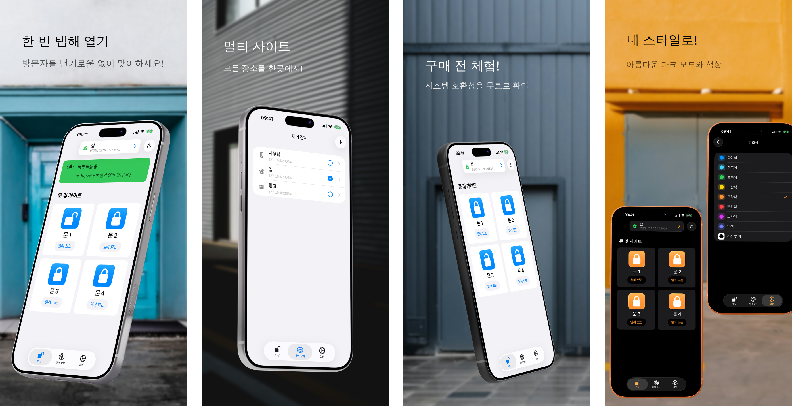

<h1>GateTap</h1>

---

🌍 **이 문서는 다른 언어로도 제공됩니다:**  
[🇺🇸 English](../README.md) | [🇩🇪 Deutsch](README.de.md) | [🇸🇦 العربية](README.ar.md) | [🇪🇸 Català](README.ca.md) | [🇨🇿 Čeština](README.cs.md) | [🇩🇰 Dansk](README.da.md) | [🇬🇷 Ελληνικά](README.el.md) | [🇪🇸 Español](README.es.md) | [🇲🇽 Español (México)](README.es-MX.md) | [🇫🇮 Suomi](README.fi.md) | [🇫🇷 Français](README.fr.md) | [🇮🇱 עברית](README.he.md) | [🇮🇳 हिन्दी](README.hi.md) | [🇭🇷 Hrvatski](README.hr.md) | [🇭🇺 Magyar](README.hu.md) | [🇮🇩 Bahasa Indonesia](README.id.md) | [🇮🇹 Italiano](README.it.md) | [🇯🇵 日本語](README.ja.md) | 🇰🇷 한국어 | [🇲🇾 Bahasa Melayu](README.ms.md) | [🇳🇴 Norsk Bokmål](README.nb.md) | [🇳🇱 Nederlands](README.nl.md) | [🇵🇱 Polski](README.pl.md) | [🇧🇷 Português (Brasil)](README.pt-BR.md) | [🇵🇹 Português (Portugal)](README.pt-PT.md) | [🇷🇴 Română](README.ro.md) | [🇷🇺 Русский](README.ru.md) | [🇸🇰 Slovenčina](README.sk.md) | [🇸🇪 Svenska](README.sv.md) | [🇹🇭 ไทย](README.th.md) | [🇹🇷 Türkçe](README.tr.md) | [🇺🇦 Українська](README.uk.md) | [🇻🇳 Tiếng Việt](README.vi.md) | [🇨🇳 简体中文](README.zh-Hans.md) | [🇹🇼 繁體中文](README.zh-Hant.md)

---

_**호환되는 웹 관리형 출입 제어 시스템을 위한 현대적인 iPhone 인터페이스입니다.**_

출입 컨트롤러는 문, 게이트, 차고 또는 차단기의 개방을 전자적으로 관리하는 장치입니다. 예를 들어 인터폰 시스템을 통해 도어 버저를 작동시키거나 게이트 모터를 제어할 수 있습니다.

많은 최신 출입 제어 시스템은 로컬 네트워크에 연결되어 있으며 웹 인터페이스를 통해 제어할 수 있습니다. 그러나 이러한 인터페이스는 종종 느리고 어렵고 사용하기 번거롭습니다. GateTap은 오래된 웹 페이지를 iPhone용으로 설계된 빠르고 터치 최적화된 경험으로 대체합니다.

로컬 네트워크를 위해 만들어진 GateTap은 호환되는 출입 컨트롤러에 직접 연결됩니다. 클라우드 서비스, 구독 또는 외부 계정이 필요 없습니다.

---

## 기능

• ☑️ 현대적인 게이트 및 도어 제어  
• 📱 직관적이고 터치에 최적화된 인터페이스  
• ⚡ 안전하게 저장된 자격 증명 또는 임시 세션 자격 증명으로 빠른 로그인  
• 🔐 앱을 위한 선택적 Face ID / Touch ID 보호  
• 📡 로컬 네트워크 직접 통신  
• ☁️ 클라우드 연결 불필요  
• 🖥️ 내장형 웹 관리 컨트롤러용으로 설계  
• 🏢 다중 컨트롤러 / 다중 사이트 지원  

---

## 호환성

GateTap은 내장 브라우저 기반 관리 인터페이스를 제공하는 특정 Ethernet 또는 Wi‑Fi 지원 출입 컨트롤러용으로 설계되었습니다.

호환되는 시스템은 일반적으로 다음을 제공합니다:
- 로컬 IP 기반 접근
- 내장 웹 관리 페이지
- 브라우저 로그인 기능
- 웹 인터페이스를 통한 릴레이 또는 출입 제어

호환성은 다음에 따라 달라집니다:
- 컨트롤러 모델
- 펌웨어 버전
- 웹 인터페이스 구조
- 네트워크 구성

### 호환되지 않는 항목

GateTap은 일반적으로 다음과 **호환되지 않습니다**:
- 클라우드 전용 시스템
- Bluetooth 전용 시스템
- 독립형 IR 리모컨
- 웹 인터페이스가 없는 출입 컨트롤러
- 네트워크 모듈이 없는 일반 리더기

[호환되는 기기의 알려진 목록을 확인하세요.](../support/ko/compatibility.ko.md)

---

## 구매 전 사용해 보기

GateTap은 구매 전에 시스템과의 호환성을 확인할 수 있도록 무료로 다운로드하고 구성할 수 있습니다.

무료 버전에서는 다음을 할 수 있습니다:
- 컨트롤러에 연결
- 로그인 자격 증명 확인
- 호환성 테스트
- 컨트롤러 인터페이스 미리 보기

일회성 인앱 구매로 다음을 잠금 해제합니다:
- 게이트 및 도어 작동
- 컨트롤러의 전체 운영 사용
- 다중 컨트롤러 / 다중 사이트 지원
- 향후 고급 기능

구독은 필요하지 않습니다.

---

## 설정

GateTap은 기술 경험이 있는 사용자를 대상으로 하며 수동 구성이 필요합니다.

1. 컨트롤러의 로컬 IP 주소를 입력합니다  
2. 로그인 자격 증명을 제공합니다  
3. 연결을 테스트합니다  
4. 전체 기능을 잠금 해제하고 iPhone에서 직접 시스템 제어를 시작합니다  

전체 [설정 가이드](../setup-guide/setup-guide.ko.md)를 읽어보세요.

---

## 지원 및 호환성 도움

출입 제어 하드웨어는 제조업체와 펌웨어 버전에 따라 크게 다르므로 모든 시스템에 대한 호환성을 보장할 수 없습니다.

현재 컨트롤러가 지원되지 않는 경우에도 지원이 가능할 수 있습니다.

사용자는 지원팀에 문의하고 다음을 제공할 수 있습니다:
- 컨트롤러 웹 인터페이스 스크린샷
- 내보낸 HTML 페이지
- 컨트롤러 모델 정보
- 펌웨어 세부 정보

가능한 경우 TestFlight 베타 빌드를 통해 사용자와 함께 호환성 개선 사항을 개발하고 테스트할 수 있습니다.

이 과정은 기술적일 수 있으며 테스트 중 적극적인 협력이 필요할 수 있습니다.

---

## 개인정보 우선

데이터는 기기에 남아 있습니다.

GateTap은 다음을 외부 서버로 보내지 않습니다:
- 자격 증명
- 명령
- 컨트롤러 데이터

선택적 충돌 보고는 언제든지 비활성화할 수 있습니다.

전체 [개인정보 처리방침](../legal/ko/privacy-policy.ko.md) 및 [이용 약관](../legal/ko/terms-of-use.ko.md)을 읽어보세요.

---

## 연락처

지원, 호환성 질문 또는 피드백:

[erikmartens.developer@gmail.com](mailto:erikmartens.developer@gmail.com)

---

## 고지 사항

GateTap은 독립 애플리케이션이며 어떤 출입 제어 하드웨어 제조업체와도 제휴하거나 보증받지 않았습니다.
