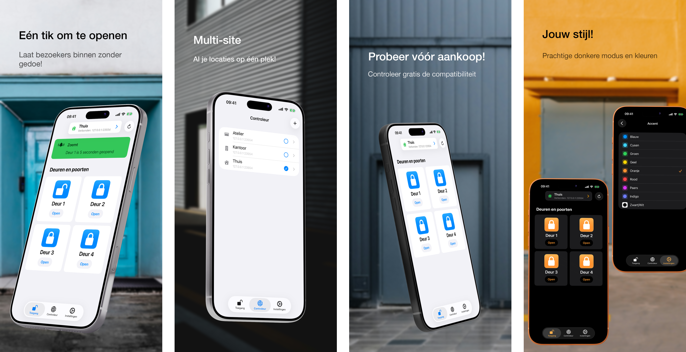

<h1>GateTap</h1>

---

🌍 **Dit document is beschikbaar in andere talen:**  
[🇺🇸 English](../README.md) | [🇩🇪 Deutsch](README.de.md) | [🇸🇦 العربية](README.ar.md) | [🇪🇸 Català](README.ca.md) | [🇨🇿 Čeština](README.cs.md) | [🇩🇰 Dansk](README.da.md) | [🇬🇷 Ελληνικά](README.el.md) | [🇪🇸 Español](README.es.md) | [🇲🇽 Español (México)](README.es-MX.md) | [🇫🇮 Suomi](README.fi.md) | [🇫🇷 Français](README.fr.md) | [🇮🇱 עברית](README.he.md) | [🇮🇳 हिन्दी](README.hi.md) | [🇭🇷 Hrvatski](README.hr.md) | [🇭🇺 Magyar](README.hu.md) | [🇮🇩 Bahasa Indonesia](README.id.md) | [🇮🇹 Italiano](README.it.md) | [🇯🇵 日本語](README.ja.md) | [🇰🇷 한국어](README.ko.md) | [🇲🇾 Bahasa Melayu](README.ms.md) | [🇳🇴 Norsk Bokmål](README.nb.md) | 🇳🇱 Nederlands | [🇵🇱 Polski](README.pl.md) | [🇧🇷 Português (Brasil)](README.pt-BR.md) | [🇵🇹 Português (Portugal)](README.pt-PT.md) | [🇷🇴 Română](README.ro.md) | [🇷🇺 Русский](README.ru.md) | [🇸🇰 Slovenčina](README.sk.md) | [🇸🇪 Svenska](README.sv.md) | [🇹🇭 ไทย](README.th.md) | [🇹🇷 Türkçe](README.tr.md) | [🇺🇦 Українська](README.uk.md) | [🇻🇳 Tiếng Việt](README.vi.md) | [🇨🇳 简体中文](README.zh-Hans.md) | [🇹🇼 繁體中文](README.zh-Hant.md)

---

_**Een moderne iPhone-interface voor compatibele webbeheerde toegangscontrolesystemen.**_

Een toegangscontroller is een apparaat dat het openen van deuren, poorten, garages of slagbomen elektronisch beheert — bijvoorbeeld door een deuropener via je intercomsysteem te activeren of een poortmotor aan te sturen.

Veel moderne toegangscontrolesystemen zijn verbonden met het lokale netwerk en kunnen via een webinterface worden bediend. Deze interfaces zijn echter vaak traag, lastig en omslachtig in gebruik. GateTap vervangt verouderde webpagina’s door een snelle, voor aanraking geoptimaliseerde ervaring die is ontworpen voor iPhone.

GateTap is gebouwd voor lokale netwerken en maakt rechtstreeks verbinding met compatibele toegangscontrollers — zonder clouddiensten, abonnementen of externe accounts.

---

## Functies

• ☑️ Moderne bediening van poorten en deuren  
• 📱 Intuïtieve, voor aanraking geoptimaliseerde interface  
• ⚡ Snel inloggen met veilig opgeslagen aanmeldgegevens of tijdelijke sessiegegevens  
• 🔐 Optionele Face ID / Touch ID-bescherming voor de app  
• 📡 Directe communicatie via het lokale netwerk  
• ☁️ Geen cloudverbinding vereist  
• 🖥️ Ontworpen voor ingebouwde webbeheerde controllers  
• 🏢 Ondersteuning voor meerdere controllers / meerdere locaties  

---

## Compatibiliteit

GateTap is ontworpen voor bepaalde Ethernet- of Wi‑Fi-geschikte toegangscontrollers die een ingebouwde browsergebaseerde beheerinterface bieden.

Compatibele systemen bieden doorgaans:
- lokale IP-gebaseerde toegang
- ingebouwde webbeheerpagina’s
- browserloginfunctionaliteit
- relais- of toegangscontrole via de webinterface

Compatibiliteit hangt af van:
- controllermodel
- firmwareversie
- structuur van de webinterface
- netwerkconfiguratie

### Niet compatibel met

GateTap is over het algemeen **niet compatibel** met:
- systemen die alleen in de cloud werken
- systemen die alleen Bluetooth gebruiken
- zelfstandige IR-afstandsbedieningen
- toegangscontrollers zonder webinterfaces
- generieke lezers zonder netwerkmodules

[Bekijk de bekende lijst met compatibele apparaten.](../support/nl/compatibility.nl.md)

---

## Probeer voordat je koopt

GateTap kan gratis worden gedownload en geconfigureerd, zodat je vóór aankoop de compatibiliteit met je systeem kunt controleren.

Met de gratis versie kun je:
- verbinding maken met je controller
- aanmeldgegevens verifiëren
- compatibiliteit testen
- de controllerinterface bekijken

Een eenmalige in-app aankoop ontgrendelt:
- activering van poorten en deuren
- volledig operationeel gebruik van de controller
- ondersteuning voor meerdere controllers / meerdere locaties
- toekomstige geavanceerde functies

Geen abonnement vereist.

---

## Instellen

GateTap is bedoeld voor technisch ervaren gebruikers en vereist handmatige configuratie.

1. Voer het lokale IP-adres van je controller in  
2. Geef je aanmeldgegevens op  
3. Test de verbinding  
4. Ontgrendel de volledige functionaliteit en begin je systeem rechtstreeks vanaf je iPhone te bedienen  

Lees de volledige [installatiehandleiding](../setup-guide/setup-guide.nl.md).

---

## Ondersteuning en compatibiliteitshulp

Omdat toegangscontrolehardware sterk verschilt per fabrikant en firmwareversie, kan compatibiliteit niet voor alle systemen worden gegarandeerd.

Als je controller momenteel niet wordt ondersteund, kan ondersteuning mogelijk toch worden toegevoegd.

Gebruikers kunnen contact opnemen met ondersteuning en het volgende aanleveren:
- schermafbeeldingen van de webinterface van de controller
- geëxporteerde HTML-pagina’s
- informatie over het controllermodel
- firmwaredetails

Waar mogelijk kunnen compatibiliteitsverbeteringen samen met gebruikers worden ontwikkeld en getest via TestFlight-bètaversies.

Houd er rekening mee dat dit proces technisch kan zijn en actieve samenwerking tijdens het testen kan vereisen.

---

## Privacy eerst

Je gegevens blijven op je apparaat.

GateTap verzendt geen:
- aanmeldgegevens
- opdrachten
- controllergegevens

naar externe servers.

Optionele crashrapportage kan op elk moment worden uitgeschakeld.

Lees het volledige [privacybeleid](../legal/nl/privacy-policy.nl.md) en de [gebruiksvoorwaarden](../legal/nl/terms-of-use.nl.md).

---

## Contact

Voor ondersteuning, compatibiliteitsvragen of feedback:

[erikmartens.developer@gmail.com](mailto:erikmartens.developer@gmail.com)

---

## Disclaimer

GateTap is een onafhankelijke app en is niet gelieerd aan of goedgekeurd door enige fabrikant van toegangscontrolehardware.
