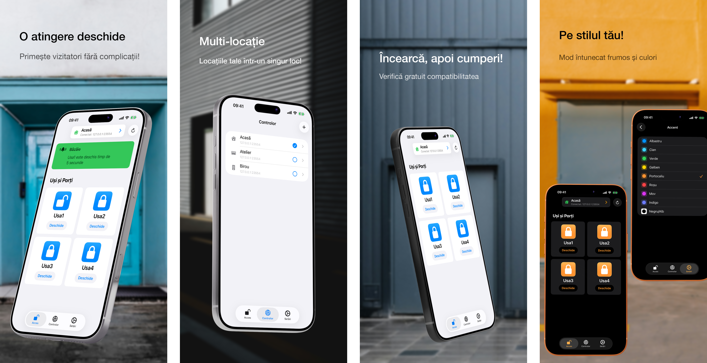

<h1>GateTap</h1>

---

🌍 **Acest document este disponibil în alte limbi:**  
[🇺🇸 English](../README.md) | [🇩🇪 Deutsch](README.de.md) | [🇸🇦 العربية](README.ar.md) | [🇪🇸 Català](README.ca.md) | [🇨🇿 Čeština](README.cs.md) | [🇩🇰 Dansk](README.da.md) | [🇬🇷 Ελληνικά](README.el.md) | [🇪🇸 Español](README.es.md) | [🇲🇽 Español (México)](README.es-MX.md) | [🇫🇮 Suomi](README.fi.md) | [🇫🇷 Français](README.fr.md) | [🇮🇱 עברית](README.he.md) | [🇮🇳 हिन्दी](README.hi.md) | [🇭🇷 Hrvatski](README.hr.md) | [🇭🇺 Magyar](README.hu.md) | [🇮🇩 Bahasa Indonesia](README.id.md) | [🇮🇹 Italiano](README.it.md) | [🇯🇵 日本語](README.ja.md) | [🇰🇷 한국어](README.ko.md) | [🇲🇾 Bahasa Melayu](README.ms.md) | [🇳🇴 Norsk Bokmål](README.nb.md) | [🇳🇱 Nederlands](README.nl.md) | [🇵🇱 Polski](README.pl.md) | [🇧🇷 Português (Brasil)](README.pt-BR.md) | [🇵🇹 Português (Portugal)](README.pt-PT.md) | 🇷🇴 Română | [🇷🇺 Русский](README.ru.md) | [🇸🇰 Slovenčina](README.sk.md) | [🇸🇪 Svenska](README.sv.md) | [🇹🇭 ไทย](README.th.md) | [🇹🇷 Türkçe](README.tr.md) | [🇺🇦 Українська](README.uk.md) | [🇻🇳 Tiếng Việt](README.vi.md) | [🇨🇳 简体中文](README.zh-Hans.md) | [🇹🇼 繁體中文](README.zh-Hant.md)

---

_**O interfață modernă pentru iPhone pentru sisteme compatibile de control al accesului administrate prin web.**_

Un controler de acces este un dispozitiv care gestionează electronic deschiderea ușilor, porților, garajelor sau barierelor — de exemplu activând un zăvor electric prin sistemul de interfon sau controlând motorul unei porți.

Multe sisteme moderne de control al accesului sunt conectate la rețeaua locală și pot fi controlate printr-o interfață web. Totuși, aceste interfețe sunt adesea lente, dificile și greoaie de folosit. GateTap înlocuiește paginile web învechite cu o experiență rapidă, optimizată pentru atingere și proiectată pentru iPhone.

Creat pentru rețele locale, GateTap se conectează direct la controlere de acces compatibile — fără servicii cloud, abonamente sau conturi externe.

---

## Funcționalități

• ☑️ Control modern pentru porți și uși  
• 📱 Interfață intuitivă, optimizată pentru atingere  
• ⚡ Autentificare rapidă cu credențiale stocate în siguranță sau credențiale temporare de sesiune  
• 🔐 Protecție opțională a aplicației cu Face ID / Touch ID  
• 📡 Comunicare directă în rețeaua locală  
• ☁️ Nu este necesară conexiune cloud  
• 🖥️ Conceput pentru controlere integrate administrate prin web  
• 🏢 Suport pentru mai multe controlere / mai multe locații  

---

## Compatibilitate

GateTap este proiectat pentru anumite controlere de acces cu Ethernet sau Wi‑Fi care oferă o interfață de administrare integrată bazată pe browser.

Sistemele compatibile oferă de obicei:
- acces local bazat pe IP
- pagini web integrate de administrare
- funcționalitate de autentificare în browser
- control releu sau acces prin interfața web

Compatibilitatea depinde de:
- modelul controlerului
- versiunea firmware
- structura interfeței web
- configurarea rețelei

### Nu este compatibil cu

GateTap în general **nu este compatibil** cu:
- sisteme exclusiv cloud
- sisteme exclusiv Bluetooth
- telecomenzi IR independente
- controlere de acces fără interfețe web
- cititoare generice fără module de rețea

[Vezi lista cunoscută a dispozitivelor compatibile.](../support/ro/compatibility.ro.md)

---

## Încearcă înainte de achiziție

GateTap poate fi descărcat și configurat gratuit, astfel încât să poți verifica compatibilitatea cu sistemul tău înainte de cumpărare.

Versiunea gratuită îți permite să:
- te conectezi la controler
- verifici credențialele de autentificare
- testezi compatibilitatea
- previzualizezi interfața controlerului

O achiziție unică în aplicație deblochează:
- declanșarea porților și ușilor
- utilizarea operațională completă a controlerului
- suport pentru mai multe controlere / mai multe locații
- funcționalități avansate viitoare

Nu necesită abonament.

---

## Configurare

GateTap este destinat utilizatorilor cu experiență tehnică și necesită configurare manuală.

1. Introdu adresa IP locală a controlerului  
2. Furnizează credențialele de autentificare  
3. Testează conexiunea  
4. Deblochează funcționalitatea completă și începe să controlezi sistemul direct de pe iPhone  

Citește [Ghidul de configurare](../setup-guide/setup-guide.ro.md) complet.

---

## Suport și asistență pentru compatibilitate

Deoarece hardware-ul de control al accesului variază semnificativ între producători și versiuni de firmware, compatibilitatea nu poate fi garantată pentru toate sistemele.

Dacă controlerul tău nu este acceptat în prezent, suportul poate fi totuși posibil.

Utilizatorii pot contacta suportul și furniza:
- capturi de ecran ale interfeței web a controlerului
- pagini HTML exportate
- informații despre modelul controlerului
- detalii firmware

Când este fezabil, îmbunătățirile de compatibilitate pot fi dezvoltate și testate împreună cu utilizatorii prin versiuni beta TestFlight.

Reține că acest proces poate fi tehnic și poate necesita colaborare activă în timpul testării.

---

## Confidențialitatea pe primul loc

Datele tale rămân pe dispozitivul tău.

GateTap nu trimite:
- credențiale
- comenzi
- date ale controlerului

către servere externe.

Raportarea opțională a blocărilor poate fi dezactivată oricând.

Citește [Politica de confidențialitate](../legal/ro/privacy-policy.ro.md) și [Termenii de utilizare](../legal/ro/terms-of-use.ro.md) compleți.

---

## Contact

Pentru suport, întrebări de compatibilitate sau feedback:

[erikmartens.developer@gmail.com](mailto:erikmartens.developer@gmail.com)

---

## Declinare de responsabilitate

GateTap este o aplicație independentă și nu este afiliată cu sau susținută de niciun producător de hardware pentru controlul accesului.
