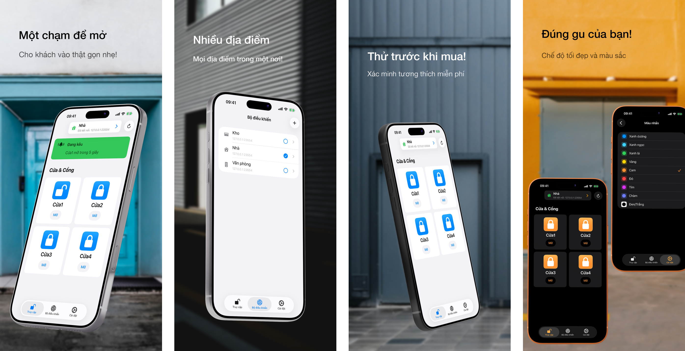

<h1>GateTap</h1>

---

🌍 **Tài liệu này có sẵn bằng các ngôn ngữ khác:**  
[🇺🇸 English](../README.md) | [🇩🇪 Deutsch](README.de.md) | [🇸🇦 العربية](README.ar.md) | [🇪🇸 Català](README.ca.md) | [🇨🇿 Čeština](README.cs.md) | [🇩🇰 Dansk](README.da.md) | [🇬🇷 Ελληνικά](README.el.md) | [🇪🇸 Español](README.es.md) | [🇲🇽 Español (México)](README.es-MX.md) | [🇫🇮 Suomi](README.fi.md) | [🇫🇷 Français](README.fr.md) | [🇮🇱 עברית](README.he.md) | [🇮🇳 हिन्दी](README.hi.md) | [🇭🇷 Hrvatski](README.hr.md) | [🇭🇺 Magyar](README.hu.md) | [🇮🇩 Bahasa Indonesia](README.id.md) | [🇮🇹 Italiano](README.it.md) | [🇯🇵 日本語](README.ja.md) | [🇰🇷 한국어](README.ko.md) | [🇲🇾 Bahasa Melayu](README.ms.md) | [🇳🇴 Norsk Bokmål](README.nb.md) | [🇳🇱 Nederlands](README.nl.md) | [🇵🇱 Polski](README.pl.md) | [🇧🇷 Português (Brasil)](README.pt-BR.md) | [🇵🇹 Português (Portugal)](README.pt-PT.md) | [🇷🇴 Română](README.ro.md) | [🇷🇺 Русский](README.ru.md) | [🇸🇰 Slovenčina](README.sk.md) | [🇸🇪 Svenska](README.sv.md) | [🇹🇭 ไทย](README.th.md) | [🇹🇷 Türkçe](README.tr.md) | [🇺🇦 Українська](README.uk.md) | 🇻🇳 Tiếng Việt | [🇨🇳 简体中文](README.zh-Hans.md) | [🇹🇼 繁體中文](README.zh-Hant.md)

---

_**Giao diện iPhone hiện đại cho các hệ thống kiểm soát ra vào tương thích được quản lý qua web.**_

Bộ điều khiển ra vào là thiết bị quản lý điện tử việc mở cửa, cổng, gara hoặc rào chắn — ví dụ bằng cách kích hoạt chuông mở cửa qua hệ thống liên lạc nội bộ hoặc điều khiển động cơ cổng.

Nhiều hệ thống kiểm soát ra vào hiện đại được kết nối với mạng cục bộ và có thể được điều khiển qua giao diện web. Tuy nhiên, các giao diện này thường chậm, khó dùng và rườm rà. GateTap thay thế các trang web lỗi thời bằng trải nghiệm nhanh, tối ưu cho cảm ứng và được thiết kế cho iPhone.

Được xây dựng cho mạng cục bộ, GateTap kết nối trực tiếp với các bộ điều khiển ra vào tương thích — không cần dịch vụ đám mây, gói đăng ký hoặc tài khoản bên ngoài.

---

## Tính năng

• ☑️ Điều khiển cổng & cửa hiện đại  
• 📱 Giao diện trực quan, tối ưu cho cảm ứng  
• ⚡ Đăng nhập nhanh bằng thông tin xác thực được lưu an toàn hoặc thông tin xác thực phiên tạm thời  
• 🔐 Bảo vệ ứng dụng tùy chọn bằng Face ID / Touch ID  
• 📡 Giao tiếp trực tiếp trong mạng cục bộ  
• ☁️ Không cần kết nối đám mây  
• 🖥️ Được thiết kế cho bộ điều khiển nhúng quản lý qua web  
• 🏢 Hỗ trợ nhiều bộ điều khiển / nhiều địa điểm  

---

## Khả năng tương thích

GateTap được thiết kế cho một số bộ điều khiển ra vào có Ethernet hoặc Wi‑Fi cung cấp giao diện quản lý tích hợp dựa trên trình duyệt.

Các hệ thống tương thích thường cung cấp:
- truy cập cục bộ dựa trên IP
- trang quản trị web tích hợp
- chức năng đăng nhập bằng trình duyệt
- điều khiển rơ-le hoặc ra vào qua giao diện web

Khả năng tương thích phụ thuộc vào:
- model bộ điều khiển
- phiên bản firmware
- cấu trúc giao diện web
- cấu hình mạng

### Không tương thích với

GateTap nhìn chung **không tương thích** với:
- hệ thống chỉ dùng đám mây
- hệ thống chỉ dùng Bluetooth
- điều khiển IR độc lập
- bộ điều khiển ra vào không có giao diện web
- đầu đọc chung không có mô-đun mạng

[Xem danh sách thiết bị tương thích đã biết.](../support/vi/compatibility.vi.md)

---

## Dùng thử trước khi mua

GateTap có thể được tải xuống và cấu hình miễn phí để bạn xác minh khả năng tương thích với hệ thống của mình trước khi mua.

Phiên bản miễn phí cho phép bạn:
- kết nối với bộ điều khiển
- xác minh thông tin đăng nhập
- kiểm tra khả năng tương thích
- xem trước giao diện bộ điều khiển

Một lần mua trong ứng dụng sẽ mở khóa:
- kích hoạt cổng & cửa
- sử dụng đầy đủ bộ điều khiển trong vận hành
- hỗ trợ nhiều bộ điều khiển / nhiều địa điểm
- các tính năng nâng cao trong tương lai

Không cần đăng ký.

---

## Thiết lập

GateTap dành cho người dùng có kinh nghiệm kỹ thuật và yêu cầu cấu hình thủ công.

1. Nhập địa chỉ IP cục bộ của bộ điều khiển  
2. Cung cấp thông tin đăng nhập của bạn  
3. Kiểm tra kết nối  
4. Mở khóa đầy đủ chức năng và bắt đầu điều khiển hệ thống trực tiếp từ iPhone  

Đọc đầy đủ [Hướng dẫn thiết lập](../setup-guide/setup-guide.vi.md).

---

## Hỗ trợ & trợ giúp tương thích

Do phần cứng kiểm soát ra vào khác nhau đáng kể giữa các nhà sản xuất và phiên bản firmware, không thể đảm bảo khả năng tương thích cho mọi hệ thống.

Nếu bộ điều khiển của bạn hiện chưa được hỗ trợ, việc hỗ trợ vẫn có thể thực hiện được.

Người dùng có thể liên hệ bộ phận hỗ trợ và cung cấp:
- ảnh chụp màn hình giao diện web của bộ điều khiển
- các trang HTML đã xuất
- thông tin model bộ điều khiển
- chi tiết firmware

Khi khả thi, các cải tiến tương thích có thể được phát triển và thử nghiệm cùng người dùng thông qua bản beta TestFlight.

Vui lòng lưu ý rằng quy trình này có thể mang tính kỹ thuật và có thể cần sự hợp tác tích cực trong quá trình thử nghiệm.

---

## Quyền riêng tư trước tiên

Dữ liệu của bạn vẫn ở trên thiết bị của bạn.

GateTap không gửi:
- thông tin xác thực
- lệnh
- dữ liệu bộ điều khiển

đến máy chủ bên ngoài.

Có thể tắt báo cáo sự cố tùy chọn bất cứ lúc nào.

Đọc đầy đủ [Chính sách quyền riêng tư](../legal/vi/privacy-policy.vi.md) và [Điều khoản sử dụng](../legal/vi/terms-of-use.vi.md).

---

## Liên hệ

Để được hỗ trợ, hỏi về khả năng tương thích hoặc gửi phản hồi:

[erikmartens.developer@gmail.com](mailto:erikmartens.developer@gmail.com)

---

## Tuyên bố miễn trừ trách nhiệm

GateTap là một ứng dụng độc lập và không liên kết hoặc được chứng thực bởi bất kỳ nhà sản xuất phần cứng kiểm soát ra vào nào.
