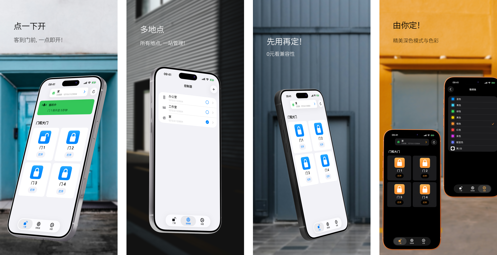

<h1>GateTap</h1>

---

🌍 **本文档也提供其他语言版本:**  
[🇺🇸 English](../README.md) | [🇩🇪 Deutsch](README.de.md) | [🇸🇦 العربية](README.ar.md) | [🇪🇸 Català](README.ca.md) | [🇨🇿 Čeština](README.cs.md) | [🇩🇰 Dansk](README.da.md) | [🇬🇷 Ελληνικά](README.el.md) | [🇪🇸 Español](README.es.md) | [🇲🇽 Español (México)](README.es-MX.md) | [🇫🇮 Suomi](README.fi.md) | [🇫🇷 Français](README.fr.md) | [🇮🇱 עברית](README.he.md) | [🇮🇳 हिन्दी](README.hi.md) | [🇭🇷 Hrvatski](README.hr.md) | [🇭🇺 Magyar](README.hu.md) | [🇮🇩 Bahasa Indonesia](README.id.md) | [🇮🇹 Italiano](README.it.md) | [🇯🇵 日本語](README.ja.md) | [🇰🇷 한국어](README.ko.md) | [🇲🇾 Bahasa Melayu](README.ms.md) | [🇳🇴 Norsk Bokmål](README.nb.md) | [🇳🇱 Nederlands](README.nl.md) | [🇵🇱 Polski](README.pl.md) | [🇧🇷 Português (Brasil)](README.pt-BR.md) | [🇵🇹 Português (Portugal)](README.pt-PT.md) | [🇷🇴 Română](README.ro.md) | [🇷🇺 Русский](README.ru.md) | [🇸🇰 Slovenčina](README.sk.md) | [🇸🇪 Svenska](README.sv.md) | [🇹🇭 ไทย](README.th.md) | [🇹🇷 Türkçe](README.tr.md) | [🇺🇦 Українська](README.uk.md) | [🇻🇳 Tiếng Việt](README.vi.md) | 🇨🇳 简体中文 | [🇹🇼 繁體中文](README.zh-Hant.md)

---

_**面向兼容的 Web 管理型门禁系统的现代 iPhone 界面。**_

门禁控制器是一种以电子方式管理门、闸门、车库门或道闸开启的设备，例如通过对讲系统触发门铃开关，或控制闸门电机。

许多现代门禁系统连接到本地网络，并可通过 Web 界面控制。不过，这些界面往往速度慢、难用且操作繁琐。GateTap 用为 iPhone 设计的快速、触控优化体验取代过时的网页。

GateTap 专为本地网络打造，可直接连接兼容的门禁控制器，无需云服务、订阅或外部账户。

---

## 功能

• ☑️ 现代化闸门与门控制  
• 📱 直观、触控优化的界面  
• ⚡ 使用安全保存的凭据或临时会话凭据快速登录  
• 🔐 可选的 Face ID / Touch ID 应用保护  
• 📡 直接本地网络通信  
• ☁️ 无需云连接  
• 🖥️ 专为嵌入式 Web 管理控制器设计  
• 🏢 支持多控制器 / 多站点  

---

## 兼容性

GateTap 面向某些支持 Ethernet 或 Wi‑Fi、并提供内置浏览器管理界面的门禁控制器设计。

兼容系统通常提供：
- 基于本地 IP 的访问
- 内置 Web 管理页面
- 浏览器登录功能
- 通过 Web 界面进行继电器或门禁控制

兼容性取决于：
- 控制器型号
- 固件版本
- Web 界面结构
- 网络配置

### 不兼容

GateTap 通常**不兼容**以下系统：
- 仅云端系统
- 仅 Bluetooth 系统
- 独立 IR 遥控器
- 没有 Web 界面的门禁控制器
- 没有网络模块的通用读卡器

[查看已知兼容设备列表。](../support/zh-Hans/compatibility.zh-Hans.md)

---

## 购买前试用

GateTap 可免费下载和配置，让你在购买前验证其与你系统的兼容性。

免费版本允许你：
- 连接到控制器
- 验证登录凭据
- 测试兼容性
- 预览控制器界面

一次性 App 内购买可解锁：
- 闸门与门触发
- 控制器完整运行使用
- 多控制器 / 多站点支持
- 未来高级功能

无需订阅。

---

## 设置

GateTap 面向具有技术经验的用户，需要手动配置。

1. 输入控制器的本地 IP 地址  
2. 提供登录凭据  
3. 测试连接  
4. 解锁完整功能，并开始直接从 iPhone 控制系统  

阅读完整的[设置指南](../setup-guide/setup-guide.zh-Hans.md)。

---

## 支持与兼容性协助

由于门禁硬件在不同制造商和固件版本之间差异很大，因此无法保证与所有系统兼容。

如果你的控制器当前不受支持，仍可能可以提供支持。

用户可以联系支持并提供：
- 控制器 Web 界面截图
- 导出的 HTML 页面
- 控制器型号信息
- 固件详情

在可行时，可以通过 TestFlight 测试版与用户一起开发和测试兼容性改进。

请注意，此过程可能具有技术性，并且可能需要在测试期间积极协作。

---

## 隐私优先

你的数据保留在你的设备上。

GateTap 不会将以下内容发送到外部服务器：
- 凭据
- 命令
- 控制器数据

可随时停用可选的崩溃报告。

阅读完整的[隐私政策](../legal/zh-Hans/privacy-policy.zh-Hans.md)和[使用条款](../legal/zh-Hans/terms-of-use.zh-Hans.md)。

---

## 联系方式

如需支持、兼容性咨询或反馈：

[erikmartens.developer@gmail.com](mailto:erikmartens.developer@gmail.com)

---

## 免责声明

GateTap 是独立应用，与任何门禁硬件制造商均无关联，也未获得其认可。
