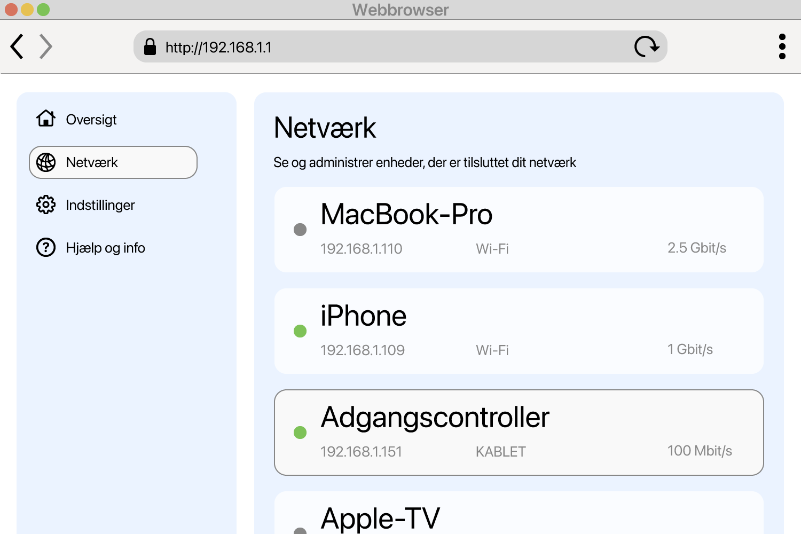

<!--
Generated from GateTap app setup guide JSON.
Do not edit manually.
Version: 1.4
Language: da
-->

# Opsætningsvejledning

---

🌍 **This Document is available in other Languages:**  
[🇺🇸 English](setup-guide.en.md) | [🇩🇪 Deutsch](setup-guide.de.md) | [🇸🇦 العربية](setup-guide.ar.md) | [🇪🇸 Català](setup-guide.ca.md) | [🇨🇿 Čeština](setup-guide.cs.md) | 🇩🇰 Dansk | [🇬🇷 Ελληνικά](setup-guide.el.md) | [🇪🇸 Español](setup-guide.es.md) | [🇲🇽 Español (México)](setup-guide.es-MX.md) | [🇫🇮 Suomi](setup-guide.fi.md) | [🇫🇷 Français](setup-guide.fr.md) | [🇮🇱 עברית](setup-guide.he.md) | [🇮🇳 हिन्दी](setup-guide.hi.md) | [🇭🇷 Hrvatski](setup-guide.hr.md) | [🇭🇺 Magyar](setup-guide.hu.md) | [🇮🇩 Bahasa Indonesia](setup-guide.id.md) | [🇮🇹 Italiano](setup-guide.it.md) | [🇯🇵 日本語](setup-guide.ja.md) | [🇰🇷 한국어](setup-guide.ko.md) | [🇲🇾 Bahasa Melayu](setup-guide.ms.md) | [🇳🇴 Norsk Bokmål](setup-guide.nb.md) | [🇳🇱 Nederlands](setup-guide.nl.md) | [🇵🇱 Polski](setup-guide.pl.md) | [🇧🇷 Português (Brasil)](setup-guide.pt-BR.md) | [🇵🇹 Português (Portugal)](setup-guide.pt-PT.md) | [🇷🇴 Română](setup-guide.ro.md) | [🇷🇺 Русский](setup-guide.ru.md) | [🇸🇰 Slovenčina](setup-guide.sk.md) | [🇸🇪 Svenska](setup-guide.sv.md) | [🇹🇭 ไทย](setup-guide.th.md) | [🇹🇷 Türkçe](setup-guide.tr.md) | [🇺🇦 Українська](setup-guide.uk.md) | [🇻🇳 Tiếng Việt](setup-guide.vi.md) | [🇨🇳 简体中文](setup-guide.zh-Hans.md) | [🇹🇼 繁體中文](setup-guide.zh-Hant.md)

---

Tilslut GateTap til din adgangscontroller

## Hvad er en adgangscontroller?

En adgangscontroller er en enhed, der styrer åbning af døre, porte, garager eller bomme — for eksempel ved at aktivere en døråbner eller portmotor.
Den modtager normalt åbningssignalet fra:

- et samtaleanlæg
- et tastatur
- en nøglebrik eller adgangskort

Mange moderne adgangskontrolsystemer er tilsluttet det lokale netværk og kan betjenes via en webgrænseflade i en browser. GateTap forbinder direkte til dit adgangskontrolsystem, så du nemt kan betjene det fra din enhed.

## Før du starter

Sørg for, at din enhed er tilsluttet det samme lokale netværk som din adgangscontroller. Sørg for eksempel for, at din iPhone er forbundet til dit Wi-Fi derhjemme og ikke bruger mobildata.

GateTap fungerer udelukkende på dit lokale netværk og skal bruge:

- Controllerens IP-adresse
- Et brugernavn og en adgangskode

## Trin 1: Find adgangscontrollerens IP-adresse

For at forbinde GateTap skal du bruge controllerens IP-adresse og loginoplysninger — se trin 2.

Vælg en af følgende muligheder:

## Mulighed A: Spørg din installatør (anbefales)

Hvis dit system blev installeret af en elektriker eller tekniker, har vedkommende sandsynligvis allerede konfigureret det hele.

I mange tilfælde:

- Bruger controlleren en fast IP-adresse
- Eller routeren tildeler den samme IP via DHCP-reservation

Spørg efter IP-adressen og loginoplysningerne. Det er normalt den nemmeste og hurtigste måde.

## Mulighed B: Tjek din router

For at få adgang til routeren skal du normalt bruge dens lokale adresse, f.eks. `192.168.1.1` eller et navn som `fritz.box`, samt routerens loginoplysninger.

Åbn routerens konfigurationsside, og se efter tilsluttede enheder.

Afsnittet kan hedde:

- Netværk
- Tilsluttede enheder
- LAN
- DHCP-klienter

Se efter:

- Ukendte kablede enheder
- Poster, der kan være din controller

IP-adressen ser normalt sådan ud:
`192.168.x.x` eller `10.0.x.x`

## Mulighed C: Scan dit netværk

Brug en netværksscanner-app på din enhed.

Scan dit netværk, og se efter:

- Ukendte kablede enheder
- Poster, der kan være din controller

IP-adressen ser normalt sådan ud:
`192.168.x.x` eller `10.0.x.x`

## Test IP-adressen

Prøv at åbne den fundne IP-adresse i Safari, f.eks.:

`http://192.168.1.50`

Hvis adgangscontrollerens loginside vises, har du fundet den rigtige adresse.

## Trin 2: Find adgangscontrollerens loginoplysninger

Nogle adgangscontrollere bruger stadig standard-loginoplysninger. Et almindeligt eksempel er brugernavnet `abc` med adgangskoden `654321`.

Andre ofte brugte standardbrugernavne er `user`, `admin` eller `123`. Du kan prøve dem sammen med typiske adgangskoder som `1234`, `user` eller `password` eller en variation af dem.

Hvis dit system blev installeret professionelt, så spørg installatøren, om standardoplysningerne blev ændret.

## Trin 3: Tilføj adgangscontrolleren i GateTap

Åbn GateTap. Hvis siden til tilføjelse af en controller ikke vises automatisk, skal du skifte til fanen "Controller" og trykke på knappen "+" i navigationslinjen øverst til højre.

På den viste side skal du indtaste:

- IP-adressen
- Dit brugernavn
- Din adgangskode

Brug de samme oplysninger som til adgangscontrollerens webinterface.

## Trin 4: Test forbindelsen

Gem konfigurationen. Appen forsøger automatisk at oprette forbindelse.

Hvis forbindelsen ikke kan oprettes, skal du kontrollere:

- At din enhed er på samme netværk som adgangscontrolleren
- At IP-adressen er korrekt
- At adgangscontrolleren er tændt og kan nås

## Trin 5: Hold IP-adressen stabil

For at undgå problemer senere bør controlleren altid bruge den samme IP-adresse.

Det kan gøres ved at:

- Indstille en statisk IP på controlleren
- Oprette en DHCP-reservation i routeren

## Demotilstand

GateTap indeholder også en demotilstand. Du kan starte en virtuel adgangscontroller fra appen, som serverer administrationsgrænsefladen på samme måde som et rigtigt system. Derefter kan du tilføje den som en normal controller med den viste IP-adresse og loginoplysninger.

Det giver dig en kendt fungerende testvej til at udforske GateTaps funktioner, selvom du ikke lige nu har en fysisk adgangscontroller.

## Sikkerhed

Dine data forbliver på din enhed.

Du kan valgfrit beskytte GateTap ved hjælp af Face ID eller Touch ID i appindstillingerne.

