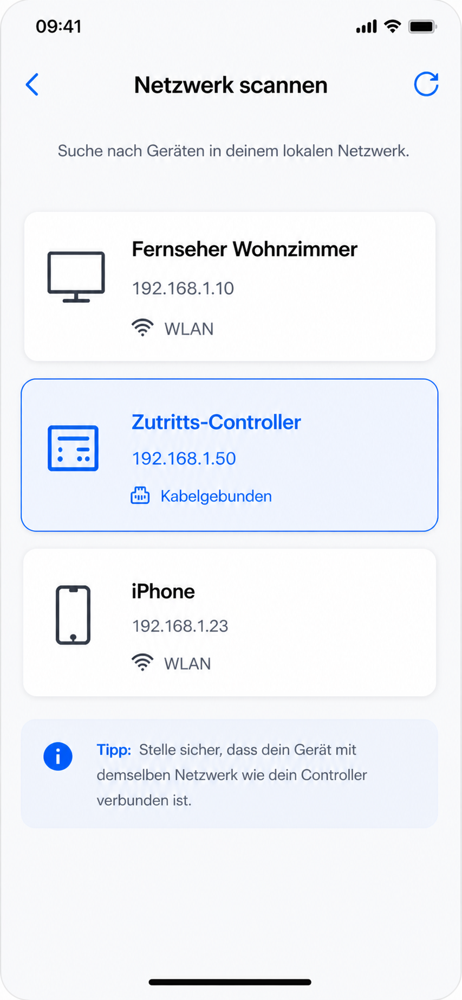

<!--
Generated from GateTap app setup guide JSON.
Do not edit manually.
Version: 1.3
Language: de
-->

# Einrichtungsanleitung

---

🌍 **Dieses Dokument ist in anderen Sprachen verfügbar:**  
[🇺🇸 English](setup-guide.en.md) | 🇩🇪 Deutsch | [🇸🇦 العربية](setup-guide.ar.md) | [🇪🇸 Català](setup-guide.ca.md) | [🇨🇿 Čeština](setup-guide.cs.md) | [🇩🇰 Dansk](setup-guide.da.md) | [🇬🇷 Ελληνικά](setup-guide.el.md) | [🇪🇸 Español](setup-guide.es.md) | [🇲🇽 Español (México)](setup-guide.es-MX.md) | [🇫🇮 Suomi](setup-guide.fi.md) | [🇫🇷 Français](setup-guide.fr.md) | [🇮🇱 עברית](setup-guide.he.md) | [🇮🇳 हिन्दी](setup-guide.hi.md) | [🇭🇷 Hrvatski](setup-guide.hr.md) | [🇭🇺 Magyar](setup-guide.hu.md) | [🇮🇩 Bahasa Indonesia](setup-guide.id.md) | [🇮🇹 Italiano](setup-guide.it.md) | [🇯🇵 日本語](setup-guide.ja.md) | [🇰🇷 한국어](setup-guide.ko.md) | [🇲🇾 Bahasa Melayu](setup-guide.ms.md) | [🇳🇴 Norsk Bokmål](setup-guide.nb.md) | [🇳🇱 Nederlands](setup-guide.nl.md) | [🇵🇱 Polski](setup-guide.pl.md) | [🇧🇷 Português (Brasil)](setup-guide.pt-BR.md) | [🇵🇹 Português (Portugal)](setup-guide.pt-PT.md) | [🇷🇴 Română](setup-guide.ro.md) | [🇷🇺 Русский](setup-guide.ru.md) | [🇸🇰 Slovenčina](setup-guide.sk.md) | [🇸🇪 Svenska](setup-guide.sv.md) | [🇹🇭 ไทย](setup-guide.th.md) | [🇹🇷 Türkçe](setup-guide.tr.md) | [🇺🇦 Українська](setup-guide.uk.md) | [🇻🇳 Tiếng Việt](setup-guide.vi.md) | [🇨🇳 简体中文](setup-guide.zh-Hans.md) | [🇹🇼 繁體中文](setup-guide.zh-Hant.md)

---

GateTap mit deinem Zutrittscontroller verbinden

## Bevor du beginnst

Stelle sicher, dass dein iPhone mit demselben Netzwerk verbunden ist wie dein Zutrittscontroller.

GateTap benötigt:
• Die IP-Adresse des Controllers
• Benutzername und Passwort

## Schritt 1: Adresse und Zugangsdaten finden

Um GateTap zu verbinden, benötigst du die IP-Adresse und die Zugangsdaten des Controllers.

Wähle eine der folgenden Möglichkeiten:

## Option A: Installateur fragen (empfohlen)

Wenn dein System von einem Elektriker oder Techniker eingerichtet wurde, ist der Controller meist bereits konfiguriert.

Oft gilt:
• Feste IP-Adresse ist vergeben
• Oder im Router reserviert

Frage nach der IP-Adresse und den Zugangsdaten. Das ist meist der einfachste Weg.

## Option B: Router prüfen

Öffne die Benutzeroberfläche deines Routers und suche nach verbundenen Geräten.

Um auf den Router zuzugreifen, benötigst du in der Regel dessen lokale Adresse (z. B. `192.168.1.1` oder `fritz.box`) sowie die Zugangsdaten für den Router.

Dieser Bereich kann heißen:
• Verbundene Geräte
• LAN
• DHCP-Clients

Suche nach:
• Unbekannten kabelgebundenen Geräten
• Einträgen, die deinem Controller entsprechen könnten

Die IP-Adresse sieht meist so aus:
`192.168.x.x` oder `10.0.x.x`

## Option C: Netzwerk scannen

Verwende eine Netzwerk-Scanner-App auf deinem iPhone oder Computer.

Scanne dein Netzwerk und öffne gefundene IP-Adressen im Browser, z. B.:

`http://192.168.1.50`

Wenn die Login-Seite erscheint, hast du die richtige Adresse gefunden.

## Schritt 2: Controller in GateTap hinzufügen

Öffne GateTap und gib ein:
• IP-Adresse
• Benutzername
• Passwort

Verwende die gleichen Zugangsdaten wie für die Weboberfläche.

## Schritt 3: Verbindung testen

Speichere die Konfiguration und teste eine Tür oder ein Tor.

Wenn nichts passiert, prüfe:
• iPhone im gleichen Netzwerk
• IP-Adresse korrekt
• Controller eingeschaltet und erreichbar

## Schritt 4: Feste IP-Adresse verwenden

Damit es später keine Probleme gibt, sollte der Controller immer die gleiche IP-Adresse verwenden.

Das erreichst du durch:
• Statische IP im Gerät
• DHCP-Reservierung im Router

## Sicherheit

Deine Daten bleiben auf deinem Gerät.

Optional kannst du GateTap mit Face ID oder Touch ID schützen.

