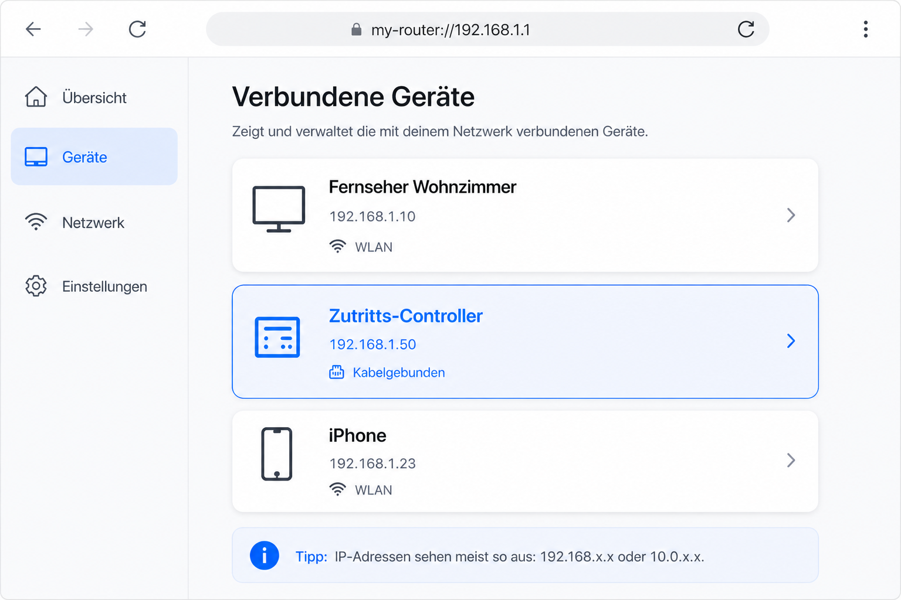

<!--
Generated from GateTap app setup guide JSON.
Do not edit manually.
Version: 1.4
Language: de
-->

# Einrichtungsanleitung

---

🌍 **Dieses Dokument ist in anderen Sprachen verfügbar:**  
[🇺🇸 English](setup-guide.en.md) | 🇩🇪 Deutsch | [🇸🇦 العربية](setup-guide.ar.md) | [🇪🇸 Català](setup-guide.ca.md) | [🇨🇿 Čeština](setup-guide.cs.md) | [🇩🇰 Dansk](setup-guide.da.md) | [🇬🇷 Ελληνικά](setup-guide.el.md) | [🇪🇸 Español](setup-guide.es.md) | [🇲🇽 Español (México)](setup-guide.es-MX.md) | [🇫🇮 Suomi](setup-guide.fi.md) | [🇫🇷 Français](setup-guide.fr.md) | [🇮🇱 עברית](setup-guide.he.md) | [🇮🇳 हिन्दी](setup-guide.hi.md) | [🇭🇷 Hrvatski](setup-guide.hr.md) | [🇭🇺 Magyar](setup-guide.hu.md) | [🇮🇩 Bahasa Indonesia](setup-guide.id.md) | [🇮🇹 Italiano](setup-guide.it.md) | [🇯🇵 日本語](setup-guide.ja.md) | [🇰🇷 한국어](setup-guide.ko.md) | [🇲🇾 Bahasa Melayu](setup-guide.ms.md) | [🇳🇴 Norsk Bokmål](setup-guide.nb.md) | [🇳🇱 Nederlands](setup-guide.nl.md) | [🇵🇱 Polski](setup-guide.pl.md) | [🇧🇷 Português (Brasil)](setup-guide.pt-BR.md) | [🇵🇹 Português (Portugal)](setup-guide.pt-PT.md) | [🇷🇴 Română](setup-guide.ro.md) | [🇷🇺 Русский](setup-guide.ru.md) | [🇸🇰 Slovenčina](setup-guide.sk.md) | [🇸🇪 Svenska](setup-guide.sv.md) | [🇹🇭 ไทย](setup-guide.th.md) | [🇹🇷 Türkçe](setup-guide.tr.md) | [🇺🇦 Українська](setup-guide.uk.md) | [🇻🇳 Tiếng Việt](setup-guide.vi.md) | [🇨🇳 简体中文](setup-guide.zh-Hans.md) | [🇹🇼 繁體中文](setup-guide.zh-Hant.md)

---

GateTap mit deinem Zutritts-Controller verbinden

## Was ist ein Zutritts-Controller?

Ein Zutritts-Controller ist ein Gerät, das das Öffnen von Türen, Toren, Garagen oder Schranken steuert — beispielsweise durch das Aktivieren eines Türsummers oder Torantriebs.
Es erhält das Öffnungssignal meist von:

- einer Gegensprechanlage
- einem Tastenfeld
- einem NFC-Chip
- oder einer Zugangskarte

Viele moderne Zutrittskontrollsysteme sind mit dem lokalen Netzwerk verbunden und können über eine Weboberfläche im Browser bedient werden. GateTap verbindet sich mit deinem Zutritts-Controller, um dein System komfortabel direkt vom iPhone aus zu steuern.

## Bevor du beginnst

Stelle sicher, dass dein Gerät mit demselben Netzwerk verbunden ist wie dein Zutritts-Controller. Achte beispielsweise darauf, dass dein iPhone mit deinem Heim-WLAN verbunden ist und nicht nur mit dem mobilen Datennetz.

GateTap benötigt:

- Die IP-Adresse des Controllers
- Benutzername und Passwort

## Schritt 1: IP-Adresse finden

Um GateTap zu verbinden, benötigst du zunächst die lokale IP-Adresse des Zutritts-Controllers.

Folgende Möglichkeiten gibt es, um sie zu finden:

## Option A: Installateur fragen (empfohlen)

Wenn dein System von einem Elektriker oder Techniker eingerichtet wurde, ist der Zutritts-Controller meist bereits konfiguriert.

Oft gilt:

- Eine feste IP-Adresse ist vergeben
- Oder im Router reserviert

Frage nach der IP-Adresse und den Login-Daten. Das ist meist der einfachste Weg.

## Option B: Router prüfen

Um auf den Router zuzugreifen, benötigst du in der Regel dessen lokale IP-Adresse (z. B. `192.168.1.1`) sowie die Login-Daten für den Router.

Öffne die Benutzeroberfläche deines Routers und suche nach verbundenen Geräten.

Dieser Bereich kann heißen:

- Heimnetzwerk
- Verbundene Geräte
- LAN
- DHCP-Clients

Suche nach:

- Unbekannten kabelgebundenen Geräten
- Einträgen, die deinem Zutritts-Controller entsprechen könnten

Die IP-Adresse sieht meist so aus:
`192.168.x.x` oder `10.0.x.x`

## Option C: Netzwerk scannen

Verwende eine Netzwerk-Scanner-App auf deinem Gerät.

Scanne dein Netzwerk und suche nach:

- Unbekannten kabelgebundenen Geräten
- Einträgen, die deinem Zutritts-Controller entsprechen könnten

Die IP-Adresse sieht meist so aus:
`192.168.x.x` oder `10.0.x.x`

## IP-Adresse testen

Öffne die gefundene IP-Adresse in einem Webbrowser, z. B.:

`http://192.168.1.50`

Wenn die Login-Seite des Zutritts-Controllers erscheint, hast du die richtige IP-Adresse gefunden.

## Schritt 2: Login-Daten finden

Es kann sein, dass auf deinem Zutritts-Controller noch Standard-Login-Daten hinterlegt sind. Ein häufiges Beispiel ist der Benutzername `abc` mit dem Passwort `654321`.

Weitere häufig verwendete Standard-Benutzernamen sind `user`, `admin` oder `123`. Du kannst sie zusammen mit typischen Standard-Passwörtern wie `1234`, `user` oder `password` bzw. einer Abwandlung davon ausprobieren.

Wenn dein System professionell installiert wurde, frage deinen Installateur, ob die Standard-Login-Daten geändert wurden.

## Schritt 3: Zutritts-Controller in GateTap hinzufügen

Öffne GateTap und wechsle in den Reiter "Controller". Tippe in der Navigationsleiste oben rechts auf "+". Gib auf der angezeigten Seite Folgendes ein:

- IP-Adresse
- Benutzername
- Passwort

Verwende die gleichen Login-Daten wie für die Weboberfläche.

## Schritt 4: Verbindung testen

Speichere die Konfiguration. Die App versucht anschließend automatisch, die Verbindung herzustellen.

Wenn die Kommunikation nicht hergestellt werden kann, prüfe:

- Gerät mit der App im gleichen Netzwerk
- IP-Adresse korrekt
- Zutritts-Controller eingeschaltet und erreichbar

## Schritt 5: Feste IP-Adresse verwenden

Damit es später keine Probleme gibt, sollte der Zutritts-Controller immer die gleiche IP-Adresse verwenden.

Das erreichst du durch:

- Eine statische IP-Adresse in den Einstellungen des Zutritts-Controllers festlegen
- Eine DHCP-Reservierung für den Zutritts-Controller in den Router-Einstellungen anlegen

## Demo Modus

GateTap enthält außerdem einen Demo Modus. Du kannst direkt in der App einen virtuellen Zutritts-Controller starten, der wie echte Hardware einen Webzugriff bereitstellt. Anschließend kannst du ihn über die angezeigte IP-Adresse und Login-Daten wie einen normalen Zutritts-Controller speichern und verwenden.

So hast du einen zuverlässig funktionierenden Testweg, um die Funktionen von GateTap zu prüfen — auch wenn du aktuell keinen Zutritts-Controller in deinem Netzwerk betreibst.

## Sicherheit

Deine Daten bleiben auf deinem Gerät.

Optional kannst du GateTap mit Face ID oder Touch ID schützen.

