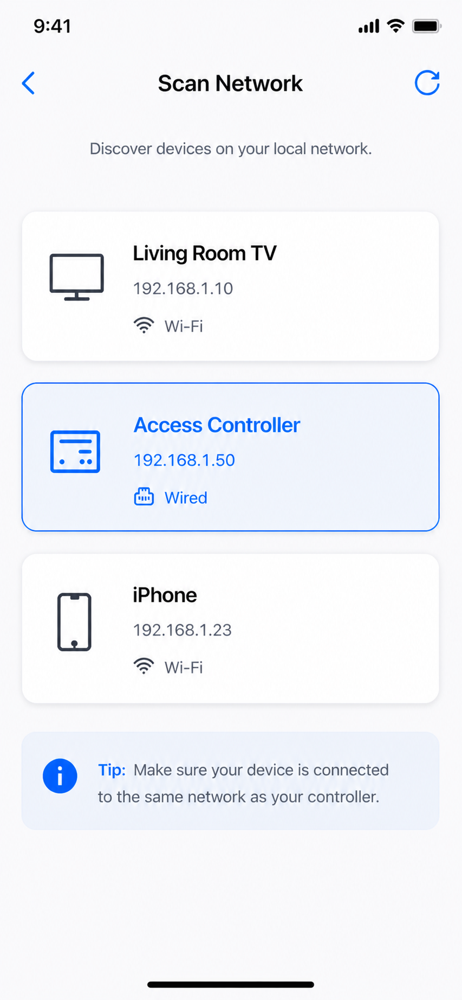

<!--
Generated from GateTap app setup guide JSON.
Do not edit manually.
Version: 1.4
Language: el
-->

# Οδηγός εγκατάστασης

---

🌍 **This Document is available in other Languages:**  
[🇺🇸 English](setup-guide.en.md) | [🇩🇪 Deutsch](setup-guide.de.md) | [🇸🇦 العربية](setup-guide.ar.md) | [🇪🇸 Català](setup-guide.ca.md) | [🇨🇿 Čeština](setup-guide.cs.md) | [🇩🇰 Dansk](setup-guide.da.md) | 🇬🇷 Ελληνικά | [🇪🇸 Español](setup-guide.es.md) | [🇲🇽 Español (México)](setup-guide.es-MX.md) | [🇫🇮 Suomi](setup-guide.fi.md) | [🇫🇷 Français](setup-guide.fr.md) | [🇮🇱 עברית](setup-guide.he.md) | [🇮🇳 हिन्दी](setup-guide.hi.md) | [🇭🇷 Hrvatski](setup-guide.hr.md) | [🇭🇺 Magyar](setup-guide.hu.md) | [🇮🇩 Bahasa Indonesia](setup-guide.id.md) | [🇮🇹 Italiano](setup-guide.it.md) | [🇯🇵 日本語](setup-guide.ja.md) | [🇰🇷 한국어](setup-guide.ko.md) | [🇲🇾 Bahasa Melayu](setup-guide.ms.md) | [🇳🇴 Norsk Bokmål](setup-guide.nb.md) | [🇳🇱 Nederlands](setup-guide.nl.md) | [🇵🇱 Polski](setup-guide.pl.md) | [🇧🇷 Português (Brasil)](setup-guide.pt-BR.md) | [🇵🇹 Português (Portugal)](setup-guide.pt-PT.md) | [🇷🇴 Română](setup-guide.ro.md) | [🇷🇺 Русский](setup-guide.ru.md) | [🇸🇰 Slovenčina](setup-guide.sk.md) | [🇸🇪 Svenska](setup-guide.sv.md) | [🇹🇭 ไทย](setup-guide.th.md) | [🇹🇷 Türkçe](setup-guide.tr.md) | [🇺🇦 Українська](setup-guide.uk.md) | [🇻🇳 Tiếng Việt](setup-guide.vi.md) | [🇨🇳 简体中文](setup-guide.zh-Hans.md) | [🇹🇼 繁體中文](setup-guide.zh-Hant.md)

---

Συνδέστε το GateTap στον ελεγκτή πρόσβασης

## Πριν ξεκινήσετε

Βεβαιωθείτε ότι η συσκευή σας είναι συνδεδεμένη στο ίδιο τοπικό δίκτυο με τον ελεγκτή πρόσβασης. Για παράδειγμα, βεβαιωθείτε ότι το iPhone είναι στο οικιακό Wi-Fi και όχι σε σύνδεση δεδομένων κινητής.

Το GateTap λειτουργεί εξ ολοκλήρου μέσα στο τοπικό σας δίκτυο και χρειάζεται:

- Τη διεύθυνση IP του ελεγκτή
- Όνομα χρήστη και κωδικό πρόσβασης

## Βήμα 1: Βρείτε τη διεύθυνση IP του ελεγκτή πρόσβασης

Για να συνδέσετε το GateTap, χρειάζεστε τη διεύθυνση IP του ελεγκτή και τα στοιχεία σύνδεσης - δείτε το Βήμα 2.

Επιλέξτε μία από τις παρακάτω επιλογές:

## Επιλογή Α: Ρωτήστε τον εγκαταστάτη σας (συνιστάται)

Αν το σύστημά σας εγκαταστάθηκε από ηλεκτρολόγο ή τεχνικό, πιθανότατα έχει ήδη ρυθμίσει τα πάντα.

Σε πολλές περιπτώσεις:

- Ο ελεγκτής χρησιμοποιεί σταθερή διεύθυνση IP
- Ή ο δρομολογητής εκχωρεί την ίδια IP μέσω κράτησης DHCP

Ζητήστε τη διεύθυνση IP και τα στοιχεία σύνδεσης. Συνήθως είναι ο πιο εύκολος και γρήγορος τρόπος.

## Επιλογή Β: Ελέγξτε τον δρομολογητή σας

Ανοίξτε τη σελίδα διαμόρφωσης του δρομολογητή και αναζητήστε τις συνδεδεμένες συσκευές.

Για πρόσβαση στον δρομολογητή, συνήθως χρειάζεστε την τοπική του διεύθυνση, π.χ. `192.168.1.1` ή ένα όνομα όπως `fritz.box`, και τα στοιχεία σύνδεσης του δρομολογητή.

Η ενότητα αυτή μπορεί να ονομάζεται:

- Δίκτυο
- Συνδεδεμένες συσκευές
- LAN
- Πελάτες DHCP

Αναζητήστε:

- Άγνωστες ενσύρματες συσκευές
- Καταχωρίσεις που μπορεί να αντιστοιχούν στον ελεγκτή σας

Η διεύθυνση IP συνήθως μοιάζει με:
`192.168.x.x` ή `10.0.x.x`

## Επιλογή Γ: Σαρώστε το δίκτυό σας

Χρησιμοποιήστε μια εφαρμογή σάρωσης δικτύου στη συσκευή σας.

Σαρώστε το δίκτυό σας και δοκιμάστε να ανοίξετε τις διευθύνσεις IP που βρέθηκαν στο Safari, για παράδειγμα:

`http://192.168.1.50`

Αν εμφανιστεί η σελίδα σύνδεσης του ελεγκτή πρόσβασης, βρήκατε τη σωστή διεύθυνση.

## Βήμα 2: Βρείτε τα στοιχεία σύνδεσης του ελεγκτή πρόσβασης

Ορισμένοι ελεγκτές εξακολουθούν να χρησιμοποιούν προεπιλεγμένα στοιχεία σύνδεσης. Ένα συνηθισμένο παράδειγμα είναι το όνομα χρήστη `abc` με κωδικό πρόσβασης `654321`.

Άλλα συχνά προεπιλεγμένα ονόματα χρήστη είναι `user`, `admin` ή `123`. Μπορείτε να τα δοκιμάσετε με τυπικούς κωδικούς όπως `1234`, `user` ή `password` ή κάποια παραλλαγή τους.

Αν το σύστημά σας εγκαταστάθηκε επαγγελματικά, ρωτήστε τον εγκαταστάτη αν άλλαξαν τα προεπιλεγμένα στοιχεία σύνδεσης.

## Βήμα 3: Προσθέστε τον ελεγκτή πρόσβασης στο GateTap

Ανοίξτε το GateTap και εισαγάγετε:

- Τη διεύθυνση IP
- Το όνομα χρήστη
- Τον κωδικό πρόσβασης

Χρησιμοποιήστε τα ίδια στοιχεία σύνδεσης με αυτά της web διεπαφής του ελεγκτή πρόσβασης.

## Βήμα 4: Δοκιμάστε τη σύνδεση

Αποθηκεύστε τη διαμόρφωση και δοκιμάστε να ανοίξετε μια πόρτα ή μια πύλη.

Αν δεν συμβεί τίποτα, ελέγξτε:

- Ότι η συσκευή σας είναι στο ίδιο δίκτυο με τον ελεγκτή πρόσβασης
- Ότι η διεύθυνση IP είναι σωστή
- Ότι ο ελεγκτής πρόσβασης τροφοδοτείται και είναι προσβάσιμος

## Βήμα 5: Διατηρήστε σταθερή τη διεύθυνση IP

Για να αποφύγετε προβλήματα αργότερα, ο ελεγκτής πρέπει να χρησιμοποιεί πάντα την ίδια διεύθυνση IP.

Αυτό μπορεί να γίνει με:

- Ορισμό στατικής IP στον ελεγκτή
- Δημιουργία κράτησης DHCP στον δρομολογητή

## Λειτουργία επίδειξης

Το GateTap περιλαμβάνει επίσης λειτουργία επίδειξης. Μπορείτε να ξεκινήσετε έναν τοπικό demo web server μέσα από την εφαρμογή και μετά να τον προσθέσετε σαν κανονικό ελεγκτή.

Έτσι έχετε μια γνωστή λειτουργική διαδρομή δοκιμής για να επαληθεύσετε ότι το ίδιο το GateTap λειτουργεί σωστά, ακόμα και αν δεν έχετε αυτή τη στιγμή πρόσβαση σε φυσικό ελεγκτή πρόσβασης.

## Ασφάλεια

Τα δεδομένα σας παραμένουν στη συσκευή σας.

Μπορείτε προαιρετικά να προστατεύσετε το GateTap χρησιμοποιώντας το Face ID ή το Touch ID στις ρυθμίσεις της εφαρμογής.

