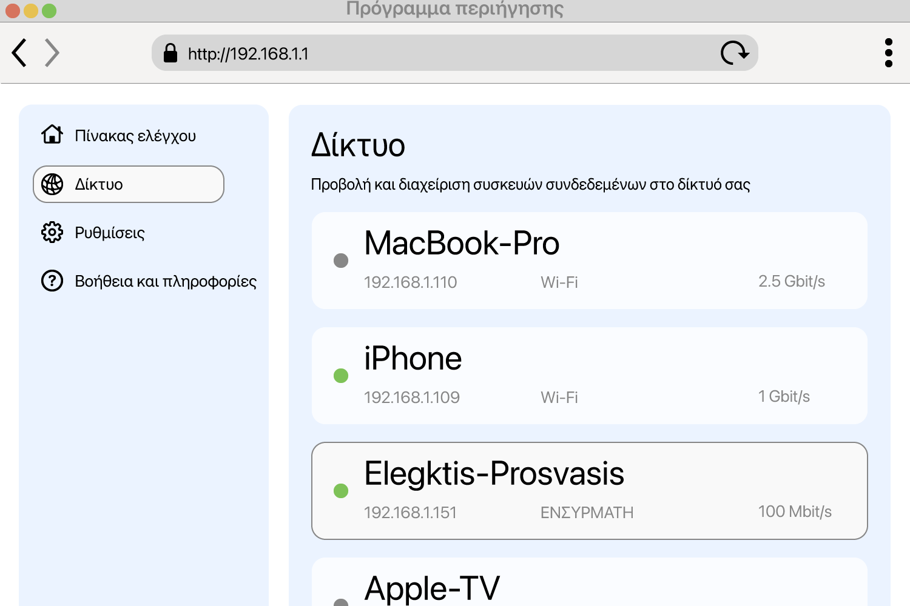

<!--
Generated from GateTap app setup guide JSON.
Do not edit manually.
Version: 1.4
Language: el
-->

# Οδηγός εγκατάστασης

---

🌍 **This Document is available in other Languages:**  
[🇺🇸 English](setup-guide.en.md) | [🇩🇪 Deutsch](setup-guide.de.md) | [🇸🇦 العربية](setup-guide.ar.md) | [🇪🇸 Català](setup-guide.ca.md) | [🇨🇿 Čeština](setup-guide.cs.md) | [🇩🇰 Dansk](setup-guide.da.md) | 🇬🇷 Ελληνικά | [🇪🇸 Español](setup-guide.es.md) | [🇲🇽 Español (México)](setup-guide.es-MX.md) | [🇫🇮 Suomi](setup-guide.fi.md) | [🇫🇷 Français](setup-guide.fr.md) | [🇮🇱 עברית](setup-guide.he.md) | [🇮🇳 हिन्दी](setup-guide.hi.md) | [🇭🇷 Hrvatski](setup-guide.hr.md) | [🇭🇺 Magyar](setup-guide.hu.md) | [🇮🇩 Bahasa Indonesia](setup-guide.id.md) | [🇮🇹 Italiano](setup-guide.it.md) | [🇯🇵 日本語](setup-guide.ja.md) | [🇰🇷 한국어](setup-guide.ko.md) | [🇲🇾 Bahasa Melayu](setup-guide.ms.md) | [🇳🇴 Norsk Bokmål](setup-guide.nb.md) | [🇳🇱 Nederlands](setup-guide.nl.md) | [🇵🇱 Polski](setup-guide.pl.md) | [🇧🇷 Português (Brasil)](setup-guide.pt-BR.md) | [🇵🇹 Português (Portugal)](setup-guide.pt-PT.md) | [🇷🇴 Română](setup-guide.ro.md) | [🇷🇺 Русский](setup-guide.ru.md) | [🇸🇰 Slovenčina](setup-guide.sk.md) | [🇸🇪 Svenska](setup-guide.sv.md) | [🇹🇭 ไทย](setup-guide.th.md) | [🇹🇷 Türkçe](setup-guide.tr.md) | [🇺🇦 Українська](setup-guide.uk.md) | [🇻🇳 Tiếng Việt](setup-guide.vi.md) | [🇨🇳 简体中文](setup-guide.zh-Hans.md) | [🇹🇼 繁體中文](setup-guide.zh-Hant.md)

---

Συνδέστε το GateTap στον ελεγκτή πρόσβασης

## Τι είναι ένας ελεγκτής πρόσβασης?

Ένας ελεγκτής πρόσβασης είναι μια συσκευή που διαχειρίζεται το άνοιγμα θυρών, πυλών, γκαράζ ή μπαρών — για παράδειγμα ενεργοποιώντας το κουδούνι εισόδου ή τον μηχανισμό μιας πύλης.
Συνήθως λαμβάνει το σήμα ανοίγματος από:

- σύστημα θυροτηλεφώνου
- πληκτρολόγιο
- μπρελόκ ή κάρτα πρόσβασης

Πολλά σύγχρονα συστήματα ελέγχου πρόσβασης είναι συνδεδεμένα στο τοπικό δίκτυο και μπορούν να λειτουργήσουν μέσω web interface σε πρόγραμμα περιήγησης. Το GateTap συνδέεται απευθείας με αυτό το σύστημα, ώστε να μπορείτε να το χειρίζεστε εύκολα από τη συσκευή σας.

## Πριν ξεκινήσετε

Βεβαιωθείτε ότι η συσκευή σας είναι συνδεδεμένη στο ίδιο τοπικό δίκτυο με τον ελεγκτή πρόσβασης. Για παράδειγμα, βεβαιωθείτε ότι το iPhone είναι συνδεδεμένο στο οικιακό Wi‑Fi και δεν χρησιμοποιεί δεδομένα κινητής.

Το GateTap λειτουργεί εξ ολοκλήρου μέσα στο τοπικό σας δίκτυο και χρειάζεται:

- Τη διεύθυνση IP του ελεγκτή
- Όνομα χρήστη και κωδικό πρόσβασης

## Βήμα 1: Βρείτε τη διεύθυνση IP του ελεγκτή πρόσβασης

Για να συνδέσετε το GateTap, χρειάζεστε τη διεύθυνση IP του ελεγκτή και τα στοιχεία σύνδεσης — δείτε το Βήμα 2.

Επιλέξτε μία από τις παρακάτω επιλογές:

## Επιλογή Α: Ρωτήστε τον εγκαταστάτη σας (συνιστάται)

Αν το σύστημά σας εγκαταστάθηκε από ηλεκτρολόγο ή τεχνικό, πιθανότατα έχει ήδη ρυθμίσει τα πάντα.

Σε πολλές περιπτώσεις:

- Ο ελεγκτής χρησιμοποιεί σταθερή διεύθυνση IP
- Ή ο δρομολογητής του αποδίδει την ίδια IP μέσω κράτησης DHCP

Ζητήστε τη διεύθυνση IP και τα στοιχεία σύνδεσης. Συνήθως αυτός είναι ο πιο εύκολος και γρήγορος τρόπος.

## Επιλογή Β: Ελέγξτε τον δρομολογητή σας

Για να αποκτήσετε πρόσβαση στον δρομολογητή σας, συνήθως χρειάζεστε την τοπική του διεύθυνση, για παράδειγμα `192.168.1.1` ή ένα όνομα όπως `fritz.box`, καθώς και τα στοιχεία σύνδεσης του δρομολογητή.

Ανοίξτε τη σελίδα ρυθμίσεων του δρομολογητή και αναζητήστε τις συνδεδεμένες συσκευές.

Αυτή η ενότητα μπορεί να ονομάζεται:

- Δίκτυο
- Συνδεδεμένες συσκευές
- LAN
- Πελάτες DHCP

Αναζητήστε:

- Άγνωστες ενσύρματες συσκευές
- Καταχωρίσεις που μπορεί να αντιστοιχούν στον ελεγκτή σας

Η διεύθυνση IP συνήθως μοιάζει με:
`192.168.x.x` ή `10.0.x.x`

## Επιλογή Γ: Σαρώστε το δίκτυό σας

Χρησιμοποιήστε μια εφαρμογή σάρωσης δικτύου στη συσκευή σας.

Σαρώστε το δίκτυό σας και αναζητήστε:

- Άγνωστες ενσύρματες συσκευές
- Καταχωρίσεις που μπορεί να αντιστοιχούν στον ελεγκτή σας

Η διεύθυνση IP συνήθως μοιάζει με:
`192.168.x.x` ή `10.0.x.x`

## Δοκιμάστε τη διεύθυνση IP

Δοκιμάστε να ανοίξετε τη διεύθυνση IP που βρήκατε στο Safari, για παράδειγμα:

`http://192.168.1.50`

Αν εμφανιστεί η σελίδα σύνδεσης του ελεγκτή πρόσβασης, έχετε βρει τη σωστή διεύθυνση.

## Βήμα 2: Βρείτε τα στοιχεία σύνδεσης του ελεγκτή πρόσβασης

Ορισμένοι ελεγκτές πρόσβασης εξακολουθούν να χρησιμοποιούν προεπιλεγμένα στοιχεία σύνδεσης. Ένα συνηθισμένο παράδειγμα είναι το όνομα χρήστη `abc` με κωδικό πρόσβασης `654321`.

Άλλα συνηθισμένα προεπιλεγμένα ονόματα χρήστη είναι `user`, `admin` ή `123`. Μπορείτε να τα δοκιμάσετε με τυπικούς κωδικούς όπως `1234`, `user` ή `password`, ή κάποια παραλλαγή τους.

Αν το σύστημά σας εγκαταστάθηκε επαγγελματικά, ρωτήστε τον εγκαταστάτη αν άλλαξαν τα προεπιλεγμένα στοιχεία σύνδεσης.

## Βήμα 3: Προσθέστε τον ελεγκτή πρόσβασης στο GateTap

Ανοίξτε το GateTap. Αν η σελίδα προσθήκης ελεγκτή δεν εμφανιστεί αυτόματα, μεταβείτε στην καρτέλα "Controller" και πατήστε το κουμπί "+" στη γραμμή πλοήγησης επάνω δεξιά.

Στη σελίδα που εμφανίζεται, εισαγάγετε:

- Τη διεύθυνση IP
- Το όνομα χρήστη
- Τον κωδικό πρόσβασης

Χρησιμοποιήστε τα ίδια στοιχεία σύνδεσης που χρησιμοποιείτε για το web interface του ελεγκτή πρόσβασης.

## Βήμα 4: Δοκιμάστε τη σύνδεση

Αποθηκεύστε τη ρύθμιση. Η εφαρμογή θα προσπαθήσει να συνδεθεί αυτόματα.

Αν δεν μπορεί να δημιουργηθεί σύνδεση, ελέγξτε:

- Ότι η συσκευή σας βρίσκεται στο ίδιο δίκτυο με τον ελεγκτή πρόσβασης
- Ότι η διεύθυνση IP είναι σωστή
- Ότι ο ελεγκτής πρόσβασης τροφοδοτείται και είναι προσβάσιμος

## Βήμα 5: Διατηρήστε σταθερή τη διεύθυνση IP

Για να αποφύγετε μελλοντικά προβλήματα, ο ελεγκτής πρέπει να χρησιμοποιεί πάντα την ίδια διεύθυνση IP.

Αυτό μπορεί να γίνει με:

- Ορισμό στατικής IP στον ελεγκτή
- Δημιουργία κράτησης DHCP στον δρομολογητή σας

## Λειτουργία επίδειξης

Το GateTap περιλαμβάνει επίσης λειτουργία επίδειξης. Μπορείτε να ξεκινήσετε έναν εικονικό ελεγκτή πρόσβασης μέσα από την εφαρμογή, ο οποίος παρέχει το interface διαχείρισης όπως θα το έκανε ένα πραγματικό σύστημα ελέγχου πρόσβασης. Στη συνέχεια μπορείτε να τον προσθέσετε σαν κανονικό ελεγκτή χρησιμοποιώντας τη διεύθυνση IP και τα στοιχεία σύνδεσης που εμφανίζονται.

Έτσι έχετε μια γνωστή, λειτουργική διαδρομή δοκιμής για να εξερευνήσετε τις λειτουργίες του GateTap, ακόμα κι αν δεν διαθέτετε αυτήν τη στιγμή φυσικό ελεγκτή πρόσβασης.

## Ασφάλεια

Τα δεδομένα σας παραμένουν στη συσκευή σας.

Μπορείτε προαιρετικά να προστατεύσετε το GateTap χρησιμοποιώντας το Face ID ή το Touch ID στις ρυθμίσεις της εφαρμογής.

