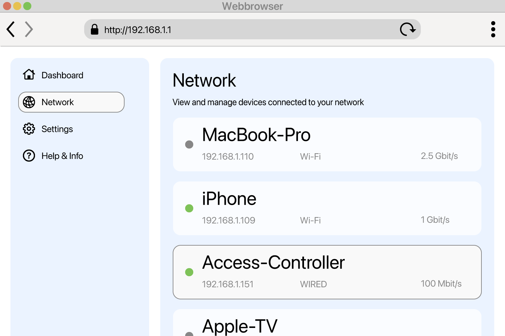

<!--
Generated from GateTap app setup guide JSON.
Do not edit manually.
Version: 1.4
Language: en
-->

# Setup Guide

---

🌍 **This Document is available in other Languages:**  
🇺🇸 English | [🇩🇪 Deutsch](setup-guide.de.md) | [🇸🇦 العربية](setup-guide.ar.md) | [🇪🇸 Català](setup-guide.ca.md) | [🇨🇿 Čeština](setup-guide.cs.md) | [🇩🇰 Dansk](setup-guide.da.md) | [🇬🇷 Ελληνικά](setup-guide.el.md) | [🇪🇸 Español](setup-guide.es.md) | [🇲🇽 Español (México)](setup-guide.es-MX.md) | [🇫🇮 Suomi](setup-guide.fi.md) | [🇫🇷 Français](setup-guide.fr.md) | [🇮🇱 עברית](setup-guide.he.md) | [🇮🇳 हिन्दी](setup-guide.hi.md) | [🇭🇷 Hrvatski](setup-guide.hr.md) | [🇭🇺 Magyar](setup-guide.hu.md) | [🇮🇩 Bahasa Indonesia](setup-guide.id.md) | [🇮🇹 Italiano](setup-guide.it.md) | [🇯🇵 日本語](setup-guide.ja.md) | [🇰🇷 한국어](setup-guide.ko.md) | [🇲🇾 Bahasa Melayu](setup-guide.ms.md) | [🇳🇴 Norsk Bokmål](setup-guide.nb.md) | [🇳🇱 Nederlands](setup-guide.nl.md) | [🇵🇱 Polski](setup-guide.pl.md) | [🇧🇷 Português (Brasil)](setup-guide.pt-BR.md) | [🇵🇹 Português (Portugal)](setup-guide.pt-PT.md) | [🇷🇴 Română](setup-guide.ro.md) | [🇷🇺 Русский](setup-guide.ru.md) | [🇸🇰 Slovenčina](setup-guide.sk.md) | [🇸🇪 Svenska](setup-guide.sv.md) | [🇹🇭 ไทย](setup-guide.th.md) | [🇹🇷 Türkçe](setup-guide.tr.md) | [🇺🇦 Українська](setup-guide.uk.md) | [🇻🇳 Tiếng Việt](setup-guide.vi.md) | [🇨🇳 简体中文](setup-guide.zh-Hans.md) | [🇹🇼 繁體中文](setup-guide.zh-Hant.md)

---

Connect GateTap to your access controller

## What is an access controller?

An access controller is a device that electronically manages the opening of doors, gates, garages, or barriers — for example by activating a door buzzer through your intercom system or controlling a gate motor.
It usually receives the opening signal from:

- an intercom system
- a keypad
- a key fob or access card

Many modern access control systems are connected to the local network and can be operated through a web interface in a browser. GateTap connects directly to your access control system so you can conveniently operate it from your device.

## Before you start

Make sure your device is connected to the same local network as your access controller. For example, ensure your iPhone is connected to your home Wi-Fi and not using a mobile data connection.

GateTap works entirely within your local network and needs:

- The controller’s IP address
- A username and password

## Step 1: Find your access controller's IP address

To connect GateTap, you need the controller’s IP address (and login credentials — see Step 2).

Choose one of the following options:

## Option A: Ask your installer (recommended)

If your system was installed by an electrician or technician, they likely already configured everything.

In many cases:

- The controller uses a fixed IP address
- Or the router assigns the same IP via DHCP reservation

Ask them for the IP address and login details. This is usually the easiest and fastest way.

## Option B: Check your router

To access your router, you usually need its local address (e.g. `192.168.1.1` or a name like `fritz.box`) and the router’s login credentials.

Open your router’s configuration page and look for connected devices.

This section may be called:

- Network
- Connected Devices
- LAN
- DHCP Clients

Look for:

- Unknown wired devices
- Entries that might represent your controller

The IP address will usually look like:
`192.168.x.x` or `10.0.x.x`

## Option C: Scan your network

Use a network scanner app on your device.

Scan your network and look for:

- Unknown wired devices
- Entries that might represent your controller

The IP address will usually look like:
`192.168.x.x` or `10.0.x.x`

## Test the IP address

Try opening the discovered IP address in Safari, for example:

`http://192.168.1.50`

If the access controller’s login page appears, you’ve found the correct address.

## Step 2: Find your access controller's login credentials

Some access controllers still use default login credentials. Common examples include the username `abc` with the password `654321`.

Other commonly used default usernames are `user`, `admin`, or `123`. You can try them together with typical passwords such as `1234`, `user`, or `password`, or a variation thereof.

If your system was installed professionally, ask your installer whether the default credentials were changed.

## Step 3: Add the access controller in GateTap

Open GateTap. If the page for adding a controller does not automatically appear, switch to the "Controller" tab and tap the "+" button in the navigation bar in the top-right corner.

On the page that appears, enter:

- The IP address
- Your username
- Your password

Use the same credentials as for the access controller’s web interface.

## Step 4: Test the connection

Save your configuration. The app will automatically try to connect.

If a connection cannot be established, check:

- Your device is on the same network as the access controller
- The IP address is correct
- The access controller is powered and reachable

## Step 5: Keep the IP address stable

To avoid issues later, the controller should always use the same IP address.

This can be done by:

- Setting a static IP address on the controller
- Creating a DHCP reservation in your router

## Demo mode

GateTap also includes a demo mode. You can start a virtual access controller from within the app, which serves the administration interface that a real access control system would. You can then add it like a normal access controller using the displayed IP address and credentials.

This gives you a known working test path to explore GateTap’s features, even if you do not currently have a physical access controller.

## Security

Your data stays on your device.

You can optionally protect GateTap using Face ID or Touch ID in the app settings.

