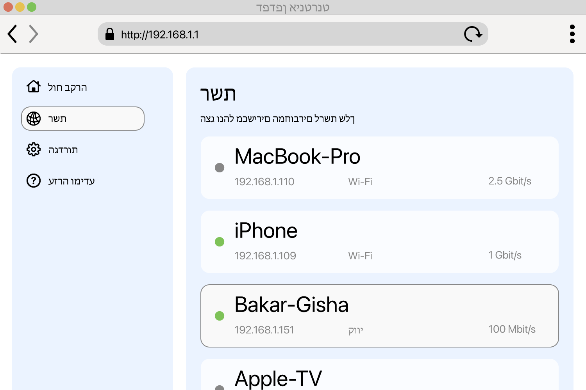

<!--
Generated from GateTap app setup guide JSON.
Do not edit manually.
Version: 1.4
Language: he
-->

# מדריך התקנה

---

🌍 **This Document is available in other Languages:**  
[🇺🇸 English](setup-guide.en.md) | [🇩🇪 Deutsch](setup-guide.de.md) | [🇸🇦 العربية](setup-guide.ar.md) | [🇪🇸 Català](setup-guide.ca.md) | [🇨🇿 Čeština](setup-guide.cs.md) | [🇩🇰 Dansk](setup-guide.da.md) | [🇬🇷 Ελληνικά](setup-guide.el.md) | [🇪🇸 Español](setup-guide.es.md) | [🇲🇽 Español (México)](setup-guide.es-MX.md) | [🇫🇮 Suomi](setup-guide.fi.md) | [🇫🇷 Français](setup-guide.fr.md) | 🇮🇱 עברית | [🇮🇳 हिन्दी](setup-guide.hi.md) | [🇭🇷 Hrvatski](setup-guide.hr.md) | [🇭🇺 Magyar](setup-guide.hu.md) | [🇮🇩 Bahasa Indonesia](setup-guide.id.md) | [🇮🇹 Italiano](setup-guide.it.md) | [🇯🇵 日本語](setup-guide.ja.md) | [🇰🇷 한국어](setup-guide.ko.md) | [🇲🇾 Bahasa Melayu](setup-guide.ms.md) | [🇳🇴 Norsk Bokmål](setup-guide.nb.md) | [🇳🇱 Nederlands](setup-guide.nl.md) | [🇵🇱 Polski](setup-guide.pl.md) | [🇧🇷 Português (Brasil)](setup-guide.pt-BR.md) | [🇵🇹 Português (Portugal)](setup-guide.pt-PT.md) | [🇷🇴 Română](setup-guide.ro.md) | [🇷🇺 Русский](setup-guide.ru.md) | [🇸🇰 Slovenčina](setup-guide.sk.md) | [🇸🇪 Svenska](setup-guide.sv.md) | [🇹🇭 ไทย](setup-guide.th.md) | [🇹🇷 Türkçe](setup-guide.tr.md) | [🇺🇦 Українська](setup-guide.uk.md) | [🇻🇳 Tiếng Việt](setup-guide.vi.md) | [🇨🇳 简体中文](setup-guide.zh-Hans.md) | [🇹🇼 繁體中文](setup-guide.zh-Hant.md)

---

חבר את GateTap לבקר הגישה שלך

## מהו בקר גישה?

בקר גישה הוא התקן שמנהל פתיחה של דלתות, שערים, חניות או מחסומים — למשל על ידי הפעלת זמזם דלת או מנוע שער.
בדרך כלל הוא מקבל את אות הפתיחה מ:

- מערכת אינטרקום
- לוח מקשים
- שלט מפתח או כרטיס גישה

מערכות בקרת גישה מודרניות רבות מחוברות לרשת המקומית וניתנות להפעלה דרך ממשק אינטרנט בדפדפן. GateTap מתחבר ישירות למערכת הזו כדי שתוכלו להפעיל אותה בנוחות מהמכשיר שלכם.

## לפני שמתחילים

ודאו שהמכשיר שלכם מחובר לאותה רשת מקומית כמו בקר הגישה. לדוגמה, ודאו שה-iPhone מחובר ל-Wi‑Fi הביתי ולא משתמש בנתונים סלולריים.

GateTap פועל כולו בתוך הרשת המקומית שלכם וזקוק ל:

- כתובת ה-IP של הבקר
- שם משתמש וסיסמה

## שלב 1: מצא את כתובת ה-IP של בקר הגישה

כדי לחבר את GateTap, דרושים לכם כתובת ה-IP של הבקר ופרטי ההתחברות — ראו שלב 2.

בחרו אחת מהאפשרויות הבאות:

## אפשרות א׳: שאל את המתקין שלך (מומלץ)

אם המערכת הותקנה על ידי חשמלאי או טכנאי, סביר שהוא כבר הגדיר הכול.

במקרים רבים:

- הבקר משתמש בכתובת IP קבועה
- או שהנתב מקצה לו את אותה כתובת IP באמצעות שמירת DHCP

בקשו מהם את כתובת ה-IP ואת פרטי ההתחברות. זו בדרך כלל הדרך הקלה והמהירה ביותר.

## אפשרות ב׳: בדוק את הנתב שלך

כדי לגשת לנתב, בדרך כלל צריך את הכתובת המקומית שלו, למשל `192.168.1.1` או שם כמו `fritz.box`, ואת פרטי ההתחברות של הנתב.

פתחו את דף ההגדרות של הנתב וחפשו התקנים מחוברים.

הסעיף הזה עשוי להיקרא:

- רשת
- התקנים מחוברים
- LAN
- לקוחות DHCP

חפשו:

- התקנים קוויים לא מוכרים
- רשומות שעשויות לייצג את הבקר שלכם

כתובת ה-IP בדרך כלל תיראה כך:
`192.168.x.x` או `10.0.x.x`

## אפשרות ג׳: סרוק את הרשת שלך

השתמשו באפליקציית סריקת רשת במכשיר שלכם.

סרקו את הרשת וחפשו:

- התקנים קוויים לא מוכרים
- רשומות שעשויות לייצג את הבקר שלכם

כתובת ה-IP בדרך כלל תיראה כך:
`192.168.x.x` או `10.0.x.x`

## בדוק את כתובת ה-IP

נסו לפתוח ב-Safari את כתובת ה-IP שנמצאה, לדוגמה:

`http://192.168.1.50`

אם מופיע דף ההתחברות של בקר הגישה, מצאתם את הכתובת הנכונה.

## שלב 2: מצא את פרטי ההתחברות של בקר הגישה

חלק מבקרי הגישה עדיין משתמשים בפרטי התחברות ברירת מחדל. דוגמה נפוצה היא שם המשתמש `abc` עם הסיסמה `654321`.

שמות משתמש נפוצים נוספים כברירת מחדל הם `user`, `admin` או `123`. אפשר לנסות אותם עם סיסמאות טיפוסיות כמו `1234`, `user` או `password`, או וריאציה שלהן.

אם המערכת הותקנה באופן מקצועי, שאלו את המתקין אם פרטי ההתחברות של ברירת המחדל שונו.

## שלב 3: הוסף את בקר הגישה ב-GateTap

פתחו את GateTap. אם הדף להוספת בקר לא מופיע אוטומטית, עברו ללשונית "Controller" והקישו על הכפתור "+" בסרגל הניווט בפינה הימנית העליונה.

בדף שמופיע, הזינו:

- כתובת IP
- שם משתמש
- סיסמה

השתמשו באותם פרטי התחברות שמשמשים לממשק האינטרנט של בקר הגישה.

## שלב 4: בדוק את החיבור

שמרו את ההגדרות. האפליקציה תנסה להתחבר אוטומטית.

אם לא ניתן ליצור חיבור, בדקו:

- שהמכשיר שלכם נמצא באותה רשת כמו בקר הגישה
- שכתובת ה-IP נכונה
- שבקר הגישה מחובר לחשמל ונגיש

## שלב 5: שמור על כתובת IP יציבה

כדי להימנע מבעיות בהמשך, הבקר צריך להשתמש תמיד באותה כתובת IP.

אפשר לעשות זאת על ידי:

- הגדרת IP סטטי בבקר
- יצירת שמירת DHCP בנתב

## מצב הדגמה

GateTap כולל גם מצב הדגמה. אפשר להפעיל מתוך האפליקציה בקר גישה וירטואלי שמגיש את ממשק הניהול כפי שמערכת בקרת גישה אמיתית הייתה עושה. לאחר מכן ניתן להוסיף אותו כמו בקר רגיל באמצעות כתובת ה-IP ופרטי ההתחברות שמוצגים.

כך יש לכם נתיב בדיקה ידוע שעובד כדי להתנסות ביכולות של GateTap, גם אם אין לכם כרגע בקר גישה פיזי.

## אבטחה

הנתונים שלך נשארים במכשיר שלך.

באפשרותך להגן על GateTap באמצעות Face ID או Touch ID בהגדרות האפליקציה.

