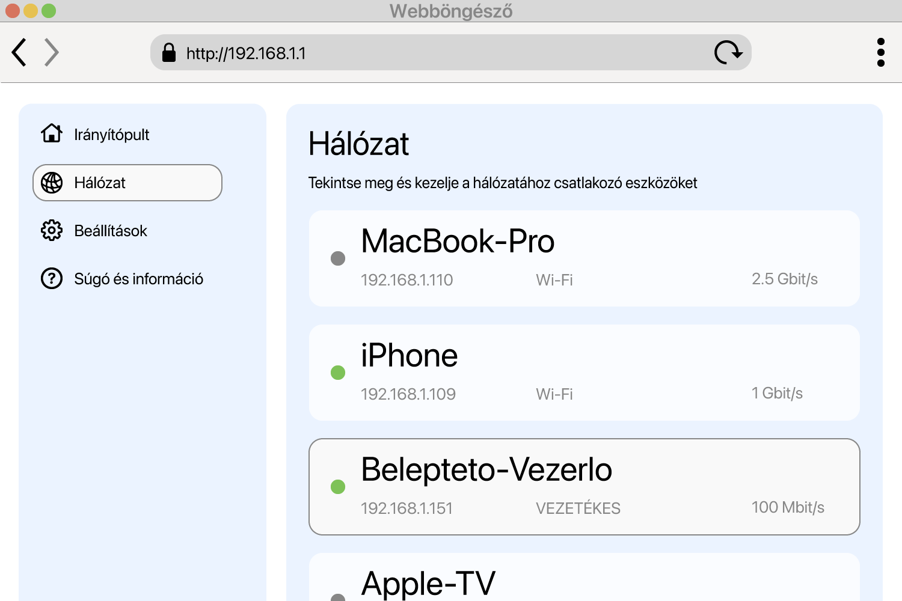

<!--
Generated from GateTap app setup guide JSON.
Do not edit manually.
Version: 1.4
Language: hu
-->

# Beállítási útmutató

---

🌍 **This Document is available in other Languages:**  
[🇺🇸 English](setup-guide.en.md) | [🇩🇪 Deutsch](setup-guide.de.md) | [🇸🇦 العربية](setup-guide.ar.md) | [🇪🇸 Català](setup-guide.ca.md) | [🇨🇿 Čeština](setup-guide.cs.md) | [🇩🇰 Dansk](setup-guide.da.md) | [🇬🇷 Ελληνικά](setup-guide.el.md) | [🇪🇸 Español](setup-guide.es.md) | [🇲🇽 Español (México)](setup-guide.es-MX.md) | [🇫🇮 Suomi](setup-guide.fi.md) | [🇫🇷 Français](setup-guide.fr.md) | [🇮🇱 עברית](setup-guide.he.md) | [🇮🇳 हिन्दी](setup-guide.hi.md) | [🇭🇷 Hrvatski](setup-guide.hr.md) | 🇭🇺 Magyar | [🇮🇩 Bahasa Indonesia](setup-guide.id.md) | [🇮🇹 Italiano](setup-guide.it.md) | [🇯🇵 日本語](setup-guide.ja.md) | [🇰🇷 한국어](setup-guide.ko.md) | [🇲🇾 Bahasa Melayu](setup-guide.ms.md) | [🇳🇴 Norsk Bokmål](setup-guide.nb.md) | [🇳🇱 Nederlands](setup-guide.nl.md) | [🇵🇱 Polski](setup-guide.pl.md) | [🇧🇷 Português (Brasil)](setup-guide.pt-BR.md) | [🇵🇹 Português (Portugal)](setup-guide.pt-PT.md) | [🇷🇴 Română](setup-guide.ro.md) | [🇷🇺 Русский](setup-guide.ru.md) | [🇸🇰 Slovenčina](setup-guide.sk.md) | [🇸🇪 Svenska](setup-guide.sv.md) | [🇹🇭 ไทย](setup-guide.th.md) | [🇹🇷 Türkçe](setup-guide.tr.md) | [🇺🇦 Українська](setup-guide.uk.md) | [🇻🇳 Tiếng Việt](setup-guide.vi.md) | [🇨🇳 简体中文](setup-guide.zh-Hans.md) | [🇹🇼 繁體中文](setup-guide.zh-Hant.md)

---

Csatlakoztassa a GateTap-ot a hozzáférés-vezérlőhöz

## Mi az a hozzáférés-vezérlő?

A beléptetővezérlő olyan eszköz, amely ajtók, kapuk, garázsok vagy sorompók nyitását kezeli — például ajtócsengő vagy kapumotor aktiválásával.
A nyitási jelet általában innen kapja:

- kaputelefon-rendszer
- billentyűzet
- kulcstartó vagy belépőkártya

Sok modern beléptetőrendszer csatlakozik a helyi hálózathoz, és böngészőben elérhető webes felületen keresztül kezelhető. A GateTap közvetlenül ehhez a rendszerhez kapcsolódik, hogy kényelmesen vezérelhesd az eszközödről.

## Mielőtt elkezdené

Győződj meg róla, hogy az eszközöd ugyanahhoz a helyi hálózathoz csatlakozik, mint a beléptetővezérlő. Például ellenőrizd, hogy az iPhone az otthoni Wi‑Fi-hálózaton van, és nem mobiladatot használ.

A GateTap teljes egészében a helyi hálózaton belül működik, és ezekre van szüksége:

- A vezérlő IP-címe
- Felhasználónév és jelszó

## 1. lépés: Keresse meg a hozzáférés-vezérlő IP-címét

A GateTap csatlakoztatásához szükséged van a vezérlő IP-címére és a bejelentkezési adatokra — lásd a 2. lépést.

Válassz az alábbi lehetőségek közül:

## A lehetőség: Kérdezze meg a telepítőt (ajánlott)

Ha a rendszert villanyszerelő vagy technikus telepítette, valószínűleg már mindent beállított.

Sok esetben:

- A vezérlő fix IP-címet használ
- Vagy a router DHCP-foglalással mindig ugyanazt az IP-címet adja neki

Kérd el tőlük az IP-címet és a bejelentkezési adatokat. Ez általában a legegyszerűbb és leggyorsabb módszer.

## B lehetőség: Ellenőrizze az útválasztót

A router eléréséhez általában szükséged van a helyi címére, például `192.168.1.1`, vagy egy névre, például `fritz.box`, valamint a router bejelentkezési adataira.

Nyisd meg a router konfigurációs oldalát, és keresd meg a csatlakoztatott eszközöket.

Ez a rész például így szerepelhet:

- Hálózat
- Csatlakoztatott eszközök
- LAN
- DHCP-kliensek

Ezeket keresd:

- Ismeretlen vezetékes eszközök
- Olyan bejegyzések, amelyek a vezérlőt jelölhetik

Az IP-cím általában így néz ki:
`192.168.x.x` vagy `10.0.x.x`

## C lehetőség: Ellenőrizze a hálózatot

Használj hálózatszkenner alkalmazást az eszközödön.

Vizsgáld át a hálózatot, és keresd:

- Ismeretlen vezetékes eszközök
- Olyan bejegyzések, amelyek a vezérlőt jelölhetik

Az IP-cím általában így néz ki:
`192.168.x.x` vagy `10.0.x.x`

## Tesztelje az IP-címet

Próbáld meg megnyitni a megtalált IP-címet Safariban, például:

`http://192.168.1.50`

Ha megjelenik a beléptetővezérlő bejelentkezési oldala, megtaláltad a megfelelő címet.

## 2. lépés: Keresse meg a hozzáférés-vezérlő bejelentkezési adatait

Egyes beléptetővezérlők még mindig alapértelmezett bejelentkezési adatokat használnak. Gyakori példa a `abc` felhasználónév és a `654321` jelszó.

További gyakori alapértelmezett felhasználónevek: `user`, `admin` vagy `123`. Ezeket kipróbálhatod tipikus jelszavakkal, például `1234`, `user` vagy `password`, illetve ezek változataival.

Ha a rendszert szakember telepítette, kérdezd meg, hogy megváltoztatták-e az alapértelmezett adatokat.

## 3. lépés: Adja hozzá a hozzáférés-vezérlőt a GateTaphez

Nyisd meg a GateTapet. Ha a vezérlő hozzáadására szolgáló oldal nem jelenik meg automatikusan, válts a "Controller" lapra, és koppints a jobb felső navigációs sávban lévő "+" gombra.

A megjelenő oldalon add meg:

- IP-cím
- Felhasználónév
- Jelszó

Ugyanazokat a bejelentkezési adatokat használd, mint a beléptetővezérlő webes felületén.

## 4. lépés: Tesztelje a kapcsolatot

Mentsd a beállításokat. Az alkalmazás automatikusan megpróbál csatlakozni.

Ha a kapcsolat nem hozható létre, ellenőrizd:

- Az eszközöd ugyanazon a hálózaton van, mint a beléptetővezérlő
- Az IP-cím helyes
- A beléptetővezérlő áram alatt van és elérhető

## 5. lépés: Tartsa stabilan az IP-címet

A későbbi problémák elkerülése érdekében a vezérlőnek mindig ugyanazt az IP-címet kell használnia.

Ez megoldható így:

- Statikus IP beállítása a vezérlőn
- DHCP-foglalás létrehozása a routerben

## Demó mód

A GateTap demó módot is tartalmaz. Az alkalmazásból elindíthatsz egy virtuális beléptetővezérlőt, amely ugyanazt az adminisztrációs felületet szolgálja ki, mint egy valódi beléptetőrendszer. Ezután a megjelenített IP-cím és bejelentkezési adatok segítségével normál vezérlőként hozzáadhatod.

Így egy ismert, működő tesztútvonalon fedezheted fel a GateTap funkcióit akkor is, ha jelenleg nincs fizikai beléptetővezérlőd.

## Biztonság

Adatai az eszközön maradnak.

Opcionálisan védheti a GateTap-et Face ID vagy Touch ID használatával az alkalmazás beállításaiban.

