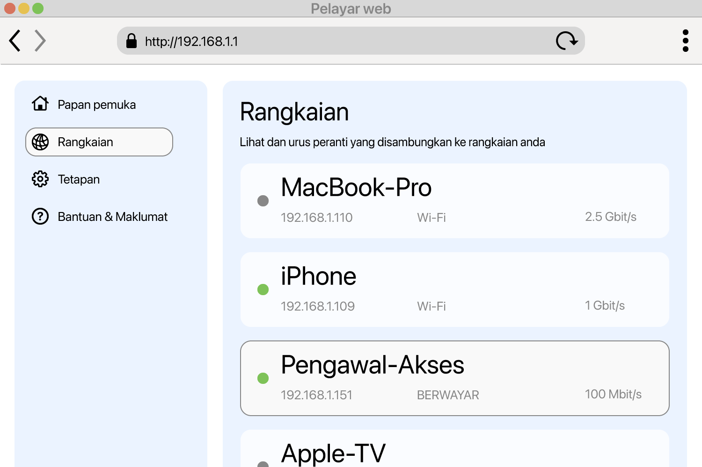

<!--
Generated from GateTap app setup guide JSON.
Do not edit manually.
Version: 1.4
Language: ms
-->

# Panduan Persediaan

---

🌍 **This Document is available in other Languages:**  
[🇺🇸 English](setup-guide.en.md) | [🇩🇪 Deutsch](setup-guide.de.md) | [🇸🇦 العربية](setup-guide.ar.md) | [🇪🇸 Català](setup-guide.ca.md) | [🇨🇿 Čeština](setup-guide.cs.md) | [🇩🇰 Dansk](setup-guide.da.md) | [🇬🇷 Ελληνικά](setup-guide.el.md) | [🇪🇸 Español](setup-guide.es.md) | [🇲🇽 Español (México)](setup-guide.es-MX.md) | [🇫🇮 Suomi](setup-guide.fi.md) | [🇫🇷 Français](setup-guide.fr.md) | [🇮🇱 עברית](setup-guide.he.md) | [🇮🇳 हिन्दी](setup-guide.hi.md) | [🇭🇷 Hrvatski](setup-guide.hr.md) | [🇭🇺 Magyar](setup-guide.hu.md) | [🇮🇩 Bahasa Indonesia](setup-guide.id.md) | [🇮🇹 Italiano](setup-guide.it.md) | [🇯🇵 日本語](setup-guide.ja.md) | [🇰🇷 한국어](setup-guide.ko.md) | 🇲🇾 Bahasa Melayu | [🇳🇴 Norsk Bokmål](setup-guide.nb.md) | [🇳🇱 Nederlands](setup-guide.nl.md) | [🇵🇱 Polski](setup-guide.pl.md) | [🇧🇷 Português (Brasil)](setup-guide.pt-BR.md) | [🇵🇹 Português (Portugal)](setup-guide.pt-PT.md) | [🇷🇴 Română](setup-guide.ro.md) | [🇷🇺 Русский](setup-guide.ru.md) | [🇸🇰 Slovenčina](setup-guide.sk.md) | [🇸🇪 Svenska](setup-guide.sv.md) | [🇹🇭 ไทย](setup-guide.th.md) | [🇹🇷 Türkçe](setup-guide.tr.md) | [🇺🇦 Українська](setup-guide.uk.md) | [🇻🇳 Tiếng Việt](setup-guide.vi.md) | [🇨🇳 简体中文](setup-guide.zh-Hans.md) | [🇹🇼 繁體中文](setup-guide.zh-Hant.md)

---

Sambungkan GateTap kepada pengawal akses anda

## Apakah itu pengawal akses?

Pengawal akses ialah peranti yang mengurus pembukaan pintu, pagar, garaj atau palang — contohnya dengan mengaktifkan buzzer pintu atau motor pagar.
Biasanya ia menerima isyarat buka daripada:

- sistem interkom
- papan kekunci
- fob kunci atau kad akses

Banyak sistem kawalan akses moden disambungkan ke rangkaian setempat dan boleh dikendalikan melalui antara muka web dalam pelayar. GateTap bersambung terus kepada sistem tersebut supaya anda boleh mengendalikannya dengan mudah daripada peranti anda.

## Sebelum anda bermula

Pastikan peranti anda disambungkan ke rangkaian setempat yang sama dengan pengawal akses anda. Contohnya, pastikan iPhone anda disambungkan ke Wi‑Fi rumah dan tidak menggunakan data mudah alih.

GateTap berfungsi sepenuhnya dalam rangkaian setempat anda dan memerlukan:

- Alamat IP pengawal
- Nama pengguna dan kata laluan

## Langkah 1: Cari alamat IP pengawal akses anda

Untuk menyambungkan GateTap, anda memerlukan alamat IP pengawal dan kelayakan log masuk — lihat Langkah 2.

Pilih salah satu pilihan berikut:

## Pilihan A: Tanya pemasang anda (disyorkan)

Jika sistem anda dipasang oleh juruelektrik atau juruteknik, kemungkinan besar mereka sudah mengkonfigurasi semuanya.

Dalam banyak kes:

- Pengawal menggunakan alamat IP tetap
- Atau penghala memberikan alamat IP yang sama melalui tempahan DHCP

Minta alamat IP dan maklumat log masuk daripada mereka. Ini biasanya cara yang paling mudah dan cepat.

## Pilihan B: Semak penghala anda

Untuk mengakses penghala anda, biasanya anda memerlukan alamat setempatnya, contohnya `192.168.1.1` atau nama seperti `fritz.box`, serta kelayakan log masuk penghala.

Buka halaman konfigurasi penghala dan cari peranti yang disambungkan.

Bahagian ini mungkin dipanggil:

- Rangkaian
- Peranti disambungkan
- LAN
- Klien DHCP

Cari:

- Peranti berwayar yang tidak dikenali
- Entri yang mungkin mewakili pengawal anda

Alamat IP biasanya kelihatan seperti:
`192.168.x.x` atau `10.0.x.x`

## Pilihan C: Imbas rangkaian anda

Gunakan aplikasi pengimbas rangkaian pada peranti anda.

Imbas rangkaian anda dan cari:

- Peranti berwayar yang tidak dikenali
- Entri yang mungkin mewakili pengawal anda

Alamat IP biasanya kelihatan seperti:
`192.168.x.x` atau `10.0.x.x`

## Uji alamat IP

Cuba buka alamat IP yang ditemui dalam Safari, contohnya:

`http://192.168.1.50`

Jika halaman log masuk pengawal akses muncul, anda telah menemui alamat yang betul.

## Langkah 2: Cari bukti kelayakan log masuk pengawal akses

Sesetengah pengawal akses masih menggunakan kelayakan log masuk lalai. Contoh biasa ialah nama pengguna `abc` dengan kata laluan `654321`.

Nama pengguna lalai lain yang biasa termasuk `user`, `admin` atau `123`. Anda boleh mencubanya dengan kata laluan lazim seperti `1234`, `user` atau `password`, atau variasinya.

Jika sistem anda dipasang secara profesional, tanya pemasang sama ada kelayakan lalai telah ditukar.

## Langkah 3: Tambah pengawal akses dalam GateTap

Buka GateTap. Jika halaman untuk menambah pengawal tidak muncul secara automatik, pergi ke tab "Controller" dan ketik butang "+" dalam bar navigasi di bahagian kanan atas.

Pada halaman yang muncul, masukkan:

- Alamat IP
- Nama pengguna
- Kata laluan

Gunakan kelayakan log masuk yang sama seperti antara muka web pengawal akses.

## Langkah 4: Uji sambungan

Simpan konfigurasi anda. Aplikasi akan cuba bersambung secara automatik.

Jika sambungan tidak dapat diwujudkan, semak:

- Peranti anda berada pada rangkaian yang sama dengan pengawal akses
- Alamat IP betul
- Pengawal akses mempunyai kuasa dan boleh dicapai

## Langkah 5: Pastikan alamat IP stabil

Untuk mengelakkan masalah kemudian, pengawal harus sentiasa menggunakan alamat IP yang sama.

Ini boleh dilakukan dengan:

- Menetapkan IP statik pada pengawal
- Membuat tempahan DHCP dalam penghala anda

## Mod demo

GateTap juga menyertakan mod demo. Anda boleh memulakan pengawal akses maya dari dalam aplikasi, yang menyediakan antara muka pentadbiran seperti sistem kawalan akses sebenar. Kemudian anda boleh menambahnya seperti pengawal biasa menggunakan alamat IP dan kelayakan yang dipaparkan.

Ini memberi anda laluan ujian yang diketahui berfungsi untuk meneroka ciri GateTap, walaupun anda tidak mempunyai pengawal akses fizikal pada masa ini.

## Keselamatan

Data anda kekal pada peranti anda.

Anda boleh melindungi GateTap secara pilihan menggunakan Face ID atau Touch ID dalam tetapan apl.

