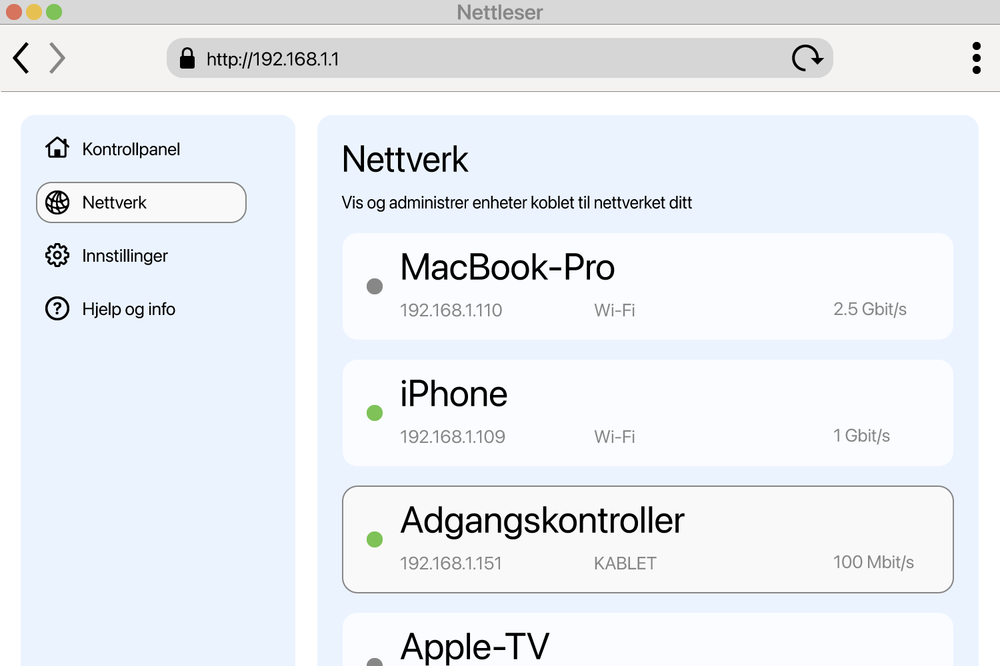

<!--
Generated from GateTap app setup guide JSON.
Do not edit manually.
Version: 1.4
Language: nb
-->

# Oppsettveiledning

---

🌍 **This Document is available in other Languages:**  
[🇺🇸 English](setup-guide.en.md) | [🇩🇪 Deutsch](setup-guide.de.md) | [🇸🇦 العربية](setup-guide.ar.md) | [🇪🇸 Català](setup-guide.ca.md) | [🇨🇿 Čeština](setup-guide.cs.md) | [🇩🇰 Dansk](setup-guide.da.md) | [🇬🇷 Ελληνικά](setup-guide.el.md) | [🇪🇸 Español](setup-guide.es.md) | [🇲🇽 Español (México)](setup-guide.es-MX.md) | [🇫🇮 Suomi](setup-guide.fi.md) | [🇫🇷 Français](setup-guide.fr.md) | [🇮🇱 עברית](setup-guide.he.md) | [🇮🇳 हिन्दी](setup-guide.hi.md) | [🇭🇷 Hrvatski](setup-guide.hr.md) | [🇭🇺 Magyar](setup-guide.hu.md) | [🇮🇩 Bahasa Indonesia](setup-guide.id.md) | [🇮🇹 Italiano](setup-guide.it.md) | [🇯🇵 日本語](setup-guide.ja.md) | [🇰🇷 한국어](setup-guide.ko.md) | [🇲🇾 Bahasa Melayu](setup-guide.ms.md) | 🇳🇴 Norsk Bokmål | [🇳🇱 Nederlands](setup-guide.nl.md) | [🇵🇱 Polski](setup-guide.pl.md) | [🇧🇷 Português (Brasil)](setup-guide.pt-BR.md) | [🇵🇹 Português (Portugal)](setup-guide.pt-PT.md) | [🇷🇴 Română](setup-guide.ro.md) | [🇷🇺 Русский](setup-guide.ru.md) | [🇸🇰 Slovenčina](setup-guide.sk.md) | [🇸🇪 Svenska](setup-guide.sv.md) | [🇹🇭 ไทย](setup-guide.th.md) | [🇹🇷 Türkçe](setup-guide.tr.md) | [🇺🇦 Українська](setup-guide.uk.md) | [🇻🇳 Tiếng Việt](setup-guide.vi.md) | [🇨🇳 简体中文](setup-guide.zh-Hans.md) | [🇹🇼 繁體中文](setup-guide.zh-Hant.md)

---

Koble GateTap til tilgangskontrolleren

## Hva er en tilgangskontroller?

En adgangskontroller er en enhet som styrer åpning av dører, porter, garasjer eller bommer — for eksempel ved å aktivere en døråpner eller portmotor.
Den mottar vanligvis åpningssignalet fra:

- et porttelefonanlegg
- et tastatur
- en nøkkelbrikke eller et adgangskort

Mange moderne adgangskontrollsystemer er koblet til lokalnettverket og kan betjenes via et webgrensesnitt i en nettleser. GateTap kobler seg direkte til dette systemet, slik at du enkelt kan betjene det fra enheten din.

## Før du begynner

Sørg for at enheten din er koblet til det samme lokalnettverket som adgangskontrolleren. Kontroller for eksempel at iPhone er koblet til hjemmets Wi‑Fi og ikke bruker mobildata.

GateTap fungerer helt innenfor lokalnettverket ditt og trenger:

- Kontrollerens IP-adresse
- Et brukernavn og passord

## Trinn 1: Finn IP-adressen til tilgangskontrolleren

For å koble til GateTap trenger du kontrollerens IP-adresse og innloggingsinformasjon — se trinn 2.

Velg ett av følgende alternativer:

## Alternativ A: Spør installatøren (anbefalt)

Hvis systemet ble installert av en elektriker eller tekniker, har de sannsynligvis allerede konfigurert alt.

I mange tilfeller:

- Bruker kontrolleren en fast IP-adresse
- Eller ruteren tildeler den samme IP-adressen via en DHCP-reservasjon

Be om IP-adressen og innloggingsinformasjonen. Dette er vanligvis den enkleste og raskeste måten.

## Alternativ B: Sjekk ruteren din

For å få tilgang til ruteren trenger du vanligvis den lokale adressen, for eksempel `192.168.1.1` eller et navn som `fritz.box`, og ruterens innloggingsinformasjon.

Åpne ruterens konfigurasjonsside og se etter tilkoblede enheter.

Denne delen kan hete:

- Nettverk
- Tilkoblede enheter
- LAN
- DHCP-klienter

Se etter:

- Ukjente kablede enheter
- Oppføringer som kan være kontrolleren din

IP-adressen ser vanligvis slik ut:
`192.168.x.x` eller `10.0.x.x`

## Alternativ C: Skann nettverket ditt

Bruk en nettverksskanner-app på enheten din.

Skann nettverket og se etter:

- Ukjente kablede enheter
- Oppføringer som kan være kontrolleren din

IP-adressen ser vanligvis slik ut:
`192.168.x.x` eller `10.0.x.x`

## Test IP-adressen

Prøv å åpne IP-adressen du fant i Safari, for eksempel:

`http://192.168.1.50`

Hvis innloggingssiden til adgangskontrolleren vises, har du funnet riktig adresse.

## Trinn 2: Finn innloggingsopplysningene til tilgangskontrolleren

Noen adgangskontrollere bruker fortsatt standard innloggingsinformasjon. Et vanlig eksempel er brukernavnet `abc` med passordet `654321`.

Andre vanlige standardbrukernavn er `user`, `admin` eller `123`. Du kan prøve dem med typiske passord som `1234`, `user` eller `password`, eller en variant.

Hvis systemet ble profesjonelt installert, spør installatøren om standardinnloggingen ble endret.

## Trinn 3: Legg til tilgangskontrolleren i GateTap

Åpne GateTap. Hvis siden for å legge til en kontroller ikke vises automatisk, går du til fanen "Controller" og trykker på "+"-knappen i navigasjonslinjen øverst til høyre.

På siden som vises, skriver du inn:

- IP-adresse
- Brukernavn
- Passord

Bruk samme innloggingsinformasjon som for adgangskontrollerens webgrensesnitt.

## Trinn 4: Test tilkoblingen

Lagre konfigurasjonen. Appen prøver automatisk å koble til.

Hvis tilkoblingen ikke kan opprettes, kontroller:

- At enheten din er på samme nettverk som adgangskontrolleren
- At IP-adressen er riktig
- At adgangskontrolleren har strøm og er tilgjengelig

## Trinn 5: Hold IP-adressen stabil

For å unngå problemer senere bør kontrolleren alltid bruke samme IP-adresse.

Dette kan gjøres ved å:

- Angi en statisk IP på kontrolleren
- Opprette en DHCP-reservasjon i ruteren

## Demomodus

GateTap har også en demomodus. Du kan starte en virtuell adgangskontroller fra appen, som serverer administrasjonsgrensesnittet slik et ekte adgangskontrollsystem ville gjort. Deretter kan du legge den til som en vanlig kontroller med IP-adressen og innloggingsinformasjonen som vises.

Dette gir deg en kjent fungerende testvei for å utforske GateTaps funksjoner, selv om du ikke har en fysisk adgangskontroller akkurat nå.

## Sikkerhet

Dataene dine forblir på enheten din.

Du kan eventuelt beskytte GateTap med Face ID eller Touch ID i appinnstillingene.

