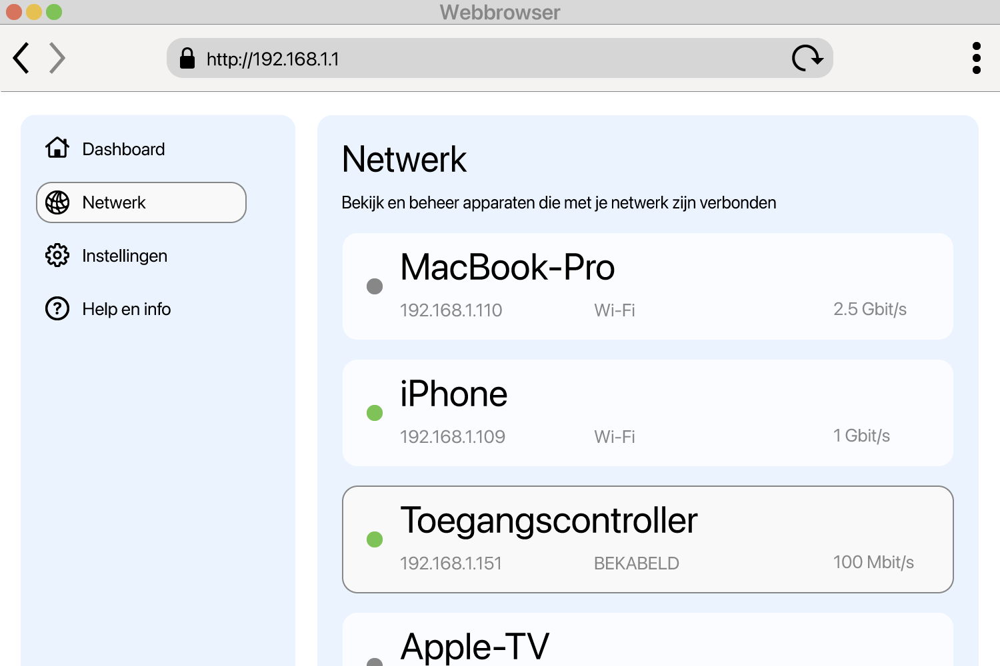

<!--
Generated from GateTap app setup guide JSON.
Do not edit manually.
Version: 1.4
Language: nl
-->

# Installatiehandleiding

---

🌍 **This Document is available in other Languages:**  
[🇺🇸 English](setup-guide.en.md) | [🇩🇪 Deutsch](setup-guide.de.md) | [🇸🇦 العربية](setup-guide.ar.md) | [🇪🇸 Català](setup-guide.ca.md) | [🇨🇿 Čeština](setup-guide.cs.md) | [🇩🇰 Dansk](setup-guide.da.md) | [🇬🇷 Ελληνικά](setup-guide.el.md) | [🇪🇸 Español](setup-guide.es.md) | [🇲🇽 Español (México)](setup-guide.es-MX.md) | [🇫🇮 Suomi](setup-guide.fi.md) | [🇫🇷 Français](setup-guide.fr.md) | [🇮🇱 עברית](setup-guide.he.md) | [🇮🇳 हिन्दी](setup-guide.hi.md) | [🇭🇷 Hrvatski](setup-guide.hr.md) | [🇭🇺 Magyar](setup-guide.hu.md) | [🇮🇩 Bahasa Indonesia](setup-guide.id.md) | [🇮🇹 Italiano](setup-guide.it.md) | [🇯🇵 日本語](setup-guide.ja.md) | [🇰🇷 한국어](setup-guide.ko.md) | [🇲🇾 Bahasa Melayu](setup-guide.ms.md) | [🇳🇴 Norsk Bokmål](setup-guide.nb.md) | 🇳🇱 Nederlands | [🇵🇱 Polski](setup-guide.pl.md) | [🇧🇷 Português (Brasil)](setup-guide.pt-BR.md) | [🇵🇹 Português (Portugal)](setup-guide.pt-PT.md) | [🇷🇴 Română](setup-guide.ro.md) | [🇷🇺 Русский](setup-guide.ru.md) | [🇸🇰 Slovenčina](setup-guide.sk.md) | [🇸🇪 Svenska](setup-guide.sv.md) | [🇹🇭 ไทย](setup-guide.th.md) | [🇹🇷 Türkçe](setup-guide.tr.md) | [🇺🇦 Українська](setup-guide.uk.md) | [🇻🇳 Tiếng Việt](setup-guide.vi.md) | [🇨🇳 简体中文](setup-guide.zh-Hans.md) | [🇹🇼 繁體中文](setup-guide.zh-Hant.md)

---

Sluit GateTap aan op uw toegangscontroller

## Wat is een toegangscontroller?

Een toegangscontroller is een apparaat dat het openen van deuren, poorten, garages of slagbomen beheert — bijvoorbeeld door een deurzoemer of poortmotor te activeren.
Meestal ontvangt hij het openingssignaal van:

- een intercomsysteem
- een toetsenpaneel
- een sleutelhanger of toegangskaart

Veel moderne toegangscontrolesystemen zijn verbonden met het lokale netwerk en kunnen via een webinterface in een browser worden bediend. GateTap maakt rechtstreeks verbinding met dat systeem, zodat je het gemakkelijk vanaf je apparaat kunt bedienen.

## Voordat je begint

Zorg ervoor dat je apparaat is verbonden met hetzelfde lokale netwerk als je toegangscontroller. Controleer bijvoorbeeld of je iPhone met je thuis-wifi is verbonden en geen mobiele data gebruikt.

GateTap werkt volledig binnen je lokale netwerk en heeft nodig:

- Het IP-adres van de controller
- Een gebruikersnaam en wachtwoord

## Stap 1: Zoek het IP-adres van je toegangscontroller

Om GateTap te verbinden, heb je het IP-adres van de controller en de inloggegevens nodig — zie stap 2.

Kies een van de volgende opties:

## Optie A: Vraag je installateur (aanbevolen)

Als je systeem door een elektricien of technicus is geïnstalleerd, heeft die waarschijnlijk alles al geconfigureerd.

In veel gevallen:

- Gebruikt de controller een vast IP-adres
- Of wijst de router hetzelfde IP-adres toe via een DHCP-reservering

Vraag om het IP-adres en de inloggegevens. Dit is meestal de eenvoudigste en snelste manier.

## Optie B: Controleer je router

Om toegang te krijgen tot je router heb je meestal het lokale adres nodig, bijvoorbeeld `192.168.1.1` of een naam zoals `fritz.box`, plus de inloggegevens van de router.

Open de configuratiepagina van je router en zoek naar verbonden apparaten.

Deze sectie kan heten:

- Netwerk
- Verbonden apparaten
- LAN
- DHCP-clients

Let op:

- Onbekende bekabelde apparaten
- Vermeldingen die je controller kunnen zijn

Het IP-adres ziet er meestal zo uit:
`192.168.x.x` of `10.0.x.x`

## Optie C: Scan je netwerk

Gebruik een netwerkscanner-app op je apparaat.

Scan je netwerk en let op:

- Onbekende bekabelde apparaten
- Vermeldingen die je controller kunnen zijn

Het IP-adres ziet er meestal zo uit:
`192.168.x.x` of `10.0.x.x`

## Test het IP-adres

Probeer het gevonden IP-adres in Safari te openen, bijvoorbeeld:

`http://192.168.1.50`

Als de inlogpagina van de toegangscontroller verschijnt, heb je het juiste adres gevonden.

## Stap 2: Zoek de inloggegevens van de toegangscontroller

Sommige toegangscontrollers gebruiken nog steeds standaardinloggegevens. Een veelvoorkomend voorbeeld is de gebruikersnaam `abc` met het wachtwoord `654321`.

Andere veelvoorkomende standaardgebruikersnamen zijn `user`, `admin` of `123`. Je kunt ze proberen met typische wachtwoorden zoals `1234`, `user` of `password`, of een variant daarvan.

Als je systeem professioneel is geïnstalleerd, vraag dan aan de installateur of de standaardinloggegevens zijn gewijzigd.

## Stap 3: Voeg de toegangscontroller toe in GateTap

Open GateTap. Als de pagina om een controller toe te voegen niet automatisch verschijnt, ga dan naar het tabblad "Controller" en tik rechtsboven in de navigatiebalk op de knop "+".

Voer op de pagina die verschijnt het volgende in:

- IP-adres
- Gebruikersnaam
- Wachtwoord

Gebruik dezelfde inloggegevens als voor de webinterface van de toegangscontroller.

## Stap 4: Test de verbinding

Sla je configuratie op. De app probeert automatisch verbinding te maken.

Als de verbinding niet tot stand komt, controleer dan:

- Of je apparaat op hetzelfde netwerk zit als de toegangscontroller
- Of het IP-adres klopt
- Of de toegangscontroller stroom heeft en bereikbaar is

## Stap 5: Houd het IP-adres stabiel

Om later problemen te voorkomen, moet de controller altijd hetzelfde IP-adres gebruiken.

Dat kan door:

- Een statisch IP-adres op de controller in te stellen
- Een DHCP-reservering in je router te maken

## Demomodus

GateTap bevat ook een demomodus. Je kunt vanuit de app een virtuele toegangscontroller starten die dezelfde beheerinterface aanbiedt als een echt toegangscontrolesysteem. Daarna kun je hem als een normale controller toevoegen met het weergegeven IP-adres en de inloggegevens.

Zo heb je een bekende, werkende testroute om de functies van GateTap te verkennen, ook als je momenteel geen fysieke toegangscontroller hebt.

## Beveiliging

Uw gegevens blijven op uw apparaat.

U kunt GateTap optioneel beveiligen met Face ID of Touch ID in de app-instellingen.

