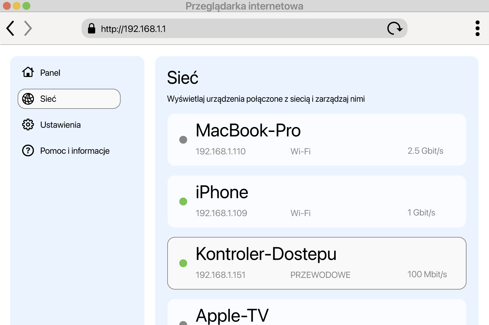

<!--
Generated from GateTap app setup guide JSON.
Do not edit manually.
Version: 1.4
Language: pl
-->

# Przewodnik konfiguracji

---

🌍 **This Document is available in other Languages:**  
[🇺🇸 English](setup-guide.en.md) | [🇩🇪 Deutsch](setup-guide.de.md) | [🇸🇦 العربية](setup-guide.ar.md) | [🇪🇸 Català](setup-guide.ca.md) | [🇨🇿 Čeština](setup-guide.cs.md) | [🇩🇰 Dansk](setup-guide.da.md) | [🇬🇷 Ελληνικά](setup-guide.el.md) | [🇪🇸 Español](setup-guide.es.md) | [🇲🇽 Español (México)](setup-guide.es-MX.md) | [🇫🇮 Suomi](setup-guide.fi.md) | [🇫🇷 Français](setup-guide.fr.md) | [🇮🇱 עברית](setup-guide.he.md) | [🇮🇳 हिन्दी](setup-guide.hi.md) | [🇭🇷 Hrvatski](setup-guide.hr.md) | [🇭🇺 Magyar](setup-guide.hu.md) | [🇮🇩 Bahasa Indonesia](setup-guide.id.md) | [🇮🇹 Italiano](setup-guide.it.md) | [🇯🇵 日本語](setup-guide.ja.md) | [🇰🇷 한국어](setup-guide.ko.md) | [🇲🇾 Bahasa Melayu](setup-guide.ms.md) | [🇳🇴 Norsk Bokmål](setup-guide.nb.md) | [🇳🇱 Nederlands](setup-guide.nl.md) | 🇵🇱 Polski | [🇧🇷 Português (Brasil)](setup-guide.pt-BR.md) | [🇵🇹 Português (Portugal)](setup-guide.pt-PT.md) | [🇷🇴 Română](setup-guide.ro.md) | [🇷🇺 Русский](setup-guide.ru.md) | [🇸🇰 Slovenčina](setup-guide.sk.md) | [🇸🇪 Svenska](setup-guide.sv.md) | [🇹🇭 ไทย](setup-guide.th.md) | [🇹🇷 Türkçe](setup-guide.tr.md) | [🇺🇦 Українська](setup-guide.uk.md) | [🇻🇳 Tiếng Việt](setup-guide.vi.md) | [🇨🇳 简体中文](setup-guide.zh-Hans.md) | [🇹🇼 繁體中文](setup-guide.zh-Hant.md)

---

Podłącz GateTap do swojego kontrolera dostępu

## Czym jest kontroler dostępu?

Kontroler dostępu to urządzenie zarządzające otwieraniem drzwi, bram, garaży lub szlabanów — na przykład przez uruchomienie elektrozaczepu lub silnika bramy.
Zwykle odbiera sygnał otwarcia z:

- systemu domofonowego
- klawiatury
- breloka lub karty dostępu

Wiele nowoczesnych systemów kontroli dostępu jest podłączonych do sieci lokalnej i można je obsługiwać przez interfejs WWW w przeglądarce. GateTap łączy się bezpośrednio z tym systemem, aby można było wygodnie sterować nim z urządzenia.

## Zanim zaczniesz

Upewnij się, że urządzenie jest połączone z tą samą siecią lokalną co kontroler dostępu. Na przykład sprawdź, czy iPhone jest połączony z domową siecią Wi‑Fi i nie używa transmisji komórkowej.

GateTap działa wyłącznie w Twojej sieci lokalnej i potrzebuje:

- adresu IP kontrolera
- nazwy użytkownika i hasła

## Krok 1: Znajdź adres IP kontrolera dostępu

Aby połączyć GateTap, potrzebujesz adresu IP kontrolera oraz danych logowania — zobacz krok 2.

Wybierz jedną z poniższych opcji:

## Opcja A: Zapytaj instalatora (zalecane)

Jeśli system został zainstalowany przez elektryka lub technika, prawdopodobnie wszystko zostało już skonfigurowane.

W wielu przypadkach:

- Kontroler używa stałego adresu IP
- Albo router przypisuje mu ten sam adres IP przez rezerwację DHCP

Poproś o adres IP i dane logowania. To zwykle najprostszy i najszybszy sposób.

## Opcja B: Sprawdź swój router

Aby uzyskać dostęp do routera, zwykle potrzebujesz jego lokalnego adresu, na przykład `192.168.1.1` lub nazwy takiej jak `fritz.box`, oraz danych logowania do routera.

Otwórz stronę konfiguracji routera i poszukaj podłączonych urządzeń.

Ta sekcja może nazywać się:

- Sieć
- Podłączone urządzenia
- LAN
- Klienci DHCP

Szukaj:

- Nieznanych urządzeń przewodowych
- Wpisów, które mogą oznaczać Twój kontroler

Adres IP zwykle wygląda tak:
`192.168.x.x` lub `10.0.x.x`

## Opcja C: Przeskanuj swoją sieć

Użyj aplikacji do skanowania sieci na swoim urządzeniu.

Przeskanuj sieć i poszukaj:

- Nieznanych urządzeń przewodowych
- Wpisów, które mogą oznaczać Twój kontroler

Adres IP zwykle wygląda tak:
`192.168.x.x` lub `10.0.x.x`

## Przetestuj adres IP

Spróbuj otworzyć znaleziony adres IP w Safari, na przykład:

`http://192.168.1.50`

Jeśli pojawi się strona logowania kontrolera dostępu, znaleziono właściwy adres.

## Krok 2: Znajdź dane logowania kontrolera dostępu

Niektóre kontrolery dostępu nadal używają domyślnych danych logowania. Częsty przykład to nazwa użytkownika `abc` i hasło `654321`.

Inne popularne domyślne nazwy użytkownika to `user`, `admin` lub `123`. Możesz wypróbować je z typowymi hasłami, takimi jak `1234`, `user` lub `password`, albo ich odmianą.

Jeśli system został profesjonalnie zainstalowany, zapytaj instalatora, czy domyślne dane logowania zostały zmienione.

## Krok 3: Dodaj kontroler dostępu w GateTap

Otwórz GateTap. Jeśli strona dodawania kontrolera nie pojawi się automatycznie, przejdź do karty "Controller" i stuknij przycisk "+" na pasku nawigacji w prawym górnym rogu.

Na wyświetlonej stronie wpisz:

- Adres IP
- Nazwę użytkownika
- Hasło

Użyj tych samych danych logowania co do interfejsu WWW kontrolera dostępu.

## Krok 4: Przetestuj połączenie

Zapisz konfigurację. Aplikacja automatycznie spróbuje się połączyć.

Jeśli nie można nawiązać połączenia, sprawdź:

- Czy urządzenie jest w tej samej sieci co kontroler dostępu
- Czy adres IP jest poprawny
- Czy kontroler dostępu ma zasilanie i jest osiągalny

## Krok 5: Utrzymuj stabilny adres IP

Aby uniknąć problemów później, kontroler powinien zawsze używać tego samego adresu IP.

Można to zrobić przez:

- Ustawienie statycznego IP w kontrolerze
- Utworzenie rezerwacji DHCP w routerze

## Tryb demo

GateTap zawiera także tryb demonstracyjny. Możesz uruchomić w aplikacji wirtualny kontroler dostępu, który udostępnia interfejs administracyjny tak jak prawdziwy system kontroli dostępu. Następnie możesz dodać go jak zwykły kontroler, używając wyświetlonego adresu IP i danych logowania.

Daje to znaną, działającą ścieżkę testową do poznania funkcji GateTap, nawet jeśli obecnie nie masz fizycznego kontrolera dostępu.

## Bezpieczeństwo

Twoje dane pozostają na Twoim urządzeniu.

Opcjonalnie możesz chronić GateTap za pomocą Face ID lub Touch ID w ustawieniach aplikacji.

