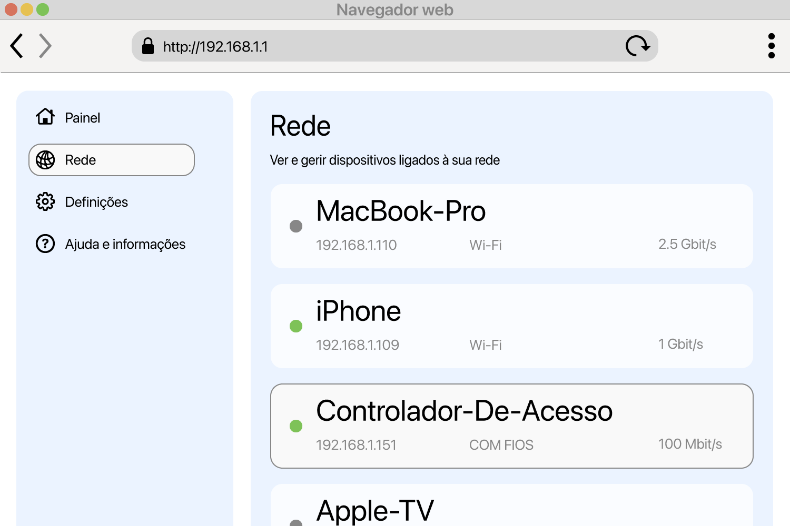

<!--
Generated from GateTap app setup guide JSON.
Do not edit manually.
Version: 1.4
Language: pt-PT
-->

# Guia de configuração

---

🌍 **This Document is available in other Languages:**  
[🇺🇸 English](setup-guide.en.md) | [🇩🇪 Deutsch](setup-guide.de.md) | [🇸🇦 العربية](setup-guide.ar.md) | [🇪🇸 Català](setup-guide.ca.md) | [🇨🇿 Čeština](setup-guide.cs.md) | [🇩🇰 Dansk](setup-guide.da.md) | [🇬🇷 Ελληνικά](setup-guide.el.md) | [🇪🇸 Español](setup-guide.es.md) | [🇲🇽 Español (México)](setup-guide.es-MX.md) | [🇫🇮 Suomi](setup-guide.fi.md) | [🇫🇷 Français](setup-guide.fr.md) | [🇮🇱 עברית](setup-guide.he.md) | [🇮🇳 हिन्दी](setup-guide.hi.md) | [🇭🇷 Hrvatski](setup-guide.hr.md) | [🇭🇺 Magyar](setup-guide.hu.md) | [🇮🇩 Bahasa Indonesia](setup-guide.id.md) | [🇮🇹 Italiano](setup-guide.it.md) | [🇯🇵 日本語](setup-guide.ja.md) | [🇰🇷 한국어](setup-guide.ko.md) | [🇲🇾 Bahasa Melayu](setup-guide.ms.md) | [🇳🇴 Norsk Bokmål](setup-guide.nb.md) | [🇳🇱 Nederlands](setup-guide.nl.md) | [🇵🇱 Polski](setup-guide.pl.md) | [🇧🇷 Português (Brasil)](setup-guide.pt-BR.md) | 🇵🇹 Português (Portugal) | [🇷🇴 Română](setup-guide.ro.md) | [🇷🇺 Русский](setup-guide.ru.md) | [🇸🇰 Slovenčina](setup-guide.sk.md) | [🇸🇪 Svenska](setup-guide.sv.md) | [🇹🇭 ไทย](setup-guide.th.md) | [🇹🇷 Türkçe](setup-guide.tr.md) | [🇺🇦 Українська](setup-guide.uk.md) | [🇻🇳 Tiếng Việt](setup-guide.vi.md) | [🇨🇳 简体中文](setup-guide.zh-Hans.md) | [🇹🇼 繁體中文](setup-guide.zh-Hant.md)

---

Conecte o GateTap ao seu controlador de acesso

## O que é um controlador de acesso?

Um controlador de acesso é um dispositivo que gere a abertura de portas, portões, garagens ou barreiras — por exemplo, acionando uma fechadura elétrica ou o motor de um portão.
Normalmente recebe o sinal de abertura de:

- um sistema de intercomunicação
- um teclado
- um comando ou cartão de acesso

Muitos sistemas modernos de controlo de acesso estão ligados à rede local e podem ser operados através de uma interface web no navegador. O GateTap liga-se diretamente a esse sistema para que o possas controlar facilmente a partir do teu dispositivo.

## Antes de começar

Certifica-te de que o dispositivo está ligado à mesma rede local que o controlador de acesso. Por exemplo, confirma que o iPhone está ligado ao Wi‑Fi de casa e não está a usar dados móveis.

O GateTap funciona inteiramente dentro da tua rede local e precisa de:

- Endereço IP do controlador
- Nome de utilizador e palavra-passe

## Etapa 1: Encontre o endereço IP do controlador de acesso

Para ligar o GateTap, precisas do endereço IP do controlador e das credenciais de início de sessão — vê o Passo 2.

Escolhe uma das opções seguintes:

## Opção A: pergunte ao seu instalador (recomendado)

Se o sistema foi instalado por um eletricista ou técnico, é provável que já tenha configurado tudo.

Em muitos casos:

- O controlador usa um endereço IP fixo
- Ou o router atribui-lhe sempre o mesmo IP através de uma reserva DHCP

Pede o endereço IP e os dados de acesso. Normalmente é a forma mais simples e rápida.

## Opção B: verifique o seu router

Para aceder ao router, normalmente precisas do endereço local, por exemplo `192.168.1.1` ou um nome como `fritz.box`, e das credenciais de acesso ao router.

Abre a página de configuração do router e procura os dispositivos ligados.

Esta secção pode chamar-se:

- Rede
- Dispositivos ligados
- LAN
- Clientes DHCP

Procura:

- Dispositivos com fio desconhecidos
- Entradas que possam representar o teu controlador

O endereço IP normalmente tem este aspeto:
`192.168.x.x` ou `10.0.x.x`

## Opção C: verifique a sua rede

Usa uma app de análise de rede no teu dispositivo.

Analisa a rede e procura:

- Dispositivos com fio desconhecidos
- Entradas que possam representar o teu controlador

O endereço IP normalmente tem este aspeto:
`192.168.x.x` ou `10.0.x.x`

## Teste o endereço IP

Experimenta abrir no Safari o endereço IP encontrado, por exemplo:

`http://192.168.1.50`

Se aparecer a página de início de sessão do controlador de acesso, encontraste o endereço correto.

## Etapa 2: Encontre as credenciais do controlador de acesso

Alguns controladores de acesso ainda usam credenciais de início de sessão predefinidas. Um exemplo comum é o nome de utilizador `abc` com a palavra-passe `654321`.

Outros nomes de utilizador predefinidos comuns incluem `user`, `admin` ou `123`. Podes experimentá-los com palavras-passe típicas como `1234`, `user` ou `password`, ou alguma variação.

Se o sistema foi instalado profissionalmente, pergunta ao instalador se as credenciais predefinidas foram alteradas.

## Etapa 3: Adicione o controlador de acesso no GateTap

Abre o GateTap. Se a página para adicionar um controlador não aparecer automaticamente, muda para o separador "Controller" e toca no botão "+" na barra de navegação no canto superior direito.

Na página apresentada, introduz:

- Endereço IP
- Nome de utilizador
- Palavra-passe

Usa as mesmas credenciais de início de sessão usadas na interface web do controlador de acesso.

## Etapa 4: Teste a ligação

Guarda a configuração. A app tentará ligar-se automaticamente.

Se não for possível estabelecer a ligação, verifica:

- Se o dispositivo está na mesma rede que o controlador de acesso
- Se o endereço IP está correto
- Se o controlador de acesso tem energia e está acessível

## Etapa 5: Mantenha o endereço IP estável

Para evitar problemas mais tarde, o controlador deve usar sempre o mesmo endereço IP.

Isto pode ser feito através de:

- Configurar um IP estático no controlador
- Criar uma reserva DHCP no router

## Modo demo

O GateTap também inclui um modo demo. Podes iniciar um controlador de acesso virtual dentro da app, que disponibiliza a interface de administração tal como um sistema real de controlo de acesso. Depois podes adicioná-lo como um controlador normal usando o endereço IP e as credenciais apresentados.

Isto dá-te um caminho de teste conhecido e funcional para explorar as funcionalidades do GateTap, mesmo que não tenhas atualmente um controlador de acesso físico.

## Segurança

Seus dados permanecem no seu dispositivo.

Opcionalmente, você pode proteger o GateTap usando Face ID ou Touch ID nas configurações do aplicativo.

