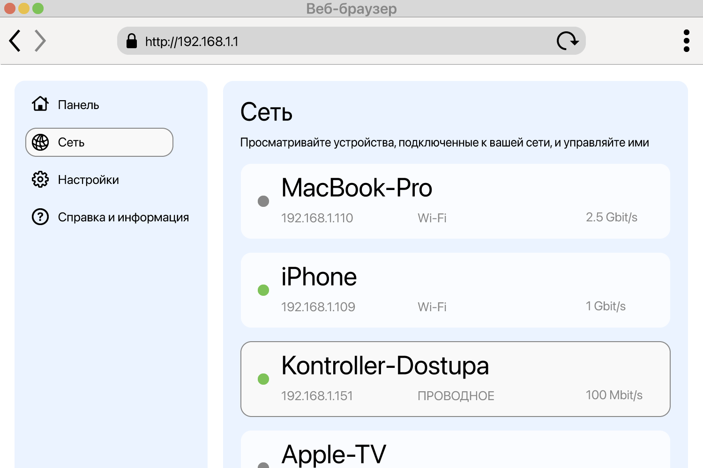

<!--
Generated from GateTap app setup guide JSON.
Do not edit manually.
Version: 1.4
Language: ru
-->

# Руководство по установке

---

🌍 **This Document is available in other Languages:**  
[🇺🇸 English](setup-guide.en.md) | [🇩🇪 Deutsch](setup-guide.de.md) | [🇸🇦 العربية](setup-guide.ar.md) | [🇪🇸 Català](setup-guide.ca.md) | [🇨🇿 Čeština](setup-guide.cs.md) | [🇩🇰 Dansk](setup-guide.da.md) | [🇬🇷 Ελληνικά](setup-guide.el.md) | [🇪🇸 Español](setup-guide.es.md) | [🇲🇽 Español (México)](setup-guide.es-MX.md) | [🇫🇮 Suomi](setup-guide.fi.md) | [🇫🇷 Français](setup-guide.fr.md) | [🇮🇱 עברית](setup-guide.he.md) | [🇮🇳 हिन्दी](setup-guide.hi.md) | [🇭🇷 Hrvatski](setup-guide.hr.md) | [🇭🇺 Magyar](setup-guide.hu.md) | [🇮🇩 Bahasa Indonesia](setup-guide.id.md) | [🇮🇹 Italiano](setup-guide.it.md) | [🇯🇵 日本語](setup-guide.ja.md) | [🇰🇷 한국어](setup-guide.ko.md) | [🇲🇾 Bahasa Melayu](setup-guide.ms.md) | [🇳🇴 Norsk Bokmål](setup-guide.nb.md) | [🇳🇱 Nederlands](setup-guide.nl.md) | [🇵🇱 Polski](setup-guide.pl.md) | [🇧🇷 Português (Brasil)](setup-guide.pt-BR.md) | [🇵🇹 Português (Portugal)](setup-guide.pt-PT.md) | [🇷🇴 Română](setup-guide.ro.md) | 🇷🇺 Русский | [🇸🇰 Slovenčina](setup-guide.sk.md) | [🇸🇪 Svenska](setup-guide.sv.md) | [🇹🇭 ไทย](setup-guide.th.md) | [🇹🇷 Türkçe](setup-guide.tr.md) | [🇺🇦 Українська](setup-guide.uk.md) | [🇻🇳 Tiếng Việt](setup-guide.vi.md) | [🇨🇳 简体中文](setup-guide.zh-Hans.md) | [🇹🇼 繁體中文](setup-guide.zh-Hant.md)

---

Подключите GateTap к вашему контроллеру доступа

## Что такое контроллер доступа?

Контроллер доступа — это устройство, которое управляет открытием дверей, ворот, гаражей или шлагбаумов, например включая дверной замок или мотор ворот.
Обычно он получает сигнал открытия от:

- домофонной системы
- клавиатуры
- брелока или карты доступа

Многие современные системы контроля доступа подключены к локальной сети и могут управляться через веб-интерфейс в браузере. GateTap подключается напрямую к этой системе, чтобы вы могли удобно управлять ей со своего устройства.

## Прежде чем начать

Убедитесь, что ваше устройство подключено к той же локальной сети, что и контроллер доступа. Например, проверьте, что iPhone подключен к домашнему Wi‑Fi и не использует мобильные данные.

GateTap полностью работает внутри вашей локальной сети и требует:

- IP-адрес контроллера
- Имя пользователя и пароль

## Шаг 1. Найдите IP-адрес контроллера доступа

Чтобы подключить GateTap, вам нужны IP-адрес контроллера и учетные данные для входа — см. шаг 2.

Выберите один из следующих вариантов:

## Вариант А: обратитесь к установщику (рекомендуется)

Если систему устанавливал электрик или техник, скорее всего, он уже все настроил.

Во многих случаях:

- Контроллер использует фиксированный IP-адрес
- Или роутер назначает ему один и тот же IP-адрес через резервирование DHCP

Попросите у них IP-адрес и данные для входа. Обычно это самый простой и быстрый способ.

## Вариант Б: проверьте маршрутизатор

Чтобы открыть роутер, обычно нужен его локальный адрес, например `192.168.1.1` или имя вроде `fritz.box`, а также данные для входа в роутер.

Откройте страницу настроек роутера и найдите подключенные устройства.

Этот раздел может называться:

- Сеть
- Подключенные устройства
- LAN
- DHCP-клиенты

Ищите:

- Неизвестные проводные устройства
- Записи, которые могут соответствовать вашему контроллеру

IP-адрес обычно выглядит так:
`192.168.x.x` или `10.0.x.x`

## Вариант C: сканируйте свою сеть

Используйте приложение для сканирования сети на своем устройстве.

Просканируйте сеть и ищите:

- Неизвестные проводные устройства
- Записи, которые могут соответствовать вашему контроллеру

IP-адрес обычно выглядит так:
`192.168.x.x` или `10.0.x.x`

## Проверьте IP-адрес

Попробуйте открыть найденный IP-адрес в Safari, например:

`http://192.168.1.50`

Если появилась страница входа контроллера доступа, вы нашли правильный адрес.

## Шаг 2. Найдите данные для входа контроллера доступа

Некоторые контроллеры доступа все еще используют стандартные учетные данные. Частый пример — имя пользователя `abc` и пароль `654321`.

Другие распространенные стандартные имена пользователя: `user`, `admin` или `123`. Можно попробовать их с типичными паролями, такими как `1234`, `user` или `password`, либо с их вариантами.

Если систему устанавливали профессионально, спросите установщика, были ли изменены стандартные учетные данные.

## Шаг 3. Добавьте контроллер доступа в GateTap

Откройте GateTap. Если страница добавления контроллера не появилась автоматически, перейдите на вкладку "Controller" и нажмите кнопку "+" на панели навигации в правом верхнем углу.

На появившейся странице введите:

- IP-адрес
- Имя пользователя
- Пароль

Используйте те же учетные данные, что и для веб-интерфейса контроллера доступа.

## Шаг 4. Проверьте соединение

Сохраните конфигурацию. Приложение автоматически попытается подключиться.

Если подключение не удается установить, проверьте:

- Ваше устройство находится в той же сети, что и контроллер доступа
- IP-адрес указан правильно
- Контроллер доступа включен и доступен

## Шаг 5. Обеспечьте стабильность IP-адреса

Чтобы избежать проблем в будущем, контроллер должен всегда использовать один и тот же IP-адрес.

Это можно сделать так:

- Настроить статический IP на контроллере
- Создать резервирование DHCP в роутере

## Демо-режим

GateTap также включает деморежим. Вы можете запустить виртуальный контроллер доступа из приложения; он предоставляет интерфейс администрирования так же, как настоящая система контроля доступа. Затем его можно добавить как обычный контроллер, используя показанный IP-адрес и учетные данные.

Это дает вам известный рабочий путь для тестирования и изучения функций GateTap, даже если сейчас у вас нет физического контроллера доступа.

## Безопасность

Ваши данные остаются на вашем устройстве.

При желании вы можете защитить GateTap с помощью Face ID или Touch ID в настройках приложения.

