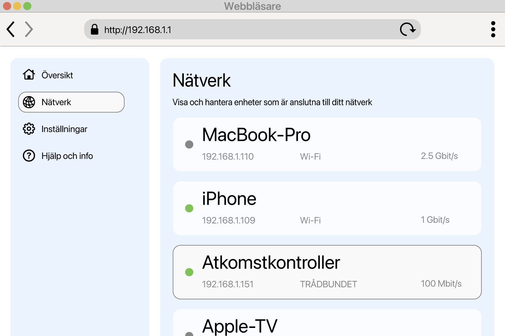

<!--
Generated from GateTap app setup guide JSON.
Do not edit manually.
Version: 1.4
Language: sv
-->

# Installationsguide

---

🌍 **This Document is available in other Languages:**  
[🇺🇸 English](setup-guide.en.md) | [🇩🇪 Deutsch](setup-guide.de.md) | [🇸🇦 العربية](setup-guide.ar.md) | [🇪🇸 Català](setup-guide.ca.md) | [🇨🇿 Čeština](setup-guide.cs.md) | [🇩🇰 Dansk](setup-guide.da.md) | [🇬🇷 Ελληνικά](setup-guide.el.md) | [🇪🇸 Español](setup-guide.es.md) | [🇲🇽 Español (México)](setup-guide.es-MX.md) | [🇫🇮 Suomi](setup-guide.fi.md) | [🇫🇷 Français](setup-guide.fr.md) | [🇮🇱 עברית](setup-guide.he.md) | [🇮🇳 हिन्दी](setup-guide.hi.md) | [🇭🇷 Hrvatski](setup-guide.hr.md) | [🇭🇺 Magyar](setup-guide.hu.md) | [🇮🇩 Bahasa Indonesia](setup-guide.id.md) | [🇮🇹 Italiano](setup-guide.it.md) | [🇯🇵 日本語](setup-guide.ja.md) | [🇰🇷 한국어](setup-guide.ko.md) | [🇲🇾 Bahasa Melayu](setup-guide.ms.md) | [🇳🇴 Norsk Bokmål](setup-guide.nb.md) | [🇳🇱 Nederlands](setup-guide.nl.md) | [🇵🇱 Polski](setup-guide.pl.md) | [🇧🇷 Português (Brasil)](setup-guide.pt-BR.md) | [🇵🇹 Português (Portugal)](setup-guide.pt-PT.md) | [🇷🇴 Română](setup-guide.ro.md) | [🇷🇺 Русский](setup-guide.ru.md) | [🇸🇰 Slovenčina](setup-guide.sk.md) | 🇸🇪 Svenska | [🇹🇭 ไทย](setup-guide.th.md) | [🇹🇷 Türkçe](setup-guide.tr.md) | [🇺🇦 Українська](setup-guide.uk.md) | [🇻🇳 Tiếng Việt](setup-guide.vi.md) | [🇨🇳 简体中文](setup-guide.zh-Hans.md) | [🇹🇼 繁體中文](setup-guide.zh-Hant.md)

---

Anslut GateTap till din åtkomstkontroll

## Vad är en åtkomstkontroller?

En åtkomstkontroller är en enhet som hanterar öppning av dörrar, grindar, garage eller bommar — till exempel genom att aktivera en dörröppnare eller grindmotor.
Den tar vanligtvis emot öppningssignalen från:

- ett porttelefonsystem
- en knappsats
- en nyckelbricka eller passerkort

Många moderna passersystem är anslutna till det lokala nätverket och kan styras via ett webbgränssnitt i en webbläsare. GateTap ansluter direkt till det systemet så att du enkelt kan styra det från din enhet.

## Innan du börjar

Se till att din enhet är ansluten till samma lokala nätverk som åtkomstkontrollern. Kontrollera till exempel att din iPhone är ansluten till hemmets Wi‑Fi och inte använder mobildata.

GateTap fungerar helt inom ditt lokala nätverk och behöver:

- Kontrollerns IP-adress
- Ett användarnamn och lösenord

## Steg 1: Hitta åtkomstkontrollerns IP-adress

För att ansluta GateTap behöver du kontrollerns IP-adress och inloggningsuppgifter — se steg 2.

Välj ett av följande alternativ:

## Alternativ A: Fråga din installatör (rekommenderas)

Om systemet installerades av en elektriker eller tekniker har de troligen redan konfigurerat allt.

I många fall:

- Använder kontrollern en fast IP-adress
- Eller så tilldelar routern samma IP-adress via en DHCP-reservation

Be om IP-adressen och inloggningsuppgifterna. Det är oftast det enklaste och snabbaste sättet.

## Alternativ B: Kontrollera din router

För att komma åt routern behöver du vanligtvis dess lokala adress, till exempel `192.168.1.1` eller ett namn som `fritz.box`, samt routerns inloggningsuppgifter.

Öppna routerns konfigurationssida och leta efter anslutna enheter.

Den här delen kan heta:

- Nätverk
- Anslutna enheter
- LAN
- DHCP-klienter

Leta efter:

- Okända trådbundna enheter
- Poster som kan motsvara din kontroller

IP-adressen ser vanligtvis ut så här:
`192.168.x.x` eller `10.0.x.x`

## Alternativ C: Skanna ditt nätverk

Använd en app för nätverksskanning på din enhet.

Skanna nätverket och leta efter:

- Okända trådbundna enheter
- Poster som kan motsvara din kontroller

IP-adressen ser vanligtvis ut så här:
`192.168.x.x` eller `10.0.x.x`

## Testa IP-adressen

Prova att öppna den hittade IP-adressen i Safari, till exempel:

`http://192.168.1.50`

Om åtkomstkontrollerns inloggningssida visas har du hittat rätt adress.

## Steg 2: Hitta åtkomstkontrollerns inloggningsuppgifter

Vissa åtkomstkontrollers använder fortfarande standardinloggning. Ett vanligt exempel är användarnamnet `abc` med lösenordet `654321`.

Andra vanliga standardanvändarnamn är `user`, `admin` eller `123`. Du kan prova dem med typiska lösenord som `1234`, `user` eller `password`, eller en variant av dem.

Om systemet installerades professionellt, fråga installatören om standarduppgifterna har ändrats.

## Steg 3: Lägg till åtkomstkontrollern i GateTap

Öppna GateTap. Om sidan för att lägga till en kontroller inte visas automatiskt går du till fliken "Controller" och trycker på "+"-knappen i navigeringsfältet uppe till höger.

På sidan som visas anger du:

- IP-adress
- Användarnamn
- Lösenord

Använd samma inloggningsuppgifter som för åtkomstkontrollerns webbgränssnitt.

## Steg 4: Testa anslutningen

Spara konfigurationen. Appen försöker ansluta automatiskt.

Om anslutningen inte kan upprättas, kontrollera:

- Att din enhet är på samma nätverk som åtkomstkontrollern
- Att IP-adressen är korrekt
- Att åtkomstkontrollern har ström och är åtkomlig

## Steg 5: Håll IP-adressen stabil

För att undvika problem senare bör kontrollern alltid använda samma IP-adress.

Det kan göras genom att:

- Ange en statisk IP på kontrollern
- Skapa en DHCP-reservation i routern

## Demoläge

GateTap innehåller också ett demoläge. Du kan starta en virtuell åtkomstkontroller inifrån appen, som tillhandahåller administrationsgränssnittet på samma sätt som ett riktigt passersystem. Sedan kan du lägga till den som en vanlig kontroller med den visade IP-adressen och inloggningsuppgifterna.

Det ger dig en känd fungerande testväg för att utforska GateTaps funktioner, även om du inte har någon fysisk åtkomstkontroller just nu.

## Säkerhet

Din data finns kvar på din enhet.

Du kan valfritt skydda GateTap med Face ID eller Touch ID i appinställningarna.

