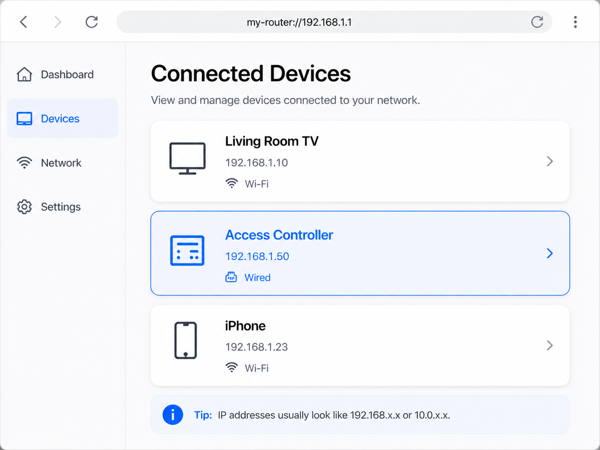

<!--
Generated from GateTap app setup guide JSON.
Do not edit manually.
Version: 1.3
Language: th
-->

# คู่มือการตั้งค่า

---

🌍 **This Document is available in other Languages:**  
[🇺🇸 English](setup-guide.en.md) | [🇩🇪 Deutsch](setup-guide.de.md) | [🌐 ar](setup-guide.ar.md) | [🌐 ca](setup-guide.ca.md) | [🌐 cs](setup-guide.cs.md) | [🌐 da](setup-guide.da.md) | [🌐 el](setup-guide.el.md) | [🌐 es](setup-guide.es.md) | [🌐 es-MX](setup-guide.es-MX.md) | [🌐 fi](setup-guide.fi.md) | [🌐 fr](setup-guide.fr.md) | [🌐 he](setup-guide.he.md) | [🌐 hi](setup-guide.hi.md) | [🌐 hr](setup-guide.hr.md) | [🌐 hu](setup-guide.hu.md) | [🌐 id](setup-guide.id.md) | [🌐 it](setup-guide.it.md) | [🌐 ja](setup-guide.ja.md) | [🌐 ko](setup-guide.ko.md) | [🌐 ms](setup-guide.ms.md) | [🌐 nb](setup-guide.nb.md) | [🌐 nl](setup-guide.nl.md) | [🌐 pl](setup-guide.pl.md) | [🌐 pt-BR](setup-guide.pt-BR.md) | [🌐 pt-PT](setup-guide.pt-PT.md) | [🌐 ro](setup-guide.ro.md) | [🌐 ru](setup-guide.ru.md) | [🌐 sk](setup-guide.sk.md) | [🌐 sv](setup-guide.sv.md) | 🌐 th | [🌐 tr](setup-guide.tr.md) | [🌐 uk](setup-guide.uk.md) | [🌐 vi](setup-guide.vi.md) | [🇨🇳 中文](setup-guide.zh-Hans.md) | [🇨🇳 中文](setup-guide.zh-Hant.md)

---

เชื่อมต่อ GateTap กับตัวควบคุมการเข้าถึงของคุณ

## ก่อนที่คุณจะเริ่ม

Make sure your iPhone is connected to the same local network as your access controller.

GateTap works entirely within your local network and needs:
• ที่อยู่ IP ของคอนโทรลเลอร์
• ชื่อผู้ใช้และรหัสผ่าน

## ขั้นตอนที่ 1: ค้นหาที่อยู่และข้อมูลประจำตัวของตัวควบคุม

To connect GateTap, you need the controller’s IP address and login credentials.

เลือกหนึ่งในตัวเลือกต่อไปนี้:

## ตัวเลือก A: สอบถามผู้ติดตั้งของคุณ (แนะนำ)

If your system was installed by an electrician or technician, they likely already configured everything.

ในหลายกรณี:
• คอนโทรลเลอร์ใช้ที่อยู่ IP คงที่
• หรือเราเตอร์กำหนด IP เดียวกันโดยการจอง

ขอที่อยู่ IP และรายละเอียดการเข้าสู่ระบบจากพวกเขา โดยปกติจะเป็นวิธีที่ง่ายที่สุดและเร็วที่สุด

## ตัวเลือก B: ตรวจสอบเราเตอร์ของคุณ

Open your router’s configuration page and look for connected devices.

ในการเข้าถึงเราเตอร์ของคุณ โดยปกติคุณจะต้องมีที่อยู่ในเครื่อง (เช่น `192.168.1.1` หรือชื่อเช่น `fritz.box`) และข้อมูลรับรองการเข้าสู่ระบบของเราเตอร์

ส่วนนี้อาจเรียกว่า:
• อุปกรณ์ที่เชื่อมต่อ
• แลน
• ลูกค้า DHCP

มองหา:
• อุปกรณ์แบบมีสายที่ไม่รู้จัก
• รายการที่อาจเป็นตัวแทนของตัวควบคุมของคุณ

ที่อยู่ IP มักจะมีลักษณะดังนี้:
`192.168.x.x` หรือ `10.0.x.x`

## ตัวเลือก C: สแกนเครือข่ายของคุณ

Use a network scanner app on your iPhone or computer.

สแกนเครือข่ายของคุณและลองเปิดที่อยู่ IP ที่ค้นพบใน Safari ตัวอย่างเช่น:

`http://192.168.1.50`

หากหน้าเข้าสู่ระบบของตัวควบคุมปรากฏขึ้น แสดงว่าคุณพบที่อยู่ที่ถูกต้อง

## ขั้นตอนที่ 2: เพิ่มคอนโทรลเลอร์ใน GateTap

เปิด GateTap แล้วป้อน:
• ที่อยู่ IP
• ชื่อผู้ใช้ของคุณ
• รหัสผ่านของคุณ

ใช้ข้อมูลรับรองเดียวกันกับเว็บอินเทอร์เฟซของคอนโทรลเลอร์

## ขั้นตอนที่ 3: ทดสอบการเชื่อมต่อ

บันทึกการกำหนดค่าของคุณแล้วลองเปิดประตูหรือประตู

หากไม่มีอะไรเกิดขึ้น ให้ตรวจสอบ:
• iPhone ของคุณอยู่ในเครือข่ายเดียวกัน
• ที่อยู่ IP ถูกต้อง
• คอนโทรลเลอร์ได้รับพลังงานและสามารถเข้าถึงได้

## ขั้นตอนที่ 4: รักษาที่อยู่ IP ให้คงที่

เพื่อหลีกเลี่ยงปัญหาในภายหลัง คอนโทรลเลอร์ควรใช้ที่อยู่ IP เดียวกันเสมอ

ซึ่งสามารถทำได้โดย:
• การตั้งค่า IP แบบคงที่บนคอนโทรลเลอร์
• การสร้างการจอง DHCP ในเราเตอร์ของคุณ

## ความปลอดภัย

ข้อมูลของคุณยังคงอยู่ในอุปกรณ์ของคุณ

คุณสามารถเลือกป้องกัน GateTap โดยใช้ Face ID หรือ Touch ID ในการตั้งค่าแอพได้

