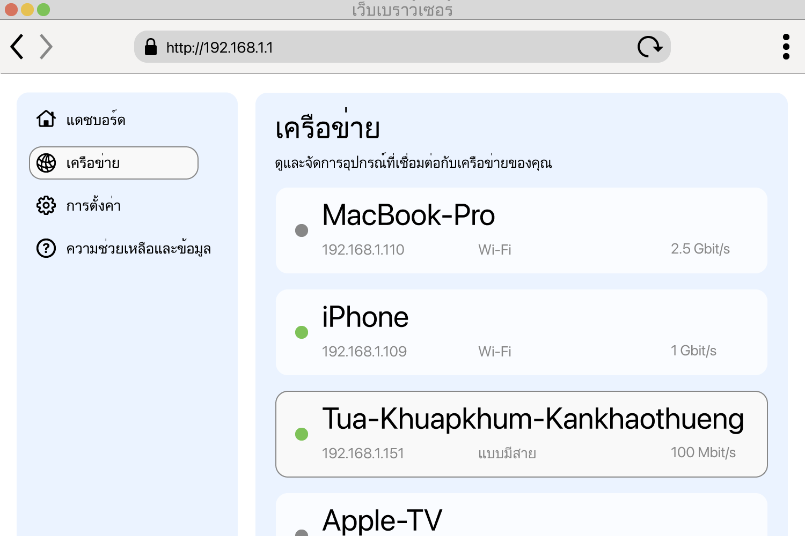

<!--
Generated from GateTap app setup guide JSON.
Do not edit manually.
Version: 1.4
Language: th
-->

# คู่มือการตั้งค่า

---

🌍 **This Document is available in other Languages:**  
[🇺🇸 English](setup-guide.en.md) | [🇩🇪 Deutsch](setup-guide.de.md) | [🇸🇦 العربية](setup-guide.ar.md) | [🇪🇸 Català](setup-guide.ca.md) | [🇨🇿 Čeština](setup-guide.cs.md) | [🇩🇰 Dansk](setup-guide.da.md) | [🇬🇷 Ελληνικά](setup-guide.el.md) | [🇪🇸 Español](setup-guide.es.md) | [🇲🇽 Español (México)](setup-guide.es-MX.md) | [🇫🇮 Suomi](setup-guide.fi.md) | [🇫🇷 Français](setup-guide.fr.md) | [🇮🇱 עברית](setup-guide.he.md) | [🇮🇳 हिन्दी](setup-guide.hi.md) | [🇭🇷 Hrvatski](setup-guide.hr.md) | [🇭🇺 Magyar](setup-guide.hu.md) | [🇮🇩 Bahasa Indonesia](setup-guide.id.md) | [🇮🇹 Italiano](setup-guide.it.md) | [🇯🇵 日本語](setup-guide.ja.md) | [🇰🇷 한국어](setup-guide.ko.md) | [🇲🇾 Bahasa Melayu](setup-guide.ms.md) | [🇳🇴 Norsk Bokmål](setup-guide.nb.md) | [🇳🇱 Nederlands](setup-guide.nl.md) | [🇵🇱 Polski](setup-guide.pl.md) | [🇧🇷 Português (Brasil)](setup-guide.pt-BR.md) | [🇵🇹 Português (Portugal)](setup-guide.pt-PT.md) | [🇷🇴 Română](setup-guide.ro.md) | [🇷🇺 Русский](setup-guide.ru.md) | [🇸🇰 Slovenčina](setup-guide.sk.md) | [🇸🇪 Svenska](setup-guide.sv.md) | 🇹🇭 ไทย | [🇹🇷 Türkçe](setup-guide.tr.md) | [🇺🇦 Українська](setup-guide.uk.md) | [🇻🇳 Tiếng Việt](setup-guide.vi.md) | [🇨🇳 简体中文](setup-guide.zh-Hans.md) | [🇹🇼 繁體中文](setup-guide.zh-Hant.md)

---

เชื่อมต่อ GateTap กับตัวควบคุมการเข้าถึงของคุณ

## ตัวควบคุมการเข้าถึงคืออะไร?

ตัวควบคุมการเข้าถึงคืออุปกรณ์ที่จัดการการเปิดประตู ประตูรั้ว โรงรถ หรือไม้กั้น เช่น การสั่งงานกลอนประตูหรือมอเตอร์ประตูรั้ว
โดยทั่วไปจะรับสัญญาณเปิดจาก:

- ระบบอินเตอร์คอม
- แป้นกด
- พวงกุญแจหรือบัตรผ่าน

ระบบควบคุมการเข้าถึงสมัยใหม่จำนวนมากเชื่อมต่อกับเครือข่ายภายใน และสามารถใช้งานผ่านเว็บอินเทอร์เฟซในเบราว์เซอร์ได้ GateTap จะเชื่อมต่อกับระบบนั้นโดยตรง เพื่อให้คุณควบคุมได้สะดวกจากอุปกรณ์ของคุณ

## ก่อนที่คุณจะเริ่ม

ตรวจสอบให้แน่ใจว่าอุปกรณ์ของคุณเชื่อมต่อกับเครือข่ายภายในเดียวกับตัวควบคุมการเข้าถึง เช่น ตรวจสอบว่า iPhone เชื่อมต่อกับ Wi‑Fi ที่บ้านและไม่ได้ใช้ข้อมูลมือถือ

GateTap ทำงานทั้งหมดภายในเครือข่ายภายในของคุณ และต้องใช้:

- ที่อยู่ IP ของตัวควบคุม
- ชื่อผู้ใช้และรหัสผ่าน

## ขั้นตอนที่ 1: ค้นหาที่อยู่ IP ของตัวควบคุมการเข้าถึง

ในการเชื่อมต่อ GateTap คุณต้องมีที่อยู่ IP ของตัวควบคุมและข้อมูลเข้าสู่ระบบ — ดูขั้นตอนที่ 2

เลือกหนึ่งในตัวเลือกต่อไปนี้:

## ตัวเลือก A: สอบถามผู้ติดตั้งของคุณ (แนะนำ)

หากระบบของคุณติดตั้งโดยช่างไฟฟ้าหรือช่างเทคนิค พวกเขาน่าจะตั้งค่าทุกอย่างไว้แล้ว

ในหลายกรณี:

- ตัวควบคุมใช้ที่อยู่ IP แบบคงที่
- หรือเราเตอร์กำหนด IP เดิมให้ผ่านการจอง DHCP

ขอที่อยู่ IP และข้อมูลเข้าสู่ระบบจากพวกเขา โดยทั่วไปนี่เป็นวิธีที่ง่ายและรวดเร็วที่สุด

## ตัวเลือก B: ตรวจสอบเราเตอร์ของคุณ

ในการเข้าถึงเราเตอร์ โดยทั่วไปคุณต้องใช้ที่อยู่ภายในของเราเตอร์ เช่น `192.168.1.1` หรือชื่ออย่าง `fritz.box` รวมถึงข้อมูลเข้าสู่ระบบของเราเตอร์

เปิดหน้าการตั้งค่าของเราเตอร์แล้วมองหาอุปกรณ์ที่เชื่อมต่ออยู่

ส่วนนี้อาจเรียกว่า:

- เครือข่าย
- อุปกรณ์ที่เชื่อมต่อ
- LAN
- ไคลเอนต์ DHCP

ให้มองหา:

- อุปกรณ์แบบมีสายที่ไม่รู้จัก
- รายการที่อาจเป็นตัวควบคุมของคุณ

ที่อยู่ IP มักจะมีลักษณะดังนี้:
`192.168.x.x` หรือ `10.0.x.x`

## ตัวเลือก C: สแกนเครือข่ายของคุณ

ใช้แอปสแกนเครือข่ายบนอุปกรณ์ของคุณ

สแกนเครือข่ายและมองหา:

- อุปกรณ์แบบมีสายที่ไม่รู้จัก
- รายการที่อาจเป็นตัวควบคุมของคุณ

ที่อยู่ IP มักจะมีลักษณะดังนี้:
`192.168.x.x` หรือ `10.0.x.x`

## ทดสอบที่อยู่ IP

ลองเปิดที่อยู่ IP ที่พบใน Safari เช่น:

`http://192.168.1.50`

หากหน้าล็อกอินของตัวควบคุมการเข้าถึงปรากฏขึ้น แสดงว่าคุณพบที่อยู่ที่ถูกต้องแล้ว

## ขั้นตอนที่ 2: ค้นหาข้อมูลเข้าสู่ระบบของตัวควบคุมการเข้าถึง

ตัวควบคุมการเข้าถึงบางรุ่นยังใช้ข้อมูลเข้าสู่ระบบเริ่มต้น ตัวอย่างที่พบบ่อยคือชื่อผู้ใช้ `abc` พร้อมรหัสผ่าน `654321`

ชื่อผู้ใช้เริ่มต้นอื่น ๆ ที่พบบ่อย ได้แก่ `user`, `admin` หรือ `123` คุณสามารถลองใช้ร่วมกับรหัสผ่านทั่วไป เช่น `1234`, `user` หรือ `password` หรือรูปแบบใกล้เคียง

หากระบบของคุณติดตั้งโดยมืออาชีพ ให้ถามผู้ติดตั้งว่าข้อมูลเข้าสู่ระบบเริ่มต้นถูกเปลี่ยนแล้วหรือไม่

## ขั้นตอนที่ 3: เพิ่มตัวควบคุมการเข้าถึงใน GateTap

เปิด GateTap หากหน้าเพิ่มตัวควบคุมไม่ปรากฏโดยอัตโนมัติ ให้ไปที่แท็บ "Controller" แล้วแตะปุ่ม "+" บนแถบนำทางด้านขวาบน

ในหน้าที่ปรากฏ ให้ป้อน:

- ที่อยู่ IP
- ชื่อผู้ใช้
- รหัสผ่าน

ใช้ข้อมูลเข้าสู่ระบบเดียวกับที่ใช้กับเว็บอินเทอร์เฟซของตัวควบคุมการเข้าถึง

## ขั้นตอนที่ 4: ทดสอบการเชื่อมต่อ

บันทึกการกำหนดค่า แอปจะพยายามเชื่อมต่อโดยอัตโนมัติ

หากไม่สามารถสร้างการเชื่อมต่อได้ ให้ตรวจสอบว่า:

- อุปกรณ์ของคุณอยู่ในเครือข่ายเดียวกับตัวควบคุมการเข้าถึง
- ที่อยู่ IP ถูกต้อง
- ตัวควบคุมการเข้าถึงมีไฟเลี้ยงและเข้าถึงได้

## ขั้นตอนที่ 5: รักษาที่อยู่ IP ให้คงที่

เพื่อหลีกเลี่ยงปัญหาในภายหลัง ตัวควบคุมควรใช้ที่อยู่ IP เดิมเสมอ

ทำได้โดย:

- ตั้งค่า IP แบบคงที่บนตัวควบคุม
- สร้างการจอง DHCP ในเราเตอร์

## โหมดสาธิต

GateTap มีโหมดสาธิตด้วย คุณสามารถเริ่มตัวควบคุมการเข้าถึงเสมือนจากภายในแอป ซึ่งจะแสดงอินเทอร์เฟซผู้ดูแลเหมือนระบบควบคุมการเข้าถึงจริง จากนั้นคุณสามารถเพิ่มได้เหมือนตัวควบคุมทั่วไปโดยใช้ที่อยู่ IP และข้อมูลเข้าสู่ระบบที่แสดง

วิธีนี้ให้เส้นทางทดสอบที่ทราบว่าใช้งานได้เพื่อสำรวจฟีเจอร์ของ GateTap แม้ว่าตอนนี้คุณจะไม่มีตัวควบคุมการเข้าถึงจริงก็ตาม

## ความปลอดภัย

ข้อมูลของคุณยังคงอยู่ในอุปกรณ์ของคุณ

คุณสามารถเลือกป้องกัน GateTap โดยใช้ Face ID หรือ Touch ID ในการตั้งค่าแอพได้

