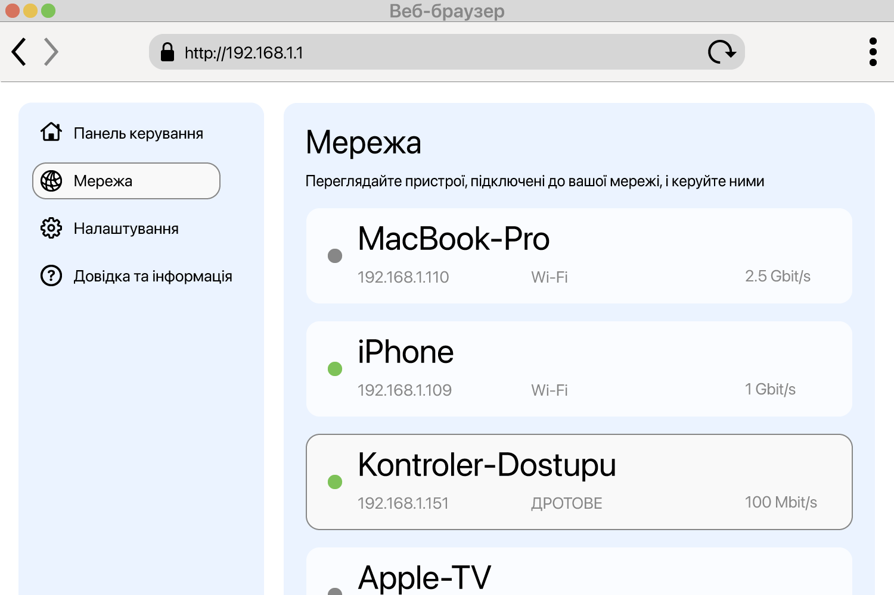

<!--
Generated from GateTap app setup guide JSON.
Do not edit manually.
Version: 1.4
Language: uk
-->

# Посібник із налаштування

---

🌍 **This Document is available in other Languages:**  
[🇺🇸 English](setup-guide.en.md) | [🇩🇪 Deutsch](setup-guide.de.md) | [🇸🇦 العربية](setup-guide.ar.md) | [🇪🇸 Català](setup-guide.ca.md) | [🇨🇿 Čeština](setup-guide.cs.md) | [🇩🇰 Dansk](setup-guide.da.md) | [🇬🇷 Ελληνικά](setup-guide.el.md) | [🇪🇸 Español](setup-guide.es.md) | [🇲🇽 Español (México)](setup-guide.es-MX.md) | [🇫🇮 Suomi](setup-guide.fi.md) | [🇫🇷 Français](setup-guide.fr.md) | [🇮🇱 עברית](setup-guide.he.md) | [🇮🇳 हिन्दी](setup-guide.hi.md) | [🇭🇷 Hrvatski](setup-guide.hr.md) | [🇭🇺 Magyar](setup-guide.hu.md) | [🇮🇩 Bahasa Indonesia](setup-guide.id.md) | [🇮🇹 Italiano](setup-guide.it.md) | [🇯🇵 日本語](setup-guide.ja.md) | [🇰🇷 한국어](setup-guide.ko.md) | [🇲🇾 Bahasa Melayu](setup-guide.ms.md) | [🇳🇴 Norsk Bokmål](setup-guide.nb.md) | [🇳🇱 Nederlands](setup-guide.nl.md) | [🇵🇱 Polski](setup-guide.pl.md) | [🇧🇷 Português (Brasil)](setup-guide.pt-BR.md) | [🇵🇹 Português (Portugal)](setup-guide.pt-PT.md) | [🇷🇴 Română](setup-guide.ro.md) | [🇷🇺 Русский](setup-guide.ru.md) | [🇸🇰 Slovenčina](setup-guide.sk.md) | [🇸🇪 Svenska](setup-guide.sv.md) | [🇹🇭 ไทย](setup-guide.th.md) | [🇹🇷 Türkçe](setup-guide.tr.md) | 🇺🇦 Українська | [🇻🇳 Tiếng Việt](setup-guide.vi.md) | [🇨🇳 简体中文](setup-guide.zh-Hans.md) | [🇹🇼 繁體中文](setup-guide.zh-Hant.md)

---

Підключіть GateTap до контролера доступу

## Що таке контролер доступу?

Контролер доступу — це пристрій, який керує відкриванням дверей, воріт, гаражів або шлагбаумів, наприклад активуючи дверний замок або мотор воріт.
Зазвичай він отримує сигнал відкривання від:

- домофонної системи
- клавіатури
- брелока або картки доступу

Багато сучасних систем контролю доступу підключені до локальної мережі й можуть керуватися через вебінтерфейс у браузері. GateTap підключається безпосередньо до цієї системи, щоб ви могли зручно керувати нею зі свого пристрою.

## Перш ніж почати

Переконайтеся, що ваш пристрій підключено до тієї самої локальної мережі, що й контролер доступу. Наприклад, перевірте, що iPhone підключений до домашнього Wi‑Fi і не використовує мобільні дані.

GateTap повністю працює у вашій локальній мережі та потребує:

- IP-адреси контролера
- Імені користувача та пароля

## Крок 1. Знайдіть IP-адресу контролера доступу

Щоб підключити GateTap, потрібні IP-адреса контролера та дані для входу — див. крок 2.

Виберіть один із наведених варіантів:

## Варіант A: запитайте свого інсталятора (рекомендовано)

Якщо систему встановлював електрик або технік, імовірно, він уже все налаштував.

У багатьох випадках:

- Контролер використовує фіксовану IP-адресу
- Або роутер призначає йому ту саму IP-адресу через резервування DHCP

Попросіть IP-адресу та дані для входу. Зазвичай це найпростіший і найшвидший спосіб.

## Варіант Б: перевірте маршрутизатор

Щоб отримати доступ до роутера, зазвичай потрібна його локальна адреса, наприклад `192.168.1.1` або назва на кшталт `fritz.box`, а також дані для входу до роутера.

Відкрийте сторінку налаштувань роутера й знайдіть підключені пристрої.

Цей розділ може називатися:

- Мережа
- Підключені пристрої
- LAN
- DHCP-клієнти

Шукайте:

- Невідомі дротові пристрої
- Записи, які можуть відповідати вашому контролеру

IP-адреса зазвичай має такий вигляд:
`192.168.x.x` або `10.0.x.x`

## Варіант C: сканування мережі

Використайте застосунок для сканування мережі на своєму пристрої.

Проскануйте мережу й шукайте:

- Невідомі дротові пристрої
- Записи, які можуть відповідати вашому контролеру

IP-адреса зазвичай має такий вигляд:
`192.168.x.x` або `10.0.x.x`

## Перевірте IP-адресу

Спробуйте відкрити знайдену IP-адресу в Safari, наприклад:

`http://192.168.1.50`

Якщо з’явиться сторінка входу контролера доступу, ви знайшли правильну адресу.

## Крок 2. Знайдіть дані для входу контролера доступу

Деякі контролери доступу досі використовують стандартні дані для входу. Поширений приклад — ім’я користувача `abc` із паролем `654321`.

Інші поширені стандартні імена користувача: `user`, `admin` або `123`. Можна спробувати їх із типовими паролями, такими як `1234`, `user` або `password`, чи з їх варіаціями.

Якщо систему встановлювали професійно, запитайте інсталятора, чи були змінені стандартні дані для входу.

## Крок 3. Додайте контролер доступу в GateTap

Відкрийте GateTap. Якщо сторінка додавання контролера не з’явилася автоматично, перейдіть на вкладку "Controller" і натисніть кнопку "+" на панелі навігації у верхньому правому куті.

На сторінці, що з’явиться, введіть:

- IP-адресу
- Ім’я користувача
- Пароль

Використовуйте ті самі дані для входу, що й для вебінтерфейсу контролера доступу.

## Крок 4. Перевірте підключення

Збережіть конфігурацію. Застосунок автоматично спробує підключитися.

Якщо підключення не вдається встановити, перевірте:

- Ваш пристрій у тій самій мережі, що й контролер доступу
- IP-адреса правильна
- Контролер доступу увімкнений і доступний

## Крок 5. Зберігайте IP-адресу стабільною

Щоб уникнути проблем у майбутньому, контролер має завжди використовувати ту саму IP-адресу.

Це можна зробити так:

- Налаштувати статичну IP-адресу на контролері
- Створити резервування DHCP у роутері

## Демо-режим

GateTap також має деморежим. Ви можете запустити з застосунку віртуальний контролер доступу, який надає адміністративний інтерфейс так, як це робила б справжня система контролю доступу. Потім його можна додати як звичайний контролер, використовуючи показану IP-адресу та дані для входу.

Це дає відомий робочий шлях тестування для ознайомлення з можливостями GateTap, навіть якщо зараз у вас немає фізичного контролера доступу.

## Безпека

Ваші дані залишаються на вашому пристрої.

Ви можете додатково захистити GateTap за допомогою Face ID або Touch ID у налаштуваннях програми.

