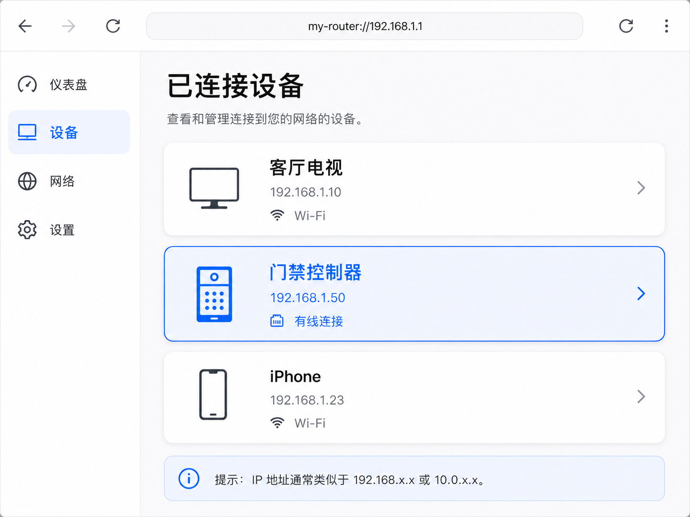
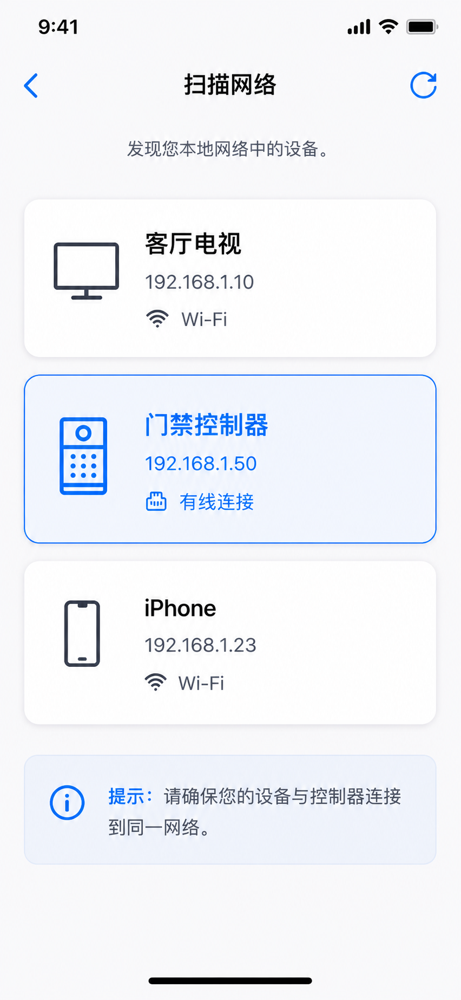

<!--
Generated from GateTap app setup guide JSON.
Do not edit manually.
Version: 1.3
Language: zh-Hans
-->

# 设置指南

---

🌍 **This Document is available in other Languages:**  
[🇺🇸 English](setup-guide.en.md) | [🇩🇪 Deutsch](setup-guide.de.md) | [🇸🇦 العربية](setup-guide.ar.md) | [🇪🇸 Català](setup-guide.ca.md) | [🇨🇿 Čeština](setup-guide.cs.md) | [🇩🇰 Dansk](setup-guide.da.md) | [🇬🇷 Ελληνικά](setup-guide.el.md) | [🇪🇸 Español](setup-guide.es.md) | [🇲🇽 Español (México)](setup-guide.es-MX.md) | [🇫🇮 Suomi](setup-guide.fi.md) | [🇫🇷 Français](setup-guide.fr.md) | [🇮🇱 עברית](setup-guide.he.md) | [🇮🇳 हिन्दी](setup-guide.hi.md) | [🇭🇷 Hrvatski](setup-guide.hr.md) | [🇭🇺 Magyar](setup-guide.hu.md) | [🇮🇩 Bahasa Indonesia](setup-guide.id.md) | [🇮🇹 Italiano](setup-guide.it.md) | [🇯🇵 日本語](setup-guide.ja.md) | [🇰🇷 한국어](setup-guide.ko.md) | [🇲🇾 Bahasa Melayu](setup-guide.ms.md) | [🇳🇴 Norsk Bokmål](setup-guide.nb.md) | [🇳🇱 Nederlands](setup-guide.nl.md) | [🇵🇱 Polski](setup-guide.pl.md) | [🇧🇷 Português (Brasil)](setup-guide.pt-BR.md) | [🇵🇹 Português (Portugal)](setup-guide.pt-PT.md) | [🇷🇴 Română](setup-guide.ro.md) | [🇷🇺 Русский](setup-guide.ru.md) | [🇸🇰 Slovenčina](setup-guide.sk.md) | [🇸🇪 Svenska](setup-guide.sv.md) | [🇹🇭 ไทย](setup-guide.th.md) | [🇹🇷 Türkçe](setup-guide.tr.md) | [🇺🇦 Українська](setup-guide.uk.md) | [🇻🇳 Tiếng Việt](setup-guide.vi.md) | 🇨🇳 简体中文 | [🇹🇼 繁體中文](setup-guide.zh-Hant.md)

---

将 GateTap 连接到你的门禁控制器

## 开始之前

请确保你的 iPhone 已连接到与门禁控制器相同的本地网络。

GateTap 完全在你的本地网络内工作，并需要：
• 控制器的 IP 地址
• 用户名和密码

## 步骤 1：找到控制器地址和登录凭据

要连接 GateTap，你需要控制器的 IP 地址和登录凭据。

请选择以下方法之一：

## 选项 A：询问安装人员（推荐）

如果你的系统由电工或技术人员安装，他们很可能已经完成了配置。

在很多情况下：
• 控制器使用固定 IP 地址
• 或者路由器通过地址保留分配相同的 IP

向他们询问 IP 地址和登录信息。这通常是最简单、最快的方法。

## 选项 B：检查路由器

打开路由器的配置页面并查找已连接设备。

要访问路由器，通常需要它的本地地址（例如 `192.168.1.1` 或 `fritz.box` 这样的名称）以及路由器登录凭据。

该区域可能叫做：
• 已连接设备
• LAN
• DHCP 客户端

请查找：
• 未知的有线设备
• 可能代表控制器的条目

IP 地址通常类似：
`192.168.x.x` 或 `10.0.x.x`

## 选项 C：扫描网络

在 iPhone 或电脑上使用网络扫描器 App。

扫描你的网络，并尝试在 Safari 中打开发现的 IP 地址，例如：

`http://192.168.1.50`

如果出现控制器登录页面，你就找到了正确的地址。

## 步骤 2：在 GateTap 中添加控制器

打开 GateTap 并输入：
• IP 地址
• 用户名
• 密码

请使用与控制器 Web 界面相同的登录凭据。

## 步骤 3：测试连接

保存配置并尝试打开一扇门或大门。

如果没有反应，请检查：
• iPhone 是否在同一网络中
• IP 地址是否正确
• 控制器是否已通电并可访问

## 步骤 4：保持 IP 地址稳定

为避免以后出现问题，控制器应始终使用相同的 IP 地址。

可以通过以下方式实现：
• 在控制器上设置静态 IP
• 在路由器中创建 DHCP 地址保留

## 安全

你的数据会保留在你的设备上。

你也可以在 App 设置中使用 Face ID 或 Touch ID 保护 GateTap。

