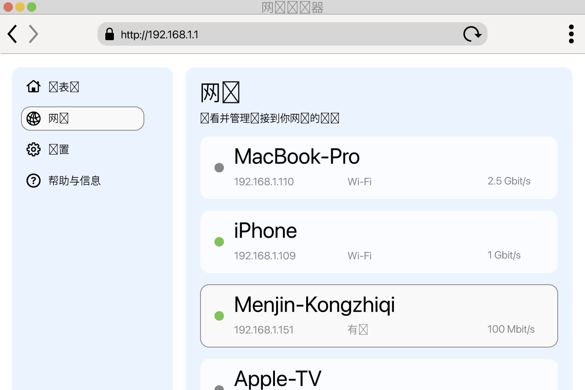

<!--
Generated from GateTap app setup guide JSON.
Do not edit manually.
Version: 1.4
Language: zh-Hans
-->

# 设置指南

---

🌍 **This Document is available in other Languages:**  
[🇺🇸 English](setup-guide.en.md) | [🇩🇪 Deutsch](setup-guide.de.md) | [🇸🇦 العربية](setup-guide.ar.md) | [🇪🇸 Català](setup-guide.ca.md) | [🇨🇿 Čeština](setup-guide.cs.md) | [🇩🇰 Dansk](setup-guide.da.md) | [🇬🇷 Ελληνικά](setup-guide.el.md) | [🇪🇸 Español](setup-guide.es.md) | [🇲🇽 Español (México)](setup-guide.es-MX.md) | [🇫🇮 Suomi](setup-guide.fi.md) | [🇫🇷 Français](setup-guide.fr.md) | [🇮🇱 עברית](setup-guide.he.md) | [🇮🇳 हिन्दी](setup-guide.hi.md) | [🇭🇷 Hrvatski](setup-guide.hr.md) | [🇭🇺 Magyar](setup-guide.hu.md) | [🇮🇩 Bahasa Indonesia](setup-guide.id.md) | [🇮🇹 Italiano](setup-guide.it.md) | [🇯🇵 日本語](setup-guide.ja.md) | [🇰🇷 한국어](setup-guide.ko.md) | [🇲🇾 Bahasa Melayu](setup-guide.ms.md) | [🇳🇴 Norsk Bokmål](setup-guide.nb.md) | [🇳🇱 Nederlands](setup-guide.nl.md) | [🇵🇱 Polski](setup-guide.pl.md) | [🇧🇷 Português (Brasil)](setup-guide.pt-BR.md) | [🇵🇹 Português (Portugal)](setup-guide.pt-PT.md) | [🇷🇴 Română](setup-guide.ro.md) | [🇷🇺 Русский](setup-guide.ru.md) | [🇸🇰 Slovenčina](setup-guide.sk.md) | [🇸🇪 Svenska](setup-guide.sv.md) | [🇹🇭 ไทย](setup-guide.th.md) | [🇹🇷 Türkçe](setup-guide.tr.md) | [🇺🇦 Українська](setup-guide.uk.md) | [🇻🇳 Tiếng Việt](setup-guide.vi.md) | 🇨🇳 简体中文 | [🇹🇼 繁體中文](setup-guide.zh-Hant.md)

---

将 GateTap 连接到你的门禁控制器

## 什么是门禁控制器？

门禁控制器是一种管理门、闸门、车库或栅栏开启的设备 — 例如启动门铃或闸门电机。
它通常从以下来源接收开启信号：

- 对讲系统
- 键盘
- 钥匙扣或门禁卡

许多现代门禁系统都连接到本地网络，并可通过浏览器中的 Web 界面操作。GateTap 会直接连接到你的门禁系统，让你可以从设备上方便地操作它。

## 开始之前

请确保你的设备与门禁控制器连接到同一个本地网络。例如，确认 iPhone 连接的是家里的 Wi‑Fi，而不是移动数据网络。

GateTap 完全在你的本地网络内工作，并需要：

- 控制器的 IP 地址
- 用户名和密码

## 步骤 1：找到门禁控制器的 IP 地址

要连接 GateTap，你需要控制器的 IP 地址和登录凭据 — 请参见步骤 2。

请选择以下方式之一：

## 选项 A：询问安装人员（推荐）

如果你的系统由电工或技术人员安装，他们很可能已经完成了配置。

在很多情况下：

- 控制器使用固定 IP 地址
- 或路由器通过 DHCP 保留分配同一个 IP

向他们询问 IP 地址和登录信息。这通常是最简单、最快的方式。

## 选项 B：检查路由器

要访问路由器，通常需要它的本地地址，例如 `192.168.1.1` 或 `fritz.box` 这样的名称，以及路由器的登录凭据。

打开路由器的配置页面，查找已连接的设备。

此部分可能称为：

- 网络
- 已连接设备
- LAN
- DHCP 客户端

请查找：

- 未知的有线设备
- 可能代表你的控制器的条目

IP 地址通常类似于：
`192.168.x.x` 或 `10.0.x.x`

## 选项 C：扫描你的网络

在设备上使用网络扫描应用。

扫描你的网络并查找：

- 未知的有线设备
- 可能代表你的控制器的条目

IP 地址通常类似于：
`192.168.x.x` 或 `10.0.x.x`

## 测试 IP 地址

尝试在 Safari 中打开发现的 IP 地址，例如：

`http://192.168.1.50`

如果出现门禁控制器的登录页面，就说明你找到了正确地址。

## 步骤 2：找到门禁控制器的登录凭据

有些门禁控制器仍然使用默认登录凭据。一个常见示例是用户名 `abc`，密码 `654321`。

其他常见的默认用户名包括 `user`、`admin` 或 `123`。你可以将它们与常见密码（如 `1234`、`user`、`password`）或其变体一起尝试。

如果你的系统是专业安装的，请询问安装人员默认凭据是否已被更改。

## 步骤 3：在 GateTap 中添加门禁控制器

打开 GateTap。如果添加控制器的页面没有自动出现，请切换到 "Controller" 标签，然后点击右上角导航栏中的 "+" 按钮。

在出现的页面中输入：

- IP 地址
- 用户名
- 密码

使用与门禁控制器网页界面相同的登录凭据。

## 步骤 4：测试连接

保存配置。应用会自动尝试连接。

如果无法建立连接，请检查：

- 你的设备与门禁控制器在同一网络中
- IP 地址正确
- 门禁控制器已通电且可访问

## 步骤 5：保持 IP 地址稳定

为了避免以后出现问题，控制器应始终使用同一个 IP 地址。

可以通过以下方式实现：

- 在控制器上设置静态 IP
- 在路由器中创建 DHCP 保留

## 演示模式

GateTap 还包含演示模式。你可以从应用内启动虚拟门禁控制器，它会像真实系统一样提供管理界面。然后你可以使用显示的 IP 地址和登录凭据，像普通控制器一样添加它。

这样即使你当前没有实体门禁控制器，也可以通过一个已知可用的测试路径来探索 GateTap 的功能。

## 安全

你的数据会保留在你的设备上。

你也可以在 App 设置中使用 Face ID 或 Touch ID 保护 GateTap。

