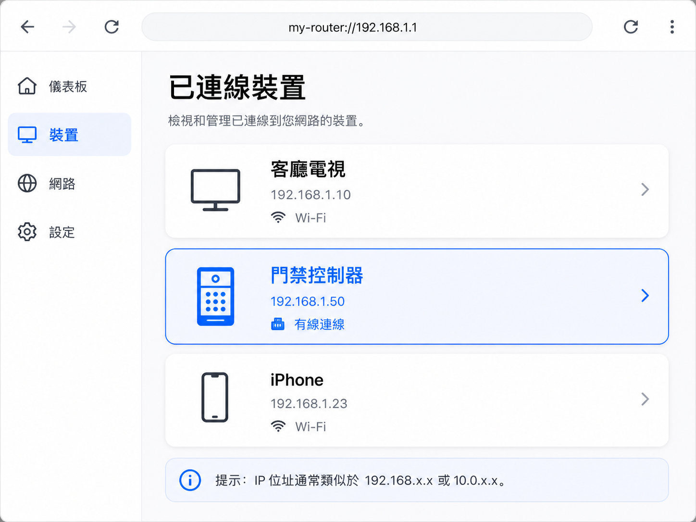
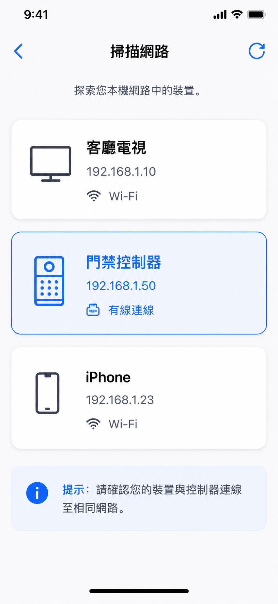

<!--
Generated from GateTap app setup guide JSON.
Do not edit manually.
Version: 1.3
Language: zh-Hant
-->

# 設定指南

---

🌍 **This Document is available in other Languages:**  
[🇺🇸 English](setup-guide.en.md) | [🇩🇪 Deutsch](setup-guide.de.md) | [🇸🇦 العربية](setup-guide.ar.md) | [🇪🇸 Català](setup-guide.ca.md) | [🇨🇿 Čeština](setup-guide.cs.md) | [🇩🇰 Dansk](setup-guide.da.md) | [🇬🇷 Ελληνικά](setup-guide.el.md) | [🇪🇸 Español](setup-guide.es.md) | [🇲🇽 Español (México)](setup-guide.es-MX.md) | [🇫🇮 Suomi](setup-guide.fi.md) | [🇫🇷 Français](setup-guide.fr.md) | [🇮🇱 עברית](setup-guide.he.md) | [🇮🇳 हिन्दी](setup-guide.hi.md) | [🇭🇷 Hrvatski](setup-guide.hr.md) | [🇭🇺 Magyar](setup-guide.hu.md) | [🇮🇩 Bahasa Indonesia](setup-guide.id.md) | [🇮🇹 Italiano](setup-guide.it.md) | [🇯🇵 日本語](setup-guide.ja.md) | [🇰🇷 한국어](setup-guide.ko.md) | [🇲🇾 Bahasa Melayu](setup-guide.ms.md) | [🇳🇴 Norsk Bokmål](setup-guide.nb.md) | [🇳🇱 Nederlands](setup-guide.nl.md) | [🇵🇱 Polski](setup-guide.pl.md) | [🇧🇷 Português (Brasil)](setup-guide.pt-BR.md) | [🇵🇹 Português (Portugal)](setup-guide.pt-PT.md) | [🇷🇴 Română](setup-guide.ro.md) | [🇷🇺 Русский](setup-guide.ru.md) | [🇸🇰 Slovenčina](setup-guide.sk.md) | [🇸🇪 Svenska](setup-guide.sv.md) | [🇹🇭 ไทย](setup-guide.th.md) | [🇹🇷 Türkçe](setup-guide.tr.md) | [🇺🇦 Українська](setup-guide.uk.md) | [🇻🇳 Tiếng Việt](setup-guide.vi.md) | [🇨🇳 简体中文](setup-guide.zh-Hans.md) | 🇹🇼 繁體中文

---

將 GateTap 連接到你的門禁控制器

## 開始之前

請確保你的 iPhone 已連接到與門禁控制器相同的本地網路。

GateTap 完全在你的本地網路內運作，並需要：
• 控制器的 IP 位址
• 使用者名稱和密碼

## 步驟 1：找到控制器位址和登入憑證

要連接 GateTap，你需要控制器的 IP 位址和登入憑證。

請選擇以下方法之一：

## 選項 A：詢問安裝人員（建議）

如果你的系統由電工或技術人員安裝，他們很可能已經完成設定。

在很多情況下：
• 控制器使用固定 IP 位址
• 或者路由器透過位址保留分配相同的 IP

向他們詢問 IP 位址和登入資訊。這通常是最簡單、最快的方法。

## 選項 B：檢查路由器

開啟路由器的設定頁面並尋找已連接裝置。

要存取路由器，通常需要它的本地位址（例如 `192.168.1.1` 或 `fritz.box` 這樣的名稱）以及路由器登入憑證。

該區域可能稱為：
• 已連接裝置
• LAN
• DHCP 用戶端

請尋找：
• 未知的有線裝置
• 可能代表控制器的項目

IP 位址通常類似：
`192.168.x.x` 或 `10.0.x.x`

## 選項 C：掃描網路

在 iPhone 或電腦上使用網路掃描器 App。

掃描你的網路，並嘗試在 Safari 中開啟發現的 IP 位址，例如：

`http://192.168.1.50`

如果出現控制器登入頁面，你就找到了正確的位址。

## 步驟 2：在 GateTap 中新增控制器

開啟 GateTap 並輸入：
• IP 位址
• 使用者名稱
• 密碼

請使用與控制器 Web 介面相同的登入憑證。

## 步驟 3：測試連線

儲存設定並嘗試開啟一扇門或大門。

如果沒有反應，請檢查：
• iPhone 是否在同一網路中
• IP 位址是否正確
• 控制器是否已通電並可存取

## 步驟 4：保持 IP 位址穩定

為避免之後出現問題，控制器應始終使用相同的 IP 位址。

可以透過以下方式實現：
• 在控制器上設定靜態 IP
• 在路由器中建立 DHCP 位址保留

## 安全

你的資料會保留在你的裝置上。

你也可以在 App 設定中使用 Face ID 或 Touch ID 保護 GateTap。

